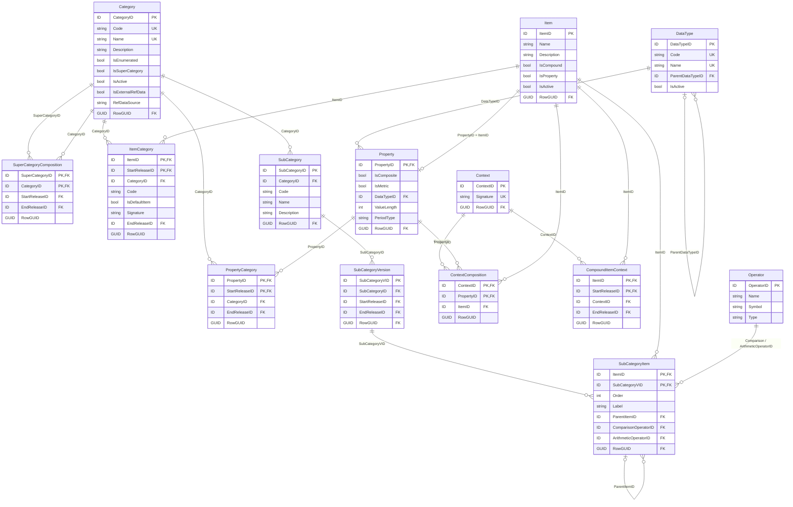
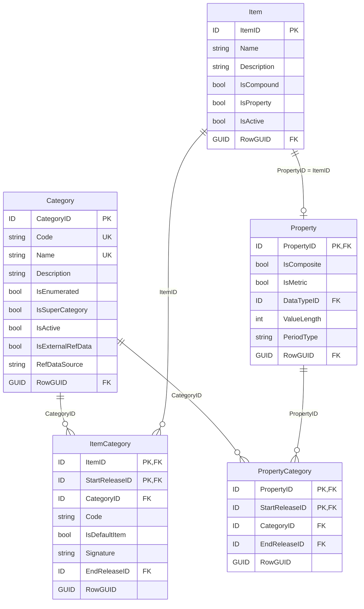
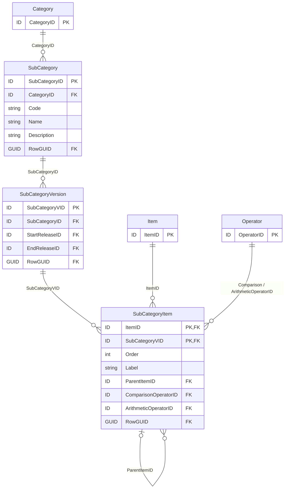
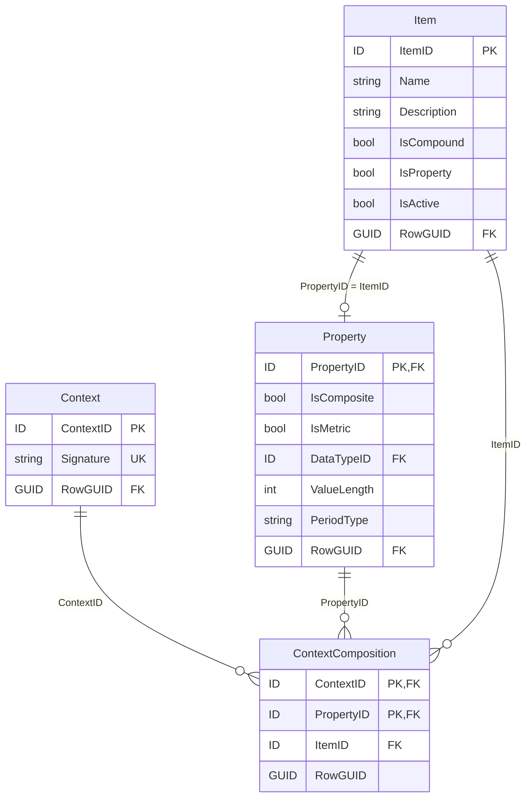
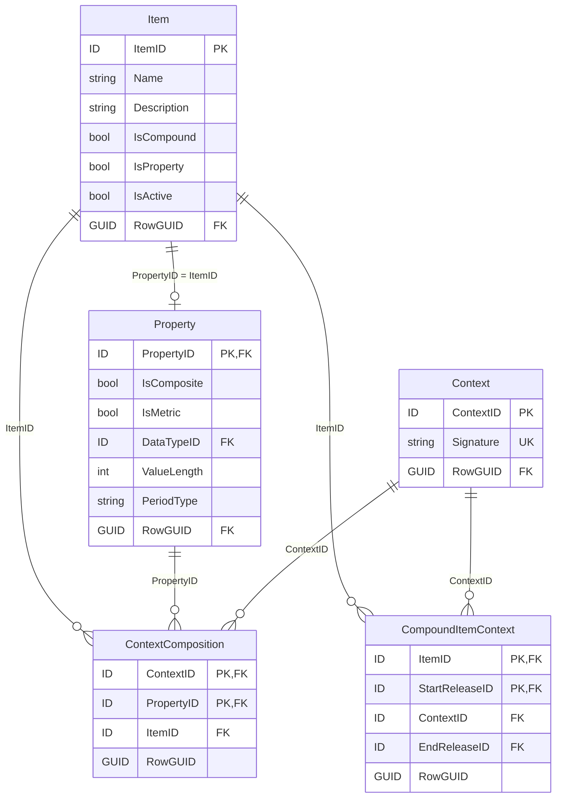
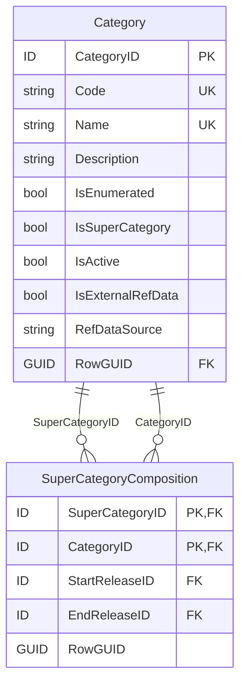
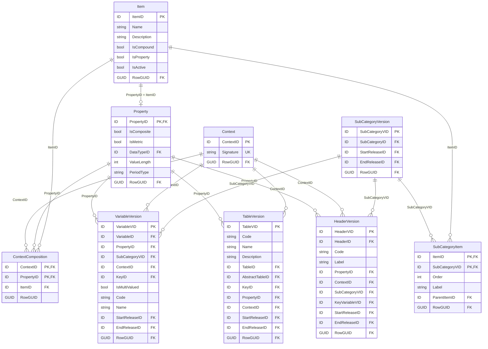

# 5.1 Glossary

The purpose of the Glossary component is to enable definition and management of terms and
notions that are later used to describe information requirements.

As presented on Figure 16 and explained in the next sections, Glossary consist of Categories
([5.1.1](#511-category)) that in turn comprise of Items ([5.1.2](#512-item)). Items of Category can be
grouped in SubCategories ([5.1.3](#513-subcategory)) belonging to this Category. Items in
SubCategories can be arranged in hierarchies (SubcategoryItem.ParentItemID). SubCategories may be
related to one another (by means of ConceptRelations -
[4.1.4](../ownership-documentation.md#414-concept-relation)). Property ([5.1.4](#514-property)) may be
associated to Category and as a consequence provide perspective for Items of this Category when
applied in description of information requirements (in Tables -
[5.2.1.1](rendering-packaging.md#5211-table-and-tableversion), their Headers -
[5.2.1.2](rendering-packaging.md#5212-header-tableversionheader-and-headerversion), or Cells -
[5.2.1.3](rendering-packaging.md#5213-cell-and-tableversioncell), and in Variables -
[5.3.3](variables.md#533-variableversions)). Each Property is also an Item of a dedicated Category
(e.g., to enable their grouping in SubCategories for further use as restrictions of information
requirements). Category can comprise of other categories (SuperCategoryComposition -
[5.1.7](#517-super-category)). Compound Items ([5.1.6](#516-compound-items)) can be constructed from
Property-Item pairs (Context and ContextComposition - [5.1.5](#515-context-and-contextcomposition)).

<figure markdown="span">

<figcaption>Figure 16. Glossary component entities and relations.</figcaption>
</figure>

## 5.1.1 Category

Categories typically represent (code) lists of items sharing common semantics or grouped based on
their similar nature. These Items ([5.1.2](#512-item)) can be defined in the model, one-by-one, in which
case Category is enumerated (IsEnumerated set to TRUE). Alternatively, Category can serve only as a
"placeholder" for such values, and not name them individually, which results in a not enumerated
Category (IsEnumerated set to FALSE). The content of not enumerated Category is either not known
for Modellers (as it can be for example reporting entity specific) or it is impractical to list all its
values as Items due to their large number or due to high and frequent volatility of its composition.

<figure markdown="span">

<figcaption>Figure 17. Category, Property and Item.</figcaption>
</figure>

As presented on Figure 17, Categories are also associated with Properties ([5.1.4](#514-property)) via
PropertyCategory entity.

In case of enumerated Category, Properties related to it provide perspective to Items from this
Category when used in description of information requirements. For example, "Spain" Item of
"Countries" Category can be associated with "Issuer residence" Property but also with "Broker
residence" or "Location of stock exchange" Properties when describing a single piece of reportable
information (a Variable – see [5.3.1](variables.md#531-variable)).

Non enumerated Category may gather Properties providing similar type of characteristic when used
in description of information requirements. These could be for example different types of codes that
identify instruments (e.g. ISIN, SEDOL, CUSIP, etc) or entities (e.g. LEI, Tax Identification Numbers,
etc). Non enumerated Category may also gather quantitative Properties.

There are three Categories predefined in the DPM Metamodel and hosted by the DPM Metamodel
Owner (Table 8).

| Code | Name | Description |
|---|---|---|
| _PR | Properties | Contains Items ([5.1.2](#512-item)) which are counterparts of Properties ([5.1.4](#514-property)) in physical implementation of the DPM metamodel. |
| _NA | Not applicable | Contains Items which do not belong to any specified Category such as those that are typically used only in dropdowns on Headers or Variables. It is also linked by Properties that do not belong to any real Category. Such enumerated Properties can refer to Items from Categories: "Not applicable", "Properties" and in such case they can also use Items of other Categories, in particular by being linked to such mixed SubCategory ([5.1.3](#513-subcategory)). It is not a semantically meaningful Category. |
| _TE | Templates | Contains Items which represent Templates (TableGroups - [5.2.1.4](rendering-packaging.md#5214-table-group) or Tables - [5.2.1.1](rendering-packaging.md#5211-table-and-tableversion)) for purposes of resembling Filing indicator Variables ([5.3.2](variables.md#532-variable-types)). |

<figcaption>Table 8. Predefined DPM Metamodel Categories.</figcaption>

Category can refer to external data (IsExternalRefData set to TRUE) identified in such case by
RefDataSource. This could be, for example, so called 'master' data (e.g. information about reporting
entities and their reporting obligations) or reference data (registries of companies, information
associated with LEI, list of instruments by ISIN codes, etc.). Such information can be used by
Operations that handle external data ([5.4.2](operations.md#542-handling-external-information)).

Category whose Category.IsSuperCategory is set to TRUE is a Super Category ([5.1.7](#517-super-category)).

Modellers identify Categories by Code and Name and may provide Description
([4.4](../ownership-documentation.md#44-naming-convention)).

Category is a Concept and must be assigned with Owner
([4.1.2](../ownership-documentation.md#412-concept-and-ownership)). It can be linked to Reference
([4.1.3.2](../ownership-documentation.md#4132-references-to-documentation)) and its Name and
Description attributes are translatable ([4.1.3.1](../ownership-documentation.md#4131-translations)).

Category can be deactivated ([4.2.3](../ownership-documentation.md#423-deactivations)).

## 5.1.2 Item

Item is each enumerated value of Category ([5.1.1](#511-category)) to which, as presented on Figure 17,
it is linked via ItemCategory. This association is versioned by referring to Release
([4.2.1](../ownership-documentation.md#421-releases)), which means that Item can change Category in
time (following bug fixing or revisions of models for improvements).

Modellers identify Items by Code and Name and may provide Description
([4.4](../ownership-documentation.md#44-naming-convention)). Item Code is assigned on relation to a
Category (ItemCategory.Code) which supports ensuing its uniqueness in context of a given Category.[^18]

[^18]: This is required for example to enable serialisation in XBRL format, in situation where Item
    changes Category to one for which its code is already occupied by another Item.

Each enumerated Category can have one Item assigned as its default value
(ItemCategory.IsDefaultItem set to TRUE). Such default Item is assumed to be implicitly present for
all Properties ([5.1.4](#514-property)) linked to this Category (via PropertyCategory) whenever these
Properties are not explicitly indicated in description of Fact Variable, and - if applicable – any of its
Key or Attribute Variables ([5.3.1](variables.md#531-variable)), with another Item or SubCategory
([5.1.3](#513-subcategory)).

Super Category ([5.1.7](#517-super-category)) can be assigned with a dedicated default Item (i.e. one of
the Items belonging to Category represented by Super Category). Otherwise, any of the default Items
of Categories that constitute a Super Category can be assumed its default Item.

In physical implementation of the DPM metamodel by the EBA and EIOPA, Items whose
Item.IsProperty is set to TRUE are counterparts of Properties ([5.1.4](#514-property)) and belong to a
dedicated Category (see Table 8).

Depending on implementation, ItemCategory.Signature can be concatenation Codes or IDs of
Category and Item prefixed with their Owners (Codes or IDs). This is derived data that helps referring
to Items or Properties in a unique and compact manner from Operations
([5.4.1](operations.md#541-operations)). The pattern for Signature for Properties applied in the EBA
and EIOPA models is as follows: `{Organization.Acronym}_{ItemCategory.Code}` (e.g. "eba_SE") while
for other Items: `{Organisation.Acronym}_{Category.Code}:{Organization.Acronym}_{ItemCategory.Code}`
(e.g. "eiopa_BL:eiopa_x2") where Organization.Acronym is of Owner
([4.1.2](../ownership-documentation.md#412-concept-and-ownership)) of Category or Item it prefixes.

Items can be compound (Item.IsCompound set to TRUE) i.e. constructed from more than one
Property-Item pairs ([5.1.6](#516-compound-items)).

Item can be deactivated ([4.2.3](../ownership-documentation.md#423-deactivations)).

Item is a Concept and must be assigned with an Owner
([4.1.2](../ownership-documentation.md#412-concept-and-ownership)).

Item and ItemCategory can be linked to Reference
([4.1.3.2](../ownership-documentation.md#4132-references-to-documentation)).

Item.Name and Item.Description attributes are translatable
([4.1.3.1](../ownership-documentation.md#4131-translations)).

## 5.1.3 SubCategory

SubCategory is a (sub)set of Items ([5.1.2](#512-item)) of Category ([5.1.1](#511-category)). They can be
used to group and further arrange Items (which - in case of some Categories - can be numerous), in
smaller thematical or otherwise related groups, for easier management, navigation and browsing of a
model.

<figure markdown="span">

<figcaption>Figure 18. SubCategory composition of Items and its versioning.</figcaption>
</figure>

!!! note

    Relationships between SubCategories ("subCategoryMaster_version" and
    "subCategoryRendering_restriction") are modelled through `ConceptRelation` / `RelatedConcept`
    (see [Figure 11](../ownership-documentation.md#414-concept-relation)).

Modellers identify SubCategory by Code and Name and may provide Description
([4.4](../ownership-documentation.md#44-naming-convention)).

SubCategories are versioned as SubCategoryVersion referring to a Release
([4.2.1](../ownership-documentation.md#421-releases)).

As presented on Figure 18, Items are assigned to SubCategoryVersion via SubCategoryItem, which
enables representation of hierarchical dependencies between Items (by means of
SubCategoryItem.ParentItemID), optionally providing information about arithmetical relations. The
latter is achieved by setting a SubCategoryItem.ComparsionOperator (one of: ">", ">=", "=", "=<",
"<") indicating if children SubCategoryItems elements (i.e. identifying this SubCategoryItem as their
ParentItemID) contribute to a given SubCategoryItem completely (equal), as a subset (less then or
equal) or a superset (greater than or equal). Positive or negative contribution is identified on each
child SubCategoryItem.ArithmeticOperator with "+" or "-" respectively. Note that only selected
Operators ([4.1.1.5](../ownership-documentation.md#4115-operator-and-operator-argument)) are allowed
on SubCategoryItem.ComprarisonOperator and SubCategoryItem.ArithmeticOperator.

Order of Items in SubCategory shall be defined globally i.e. take sequential numbers for all (not each)
branches/levels disregarding nesting.

Apart from arranging and documenting glossary, SubCategories can provide enumeration options
(list of available/selectable values in form of subsets of Items) for table Headers
([5.2.1.2](rendering-packaging.md#5212-header-tableversionheader-and-headerversion)) and thus
resulting from them Variables ([5.3.3](variables.md#533-variableversions)). In such application an Item
participating as an option in a dropdown can be assigned with a different label (by means of
SubCategory.Label) than its globally applied Item.Name. Consuming application shall utilise this
functionality and render dropdown options using SubCategory.Label that matches the wording
prescribed in the underlying regulations, instructions, etc. Definition of such dropdown Headers (and
Variables) must include identification of Property and SubCategory (consuming application
reassemble these into Property-Item pairs for data exchange).

SubCategories that are related to each other can be linked though ConceptRelation
([4.1.4](../ownership-documentation.md#414-concept-relation)). ConceptRelation.Type includes by
design the following options (subject to extension by Modellers) dedicated to defining relationships
between SubCategories:

- "subCategoryMaster_version" – indicates that SubCategory identified as a source of the
  relation (RelatedConcept.IsRelatedConcept equal to FALSE) is a "master" (i.e. complete subset
  of Items for specific classicisation e.g. list of all countries in the World) while SubCategory
  identified as a target (RelatedConcept.IsRelatedConcept equal to TRUE) some 'version' of this
  'master' (e.g. list of countries in Europe); such linking shall help maintaining of 'version' when
  composition of a related 'master' is changed (e.g. automatically apply modification in both when
  any is changed by the Modeller),
- "subCategoryRendering_restriction" - indicates that the target SubCategory (pointed by
  RelatedConcept.IsRelatedConcept equal to TRUE) shall be used by consuming application for
  rendering purposes (e.g. presentation in Table Cells -
  [5.2.1.3](rendering-packaging.md#5213-cell-and-tableversioncell)) whenever another SubCategory
  indicated by the source of the relationship (i.e. pointed by RelatedConcept.IsRelatedConcept
  equal to FALSE) is identified on a SubCategory of HeaderVersion
  ([5.2.1.2](rendering-packaging.md#5212-header-tableversionheader-and-headerversion)) and/or
  VariableVersion ([5.3.5](variables.md#535-variables-definition-process)) that
  defines/corresponds to this Cell; this mechanism enables displaying to users hierarchically
  structured dropdowns when not all options (e.g. only leaves and/or certain branches) are
  actually 'selectable' and thus reportable.

SubCategoryVersions can also be linked with "version_fix" and "version_new" concept relation types
to distinguish between patches and evolutionary changes respectively, in case it can't be achieved by
means of Releases.

SubCategory is a Concept and must be assigned with an Owner
([4.1.2](../ownership-documentation.md#412-concept-and-ownership)), which is inherited by
SubCategoryVersion.

SubCategory and SubCategoryVersion can be linked to Reference
([4.1.3.2](../ownership-documentation.md#4132-references-to-documentation)).

SubCategory.Name, SubCategory.Description and SubCategoryItem.Label are translatable
([4.1.3.1](../ownership-documentation.md#4131-translations)).

## 5.1.4 Property

Properties can be quantitative or qualitative which in the metamodel (Figure 17) is represented by
IsMetric attribute with values TRUE or FALSE respectively.

Quantitative Properties are used to identify the basics of what is measured. For this purpose, they
provide information about expected data type of observation (by referring to Data Type,
[4.1.1](../ownership-documentation.md#411-metamodel-metadata-entities)) and indicate if requested
value is determined at a point of time (PeriodType set to Instant) or for a period of time (PeriodType
set to Duration).

Qualitative Properties are used in descriptive observations. In many cases they are applied in
addition to quantitative Properties to further describe information requirements by providing
perspective to Items (in Context [5.1.5](#515-context-and-contextcomposition)) or serving as Key or
Attribute Variables to Fact Variables ([5.3.2](variables.md#532-variable-types)).

Properties must be explicitly indicated on each Variable
([5.1.8](#518-application-of-glossary-terms-to-other-components-of-the-metamodel),
[5.3.3](variables.md#533-variableversions)) and optionally, indirectly, in Contexts
([5.1.5](#515-context-and-contextcomposition)) referred by Variable. Table Headers
([5.2.1.2](rendering-packaging.md#5212-header-tableversionheader-and-headerversion)) and Variables
which are dropdowns apply Properties along with SubCategories ([5.1.3](#513-subcategory)) listing
enumerable options.

Properties may refer to Categories (e.g. for the purpose of their grouping or to indicate applicable
Items). In case of the EBA and EIOPA models, Properties that don't belong to any natural Category
are applied to "Not applicable" Category (see Table 8).

When used in rendering or in definition of Variables, Properties can provide perspective only to Items
of a Category (or Super Category [5.1.7](#517-super-category) that this Category is part of) that they are
linked to via PropertyCategory for a Release ([4.2.1](../ownership-documentation.md#421-releases)) for
which this rendering, and variables are defined. For patches to past Releases, "version_fix" relation
type ([4.1.4](../ownership-documentation.md#414-concept-relation)) may be applied if required (as it is
for example planned by EIOPA) to help identifying the glossary state that shall be applied in the
modelling of the fix (e.g., by enabling determining the Release of the fixed TableVersion and hence
the PropertyCategory or ItemCategory assignment applicable for that Release).

DataType ([4.1.1.2](../ownership-documentation.md#4112-data-type)) of Properties that refer to
enumerated Categories (i.w. whose IsEnumerated attribute equals TRUE) is "Enumeration".

Properties that are related to a Category containing Compound Items ([5.1.6](#516-compound-items))
have IsComposite attribute set to TRUE.

In physical implementation of the DPM metamodel by the EBA and EIOPA, each Property has a
counterpart Item ([5.1.2](#512-item)) whose IsProperty equals TRUE and that belongs to a dedicated
Category (see Table 8). Therefore, Property receives Owner
([4.1.2](../ownership-documentation.md#412-concept-and-ownership)), Code, Name, Description
([4.4](../ownership-documentation.md#44-naming-convention)), deactivation information
([4.2.3](../ownership-documentation.md#423-deactivations)) as well as translations
([4.1.3.1](../ownership-documentation.md#4131-translations)) and references
([4.1.3.2](../ownership-documentation.md#4132-references-to-documentation)) from that Item.

## 5.1.5 Context and ContextComposition

Context serves various roles in the metamodel and can be used by objects from components other
than Glossary, i.e. rendering ([5.2.1](rendering-packaging.md#521-grouping-and-rendering)) and
Variables ([5.3](variables.md)). As presented on Figure 19 and described in this section the main role of
Context is to gather Property-Item pairs.

<figure markdown="span">

<figcaption>Figure 19. Context and ContextComposition.</figcaption>
</figure>

Context through ContextComposition identifies at least one Property-Item pair. One Property
([5.1.4](#514-property)) can be used in a Context only once and only with one Item ([5.1.2](#512-item)).
This Item needs to belong to Category ([5.1.1](#511-category)) to which Property refers (via
PropertyCategory) in given Release ([4.2.1](../ownership-documentation.md#421-releases)).

ContextSignature is composed by concatenation of Codes or IDs of Properties and Items (including
identification of their Owners - [4.1.2](../ownership-documentation.md#412-concept-and-ownership))
from ContextComposition of a Context. In case of the EBA and EIOPA models, signature is based on
IDs according to the following pattern: `{PropertyID_ItemID}` separated with `#` and order by
PropertyID, e.g. `117_2375#251_1528#326_5216#`. Such approach supports identification and reuse of
Contexts.

Context as Concept can be assigned to Owner which must be the same as the Owner of:

- Compound Item ([5.1.6](#516-compound-items)),
- Table – for TableVersion and HeaderVersion
  ([5.2.1.1](rendering-packaging.md#5211-table-and-tableversion)), or
- Variable – for VariableVersion ([5.3.1](variables.md#531-variable)).

for which this Context was created.

## 5.1.6 Compound Items

Compound Items are Items whose IsCompoundItem is set to TRUE.

Compound Items are used to simplify representation of complex terms in a model.

Definition of Compound Item is composed of two or more Property-Item pairs. Each pair is identified
in ContextComposition and gathered in Context ([5.1.5](#515-context-and-contextcomposition)). To
enable for this composition to be versioned, Compound Item links to Context via
CompoundItemContext that relates to Release ([4.2.1](../ownership-documentation.md#421-releases)) as
presented on Figure 20.

<figure markdown="span">

<figcaption>Figure 20. Compound Item.</figcaption>
</figure>

!!! note

    A Compound Item (an `Item` whose `IsCompound` = TRUE) links to a `Context` — which gathers its
    constituent Property-Item pairs via `ContextComposition` — through `CompoundItemContext`. The
    composition is versioned by `Release` (`StartReleaseID` / `EndReleaseID`).

An example of Compound Item is financial instrument "Treasury bills". When broken down, its
definition consists of the following Property-Item pairs:

- "Instrument type": "Debt security",
- "Issuer sector": "Central government",
- "Original maturity": "< 1 year".

When used in modelling, Compound Items[^19] reduce complexity of the model enabling its
decomposition in atomic Items if needed. They also enable definition of dropdowns where individual
options are composed of several Items ([5.1.2](#512-item)) for various Properties ([5.1.4](#514-property)).

[^19]: This mechanism enables also definition of Compound Properties, but as all Properties belong to
    one dedicated Category the more natural way of identifying that one Property combines semantics
    of two or more other Properties would be to assign it as a Parent Hierarchy Item of the Items
    representing the combined Properties.

As Item, Compound Item belongs to Category (which can be the same as any of its contributing Items
or a different one) and can be applied to Properties of this Category it belongs. It also inherits all
other characteristics of Item.

## 5.1.7 Super Category

Super Category is a Category ([5.1.1](#511-category)) whose Category.IsSuperCategory is set to TRUE.

As presented on Figure 21, Super Category must be identified on
SuperCategoryComposition.SuperCategoryID and results in union of all Categories referred by
SuperCategoryComposition.CategoryID. As a consequence, all Properties ([5.1.4](#514-property)) and, in
case any of referred Categories is enumerated, Items ([5.1.2](#512-item)) indirectly belong to such
Super Category.

<figure markdown="span">

<figcaption>Figure 21. Super Category.</figcaption>
</figure>

!!! note

    A Super Category is a `Category` with `IsSuperCategory` = TRUE. `SuperCategoryComposition`
    links it (`SuperCategoryID`) to each member `Category` (`CategoryID`); the composition is
    versioned by `Release` (`StartReleaseID` / `EndReleaseID`).

Super Category can have its own Properties and, in case it is enumerated, also Items.

Composition of a Super Category in terms of referred Categories is versioned through
SuperCategoryComposition which refers to Release ([4.2.1](../ownership-documentation.md#421-releases)).

Super Category enables applying Items from more than one Category with Property belonging to any
of these Categories or to this Super Category.

Similarly to Compound Items ([5.1.6](#516-compound-items)), Super Categories may help simplifying
modelling by reducing the number of Properties in rendering
([5.2.1](rendering-packaging.md#521-grouping-and-rendering)) or in Variable definition
([5.3.3](variables.md#533-variableversions)). They also support creation of dropdowns comprising of
Items from various Categories which can be applied on SubCategories ([5.1.3](#513-subcategory)) of
Super Category and subsequently used by Table Headers
([5.2.1.2](rendering-packaging.md#5212-header-tableversionheader-and-headerversion)) or Variables
([5.3.1](variables.md#531-variable)).

Default Item of a Super Category (marked as its default by ItemCategory.IsDefaultItem equal TRUE)
can be any of the Items of referred Categories' or a dedicated Item defined for Super Category. If not
explicitly indicated, it is one (any) of the default Items of the referred Categories'.

## 5.1.8 Application of glossary terms to other components of the metamodel

Properties ([5.1.4](#514-property)), Items ([5.1.2](#512-item)) and SubCategories ([5.1.3](#513-subcategory))
are used in the modelling process to describe information requirements.

As presented on Figure 22 and explained in the next sections of this document they are typically
assigned by Modellers to TableVersions ([5.2.1.1](rendering-packaging.md#5211-table-and-tableversion)),
HeaderVersions ([5.2.1.2](rendering-packaging.md#5212-header-tableversionheader-and-headerversion))
and VariableVersions ([5.3.3](variables.md#533-variableversions)) when reflecting/constructing tabular
representation of information requirements or defining a Variable (if the latter is not derived from
rendering - see [4.3](../ownership-documentation.md#43-derivation) and
[5.3.5](variables.md#535-variables-definition-process)).

<figure markdown="span">

<figcaption>Figure 22. Application of Glossary terms to other components of the model.</figcaption>
</figure>

Qualitative Properties are referred directly from TableVersion, HeaderVersion and VariableVersion.
The same applies to quantitative Properties of non-enumerated Categories ([5.1.1](#511-category)) and
these Properties of enumerated Categories that are applied as dropdowns on table Headers or
Variables. In case of the latter, the list of Items to appear as dropdown values is defined by
SubCategory identified on these entities (i.e. HeaderVersion.SubCategoryVID,
VariableVersion.SubCategoryVID). Property must be indicated on every Variable.

Property-Item pairs are assigned to TableVersion, HeaderVersion and VariableVersion through
Contexts ([5.1.5](#515-context-and-contextcomposition)).

They are packaged thematically (in Frameworks - [5.2.2.1](rendering-packaging.md#5221-framework))
