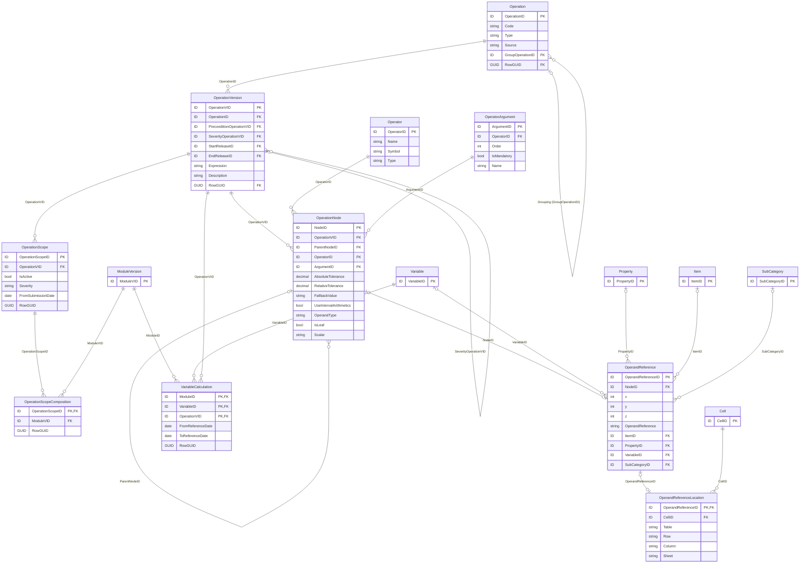

# 5.4 Operations on data

In addition to explicit and comprehensive description and unique identification of information
requirements, DPM enables representation of definitions of Operations on data. These could be:

- quality checks related to imposing constraints on requested data values or their formats,
- documentation of logical and arithmetic relations between reported data,
- data transformations enabling producing new data from reported observations according to
  certain formulas.

These definitions can be used by software applications parsing reports to execute Operations on
reported data.

## 5.4.1 Operations

As indicated on Figure 35, Operations are represented in form of Abstract Syntax Tree (AST)[^21], where
tree nodes are Operators
([4.1.1.5](../ownership-documentation.md#4115-operator-and-operator-argument)) or OperandReferences
referring to Variables ([5.3.1](variables.md#531-variable)), Properties ([5.1.4](glossary.md#514-property)),
Items ([5.1.2](glossary.md#512-item)), SubCategories ([5.1.3](glossary.md#513-subcategory)) or – through
OperandReferenceLocation to Cells ([5.2.1.3](rendering-packaging.md#5213-cell-and-tableversioncell)).

[^21]: <https://en.wikipedia.org/wiki/Abstract_syntax_tree>

<figure markdown="span">

<figcaption>Figure 35. Entities and relations of Operations component.</figcaption>
</figure>

!!! note

    Operations are represented as Abstract Syntax Trees: each `OperationNode` links to an
    `Operator` (and an `OperatorArgument`) or, when it is a leaf, to an `OperandReference` that
    points to a `Variable`, `Property`, `Item` or `SubCategory` — or, via
    `OperandReferenceLocation`, to a `Cell`. Referenced entities (`Cell`, `Variable`, `Property`,
    `Item`, `SubCategory`, `ModuleVersion`) are shown reduced to their key; their full definitions
    are in the glossary, rendering and variables figures.

Operation Type indicates if Operation represents:

- "validation" – a quality check checking correctness and consistency of reported fata reported
  data,
- "calculation" – transformation of reported data to produce new derived data, e.g. ratios,
  aggregates, etc,
- "precondition" – check that determines if another related Operation should be executed,
- "conditional_severity" – test that determines severity of another related Operation.

Operations can be grouped, nested and sequenced. This latter is used for Operations that serve as a
precondition or inform how severity is determined.

Operation Source indicates the origin of Operation which can be one of the following:

- "sign" – checks if a reported value is positive or negative, derived from TableVersionCell.Sign
  ([5.2.1.3](rendering-packaging.md#5213-cell-and-tableversioncell)),
- "hierarchy" – originates from one of SubCategories which structure along with ArithmeticOperators
  and ComparisonOperators ([5.1.3](glossary.md#513-subcategory)) were identified by Modellers as
  applicable to verify reported data or produce new date,
- "existence" – checks if mandatory data was reported, derived from TableVersionCell.IsNullable
  ([5.2.1.3](rendering-packaging.md#5213-cell-and-tableversioncell)),
- "property_constraint" – ensures that Property is assigned with allowed Items (derived from
  SubCategories applied to Variables for a given Property),
- "user_defined" – neither of the above, typically defined by modeller by indicating Table Headers,
  Cells, Variables or glossary terms and applying them in test expression along with Operators and
  scalars,
- "variant" – as above but defined on TableGroups whose type is "templateScope"
  ([5.2.1.4](rendering-packaging.md#5214-table-group)) and therefore propagated to all Tables that
  this TableGroup or its descendants are composed of (via TableGroupComposition).

Operation is versioned by means of OperationVersion referring to Release
([4.2.1](../ownership-documentation.md#421-releases)).

OperationVersion applies to data reported for Modules it is connected to. For Operations whose Type
is "validation", this connection is made through OperationScope and OperationScopeComposition to
enable handling situations where Operation has different severity depending on the Module or can be
deactivated/re-activated starting from certain submission date
([4.2.3](../ownership-documentation.md#423-deactivations)). Operations whose Type is "calculation" are
additionally linked to the derived Variable through VariableCalculation.

As explained above, Operations are represented as trees whose branches and leaves (OperationNodes)
link to Operators ([4.1.1.5](../ownership-documentation.md#4115-operator-and-operator-argument)) and
Operands. Detailed explanation of this mechanism and description of attributes of these entities can
be found in the DPM XL and ML documentation.

Operation, OperationVersion and OperationScope are Concepts and therefore are assigned with
Owner, where the latter two inherit the Owner of the first. All three can have references
([4.1.3.2](../ownership-documentation.md#4132-references-to-documentation)).

Description of OperationVersion can be translated
([4.1.3.1](../ownership-documentation.md#4131-translations)) to any natural language while Expression
can be reflected in any programming language (e.g. Java, .Net, Python, R, SQL) or other formal
language (different syntaxes build according to specified grammar).

## 5.4.2 Handling external information

Some Operations refer to external data i.e. information not belonging to any Framework
([5.2.2.1](rendering-packaging.md#5221-framework) – and hence Modules
[5.2.2.2](rendering-packaging.md#5222-module)) and therefore not exchanged in reports. This could be
in particular:

- master data about reporting entities (that may impact data to be disclosed in reports or determine
  which ratios or aggregates can computed based on reported data), or
- reference data (e.g. registry of entities or instruments, that can be crosschecked against reported
  information).

Such metadata can be resembled in DPM as Properties ([5.1.4](glossary.md#514-property)) of dedicated
Categories ([5.1.1](glossary.md#511-category)), and eventually as Variables ([5.3.1](variables.md#531-variable))
which as Operands can be referred from Operations and treated as parameters, that during execution
are replaced with values from this master or reference data.
