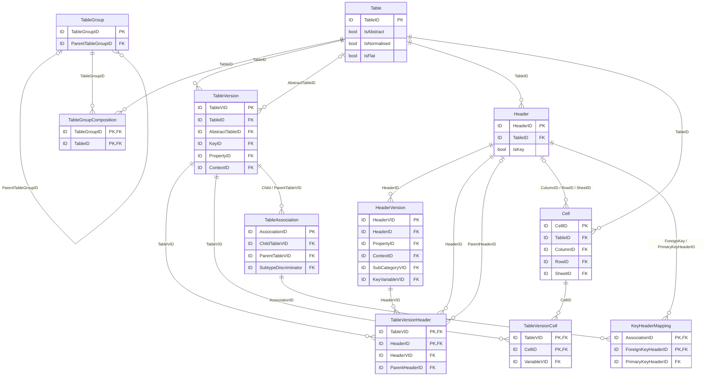
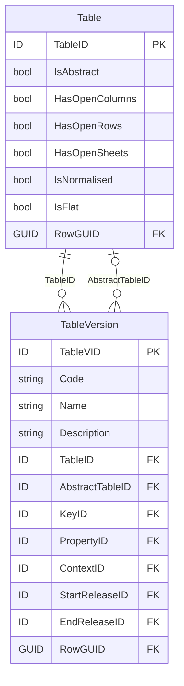
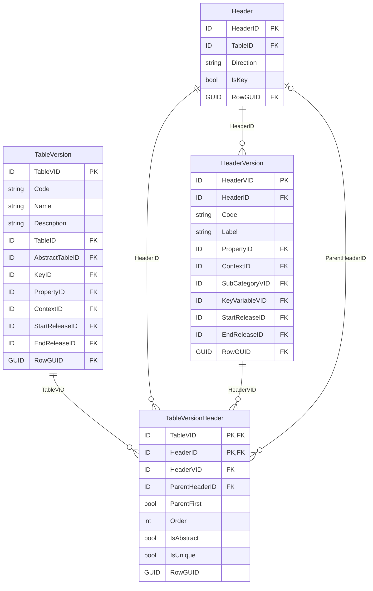
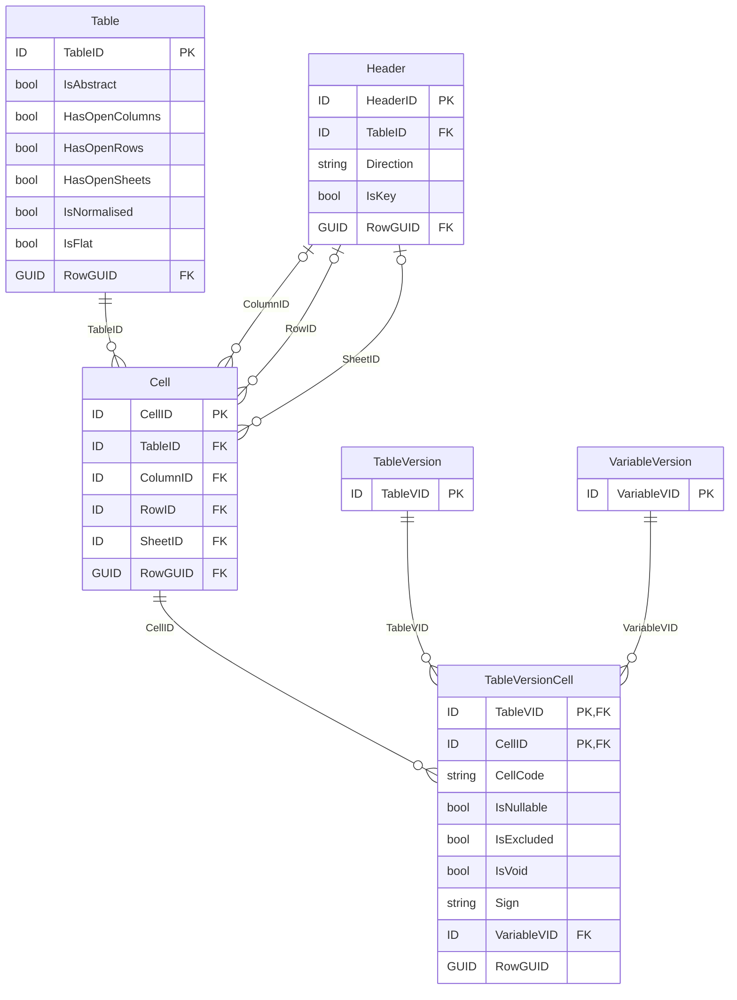
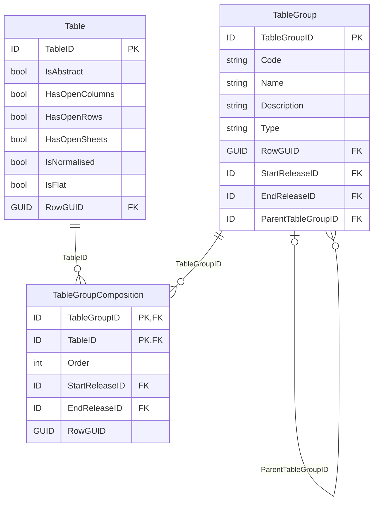
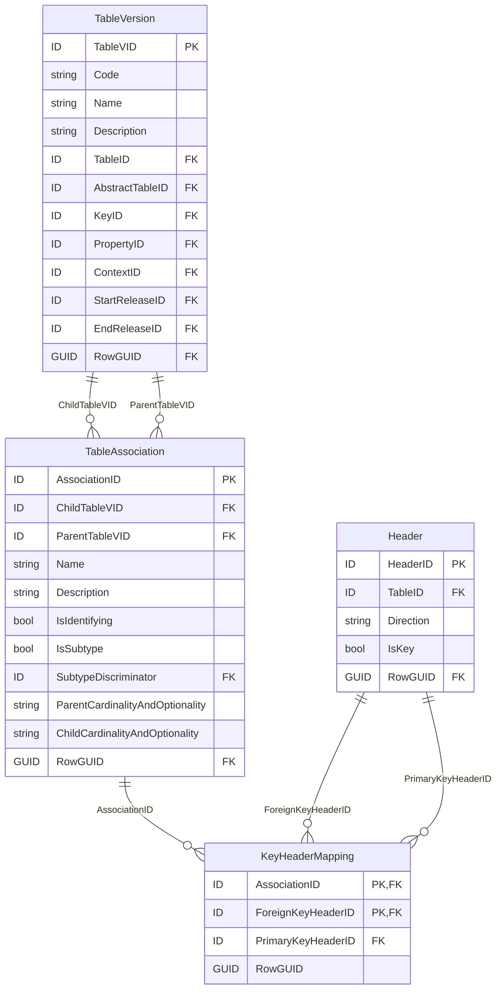
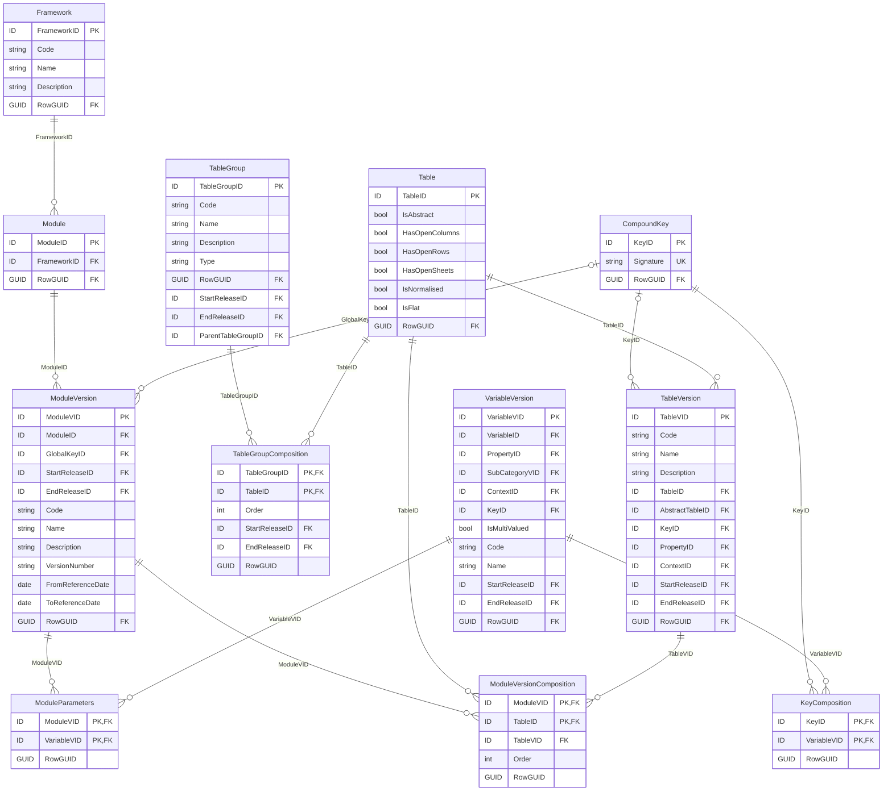
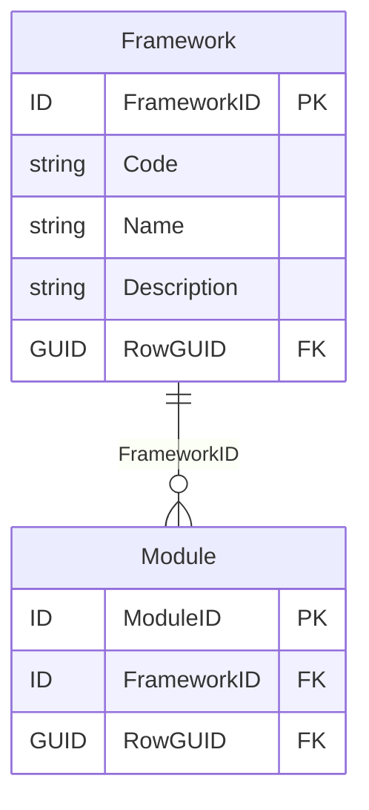
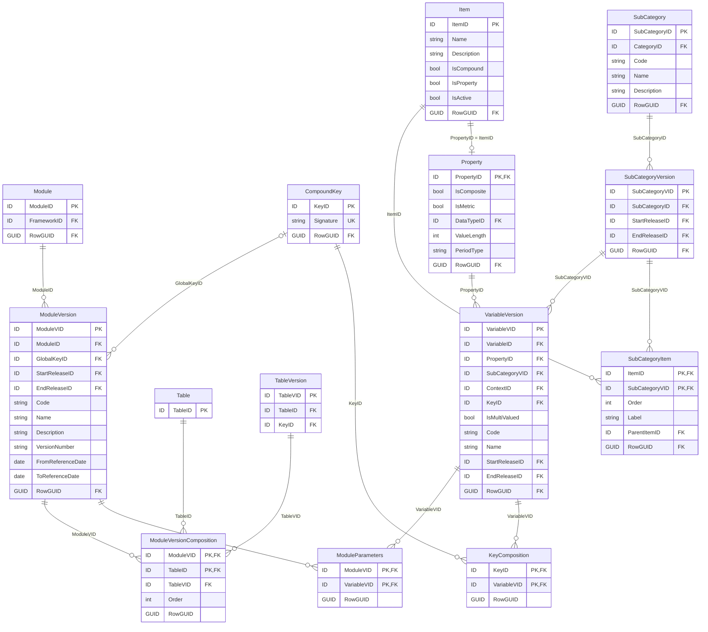

# 5.2 Grouping, rendering, and packaging of information requirements

Information requirements defined in regulations are typically represented in tabular format and
grouped by subject, area or scope. Therefore, as presented on Figure 23, DPM Metamodel enables
definition of Tables ([5.2.1.1](#5211-table-and-tableversion)) that can be related to one another and
gathered in TableGroups ([5.2.1.4](#5214-table-group)).

Tables can be also assembled in Modules ([5.2.2.2](#5222-module)) in order to indicate what
information is required to be reported by which institutions and under what circumstances for a given
reference date.

Modules are packaged thematically in Frameworks ([5.2.2.1](#5221-framework)), where Framework
typically represents a piece of legislation that resulted in the need for definition of a set of Tables to
be reported for these Modules.

Tables are built from Headers
([5.2.1.2](#5212-header-tableversionheader-and-headerversion)) of columns and optionally rows or
sheets, on intersection of which are Cells ([5.2.1.3](#5213-cell-and-tableversioncell)). These Cells, but
also Key Headers in case of open Tables, result in Variables ([5.3.1](variables.md#531-variable))
representing each reportable value.

```mermaid
erDiagram
  Framework {
    ID FrameworkID PK
  }
  Module {
    ID ModuleID PK
    ID FrameworkID FK
  }
  ModuleVersion {
    ID ModuleVID PK
    ID ModuleID FK
    ID GlobalKeyID FK
  }
  ModuleParameters {
    ID ModuleVID PK,FK
    ID VariableVID PK,FK
  }
  ModuleVersionComposition {
    ID ModuleVID PK,FK
    ID TableID PK,FK
    ID TableVID FK
  }
  Variable {
    ID VariableID PK
    string Type
  }
  VariableVersion {
    ID VariableVID PK
    ID VariableID FK
    ID PropertyID FK
    ID SubCategoryVID FK
    ID ContextID FK
    ID KeyID FK
  }
  CompoundKey {
    ID KeyID PK
  }
  KeyComposition {
    ID KeyID PK,FK
    ID VariableVID PK,FK
  }
  TableGroup {
    ID TableGroupID PK
    ID ParentTableGroupID FK
  }
  TableGroupComposition {
    ID TableGroupID PK,FK
    ID TableID PK,FK
  }
  Table {
    ID TableID PK
  }
  TableVersion {
    ID TableVID PK
    ID TableID FK
    ID AbstractTableID FK
    ID KeyID FK
    ID PropertyID FK
    ID ContextID FK
  }
  Header {
    ID HeaderID PK
    ID TableID FK
    bool IsKey
  }
  HeaderVersion {
    ID HeaderVID PK
    ID HeaderID FK
    ID PropertyID FK
    ID ContextID FK
    ID SubCategoryVID FK
    ID KeyVariableVID FK
  }
  TableVersionHeader {
    ID TableVID PK,FK
    ID HeaderID PK,FK
    ID HeaderVID FK
    ID ParentHeaderID FK
  }
  Cell {
    ID CellID PK
    ID TableID FK
    ID ColumnID FK
    ID RowID FK
    ID SheetID FK
  }
  TableVersionCell {
    ID TableVID PK,FK
    ID CellID PK,FK
    ID VariableVID FK
  }
  TableAssociation {
    ID AssociationID PK
    ID ChildTableVID FK
    ID ParentTableVID FK
  }
  KeyHeaderMapping {
    ID AssociationID PK,FK
    ID ForeignKeyHeaderID PK,FK
    ID PrimaryKeyHeaderID FK
  }
  Context {
    ID ContextID PK
  }
  SubCategoryVersion {
    ID SubCategoryVID PK
  }
  Framework ||--o{ Module : "FrameworkID"
  Module ||--o{ ModuleVersion : "ModuleID"
  ModuleVersion ||--o{ ModuleParameters : "ModuleVID"
  VariableVersion ||--o{ ModuleParameters : "VariableVID"
  ModuleVersion ||--o{ ModuleVersionComposition : "ModuleVID"
  Table ||--o{ ModuleVersionComposition : "TableID"
  TableVersion ||--o{ ModuleVersionComposition : "TableVID"
  CompoundKey |o--o{ ModuleVersion : "GlobalKeyID"
  Variable ||--o{ VariableVersion : "VariableID"
  CompoundKey ||--o{ KeyComposition : "KeyID"
  VariableVersion ||--o{ KeyComposition : "VariableVID"
  CompoundKey |o--o{ TableVersion : "KeyID"
  TableGroup |o--o{ TableGroup : "ParentTableGroupID"
  TableGroup ||--o{ TableGroupComposition : "TableGroupID"
  Table ||--o{ TableGroupComposition : "TableID"
  Table ||--o{ TableVersion : "TableID"
  Table |o--o{ TableVersion : "AbstractTableID"
  Table ||--o{ Header : "TableID"
  Header ||--o{ HeaderVersion : "HeaderID"
  TableVersion ||--o{ TableVersionHeader : "TableVID"
  Header ||--o{ TableVersionHeader : "HeaderID"
  HeaderVersion ||--o{ TableVersionHeader : "HeaderVID"
  Table ||--o{ Cell : "TableID"
  Header |o--o{ Cell : "ColumnID / RowID / SheetID"
  Cell ||--o{ TableVersionCell : "CellID"
  TableVersion ||--o{ TableVersionCell : "TableVID"
  VariableVersion ||--o{ TableVersionCell : "VariableVID"
  TableVersion ||--o{ TableAssociation : "Child / ParentTableVID"
  TableAssociation ||--o{ KeyHeaderMapping : "AssociationID"
  Header ||--o{ KeyHeaderMapping : "ForeignKey / PrimaryKeyHeaderID"
  Context |o--o{ TableVersion : "ContextID"
  Context |o--o{ HeaderVersion : "ContextID"
  Context |o--o{ VariableVersion : "ContextID"
  SubCategoryVersion |o--o{ HeaderVersion : "SubCategoryVID"
  SubCategoryVersion |o--o{ VariableVersion : "SubCategoryVID"
```

<figure markdown="span">

<figcaption>Figure 23. Information requirements component entities and relations.</figcaption>
</figure>

!!! note

    This is the master overview of the grouping, rendering and packaging component together with
    its links to Variables. Only primary and foreign keys are listed; the full attribute set of
    each entity is given in the dedicated figures of sections [5.2.1](#521-grouping-and-rendering)
    and [5.2.2](#522-packaging), and in [Figure 33](variables.md#531-variable) for Variables.

## 5.2.1 Grouping and Rendering

Rendering component of the metamodel serves an important role in the modelling process.

Modellers define tabular views following the underlying regulations and subsequently, as presented
on Figure 24, assign these Tables ([5.2.1.1](#5211-table-and-tableversion)) and their Headers
([5.2.1.2](#5212-header-tableversionheader-and-headerversion)) with terms from Glossary
([5.1](glossary.md)) to express their meaning. Table Cells ([5.2.1.3](#5213-cell-and-tableversioncell))
result from Headers.

Table Headers or Cells result in Variables ([5.3.1](variables.md#531-variable)).

Tables can be grouped ([5.2.1.4](#5214-table-group)), associated to one another in terms of
primary/foreign keys, optionality and cardinality of relations, subtyping, etc.
([5.2.1.5](#5215-table-relation)) or related to one another in other ways
([5.2.1.2](#5212-header-tableversionheader-and-headerversion)).

<figure markdown="span">

<figcaption>Figure 24. Rendering component entities and relations.</figcaption>
</figure>

!!! note

    This overview shows the entities of the rendering component and the relationships between
    them; only primary and foreign keys are listed. The full attribute set of each entity is given
    in the dedicated figures: [Figure 25](#5211-table-and-tableversion) (Table/TableVersion),
    [Figure 26](#5212-header-tableversionheader-and-headerversion) (Header), [Figure 27](#5213-cell-and-tableversioncell)
    (Cell), [Figure 28](#5214-table-group) (TableGroup), [Figure 29](#5216-tableassociation-and-keymapping)
    (TableAssociation).

### 5.2.1.1 Table and TableVersion

As presented on Figure 25, Table can be flagged as abstract (Table.IsAbstract set to TRUE) or
non-abstract (Table.IsAbstract set to FALSE). Abstract Tables are defined when a single tabular view
defined in a regulation needs to be decomposed in more than one Table, due to for example:

- DPM modelling assumptions and constraints, disallowing for example one Property
  ([5.1.4](glossary.md#514-property)) to be used on a Header
  ([5.2.1.2](#5212-header-tableversionheader-and-headerversion)) of a row and a Header of a column
  of one Table at the same time,
- normalization of tables to minimize redundancies and dependencies, in which case
  Table.IsNormalised set to TRUE indicates that a non-abstract Table resulted from normalization
  of an abstract Table.

In case when there is no need to split a tabular view defined in legislation to more Tables (i.e.
abstract and non-abstract Tables are identical), the model does not define any abstract Table for this
tablular view and contains only one non-abstract Table.

Information about relations between abstract Table and resulting decompose non-abstract Tables is
defined on TableVersions (see below) of non-abstract Tables by indicating there the originating
abstract Table on TableVersion.AbstractTableID.

While both, abstract and non-abstract Tables can be assigned with Headers
([5.2.1.2](#5212-header-tableversionheader-and-headerversion)) and Cells
([5.2.1.3](#5213-cell-and-tableversioncell)), only non-abstract Tables can be modelled with glossary
([5.1](glossary.md)) concepts (i.e. their Headers may refer to Properties, SubCategories, Contexts and
link to Variables).

Table.IsFlat flag set to TRUE indicates that Table modelling is done using Properties only and
contains no Contexts which is typical case for statistical tables as defined for example in SDMX. This
may impact the behaviour of Operations (e.g. filter function).

Tables are versioned by means of TableVersion referring to a Release
([4.2.1](../ownership-documentation.md#421-releases)). This enables tracking evolution of a Table in
time for both – graphical representation of a tabular view as well as changes in its modelling (i.e.
referenced glossary terms). "version_fix" and "version_new" Concept relations
([4.1.4](../ownership-documentation.md#414-concept-relation)) may be used to support this tracing in
more complex scenarios (e.g. when updating past versions).

Modellers identify Table by Code and Name and may provide Description
([4.4](../ownership-documentation.md#44-naming-convention)). These attributes are defined on
TableVersion corresponding to that Table, to enable their change in time and recoding all
historization.

HasOpenColumns, HasOpenRows and HasOpenSheets indicate if a Table is open - i.e. contains
Headers ([5.2.1.2](#5212-header-tableversionheader-and-headerversion)) which are Key Variables to
other Headers representing Fact Variables ([5.3.2](variables.md#532-variable-types)) - and in which
direction it is opened (as columns, rows and/or sheets - Table can be open in one, two or all three
directions).

<figure markdown="span">

<figcaption>Figure 25. Table and TableVersion.</figcaption>
</figure>

TableVersion may link to glossary terms - Properties ([5.1.4](glossary.md#514-property)) or
Property-Item pairs gathered in Contexts
([5.1.8](glossary.md#518-application-of-glossary-terms-to-other-components-of-the-metamodel)). This
information is applied to all Headers ([5.2.1.2](#5212-header-tableversionheader-and-headerversion))
and hence all Cells ([5.2.1.3](#5213-cell-and-tableversioncell)) of that TableVersion.

TableVersion.KeyID links to CompondKey ([5.3.4](variables.md#534-compoundkey-and-its-keycomposition))
identifying Key Variables applicable to Fact Variables ([5.3.2](variables.md#532-variable-types)) of this
TableVersion.

Table is a Concept that can be assigned with an Owner
([4.1.2](../ownership-documentation.md#412-concept-and-ownership)). TableVersion receives Owner from
Table it corresponds to. Both Table and TableVersion can be linked to Reference
([4.1.3.2](../ownership-documentation.md#4132-references-to-documentation)). TableVersion.Name and
TableVersion.Description are translatable ([4.1.3.1](../ownership-documentation.md#4131-translations)).

### 5.2.1.2 Header, TableVersionHeader and HeaderVersion

Header represents each "Row", "Column" or a "Sheet" as per Header.Direction.

As Header description and definition may change in time (due to bug fixes, improvements to
modelling, etc), each Header results in HeaderVersion. HeaderVersion is versioned by means of
reference to Release ([4.2.1](../ownership-documentation.md#421-releases)).

<figure markdown="span">

<figcaption>Figure 26. Header, TableVersionHeader and HeaderVersion.</figcaption>
</figure>

As presented on Figure 26, HeaderVersion identifies Header Code and provides its Label (the latter is
translatable, [4.1.3.1](../ownership-documentation.md#4131-translations)).

HeaderVersion links to glossary terms ([5.1](glossary.md)) that provide semantics to explain the
meaning of each header. As explained in section
[5.1.8](glossary.md#518-application-of-glossary-terms-to-other-components-of-the-metamodel) this is
achieved by referring from HeaderVersion to:

- Property ([5.1.4](glossary.md#514-property)) that is quantitative (metric) or qualitative but
  non-enumerated or enumerated Property in which case it is required to also indicate SubCategory,
- Property-Item pairs gathered in Contexts ([5.1.5](glossary.md#515-context-and-contextcomposition)).

IsKey set to TRUE implies that Header represents a Key Variable ([5.3.2](variables.md#532-variable-types)).
As a result, HeaderVersion.KeyVariableVID of this Header points to VariableVersion
([5.3.3](variables.md#533-variableversions)) that is a Key Variable. Such Header is not linked from any
Cell ([5.2.1.3](#5213-cell-and-tableversioncell)). Only headers who contribute to definition of a Fact
Variable result in Cells.

HeaderVersion refers to TableVersion ([5.2.1.1](#5211-table-and-tableversion)) via TableVersionHeader.
This enables reuse of Headers across TableVersions and provides information about changes in
structure of any Table in time. As Headers' structure can be rearranged between TableVersions, the
following attributes are applied on TableVersionHeader:

- nesting of Headers (ParentHeaderID),
- rendering of Parent Header before (ParentFirst set to TRUE) or after its Children,
- Order of presentation of Headers,
- marking Headers as "grouping only" – i.e. not resulting in cells (IsAbstract set to TRUE),
- indicating if values reported for Key Variable corresponding to this Header or Fact Variables in
  Cells resulting from Headers must be unique (IsUnique set to TRUE).

Owner ([4.1.2](../ownership-documentation.md#412-concept-and-ownership)) of Header (and hence
HeaderVersion) must be the same as Owner of Table which this Header belongs to (Header.TableID).

As Concepts, Header and HeaderVersion can be linked to Reference
([4.1.3.2](../ownership-documentation.md#4132-references-to-documentation)). HeaderVersion.Label is
translatable ([4.1.3.1](../ownership-documentation.md#4131-translations)).

### 5.2.1.3 Cell and TableVersionCell

As presented on Figure 27, Cell must refer to at least one leaf-level Column or Row Header
([5.2.1.2](#5212-header-tableversionheader-and-headerversion)) but may also point to two or maximum
three (i.e. one for each: Column, Row and Sheet).

Key Headers ([5.2.1.2](#5212-header-tableversionheader-and-headerversion)) do not result in Cells.

<figure markdown="span">

<figcaption>Figure 27. Cell and TableVersionCell.</figcaption>
</figure>

As described in [5.2.1.1](#5211-table-and-tableversion), Tables may be modified in time by means of
TableVersion referring to HeaderVersion
([5.2.1.2](#5212-header-tableversionheader-and-headerversion)) through TableVersionHeader. As a
result, Cells can refer to various TableVersions via TableVersionCell, while still representing the same
Header(s).

TableVersionCell indicates:

- a code of a Cell (if exists): CellCode; such information may be useful for example in mapping to
  legislation if it contains such codes or to legacy systems or exchange formats which are forms
  driven and therefore base on cells coordinates;
- if a Cell is mandatory: IsNullable set to FALSE; report must contain data for Variable
  ([5.3.1](variables.md#531-variable)) corresponding to this Cell (this is subject to the presence of
  respective filing indicators);
- if a Cell is not reportable: IsExcluded set to TRUE; data for Variable corresponding to this Cell
  is not requested for this Table; such Cell is typically displayed as greyed out or criss-crossed;
- that a Cell does not result in any Variable ([5.3.1](variables.md#531-variable)): IsVoid is set to
  TRUE; i.e. its definition stemming from concatenation of semantics indicated by glossary
  ([5.1](glossary.md)) terms applied on Headers on which intersection this Cell is defined is
  illogical (e.g. "Equity instruments" issued by "Government" with certain "Maturity period"); note
  that TableVersionCell whose IsVoid is set to FALSE must point to VariableVersion
  ([5.3.3](variables.md#533-variableversions)) resulting from/corresponding to this Cell;
- if a value reportable for a Cell is a "positive" or "negative" number: imposed by Sign attribute;
  note that this and more complex constraints related to the expected value reportable for a given
  Cell are imposed by means of Operations ([5.4.1](operations.md#541-operations)).

In case Cell results from Header whose TableVersionHeader.IsUnique is set to TRUE then values
reported in each Cell across all Cells for that Header must be unique.

Owner ([4.1.2](../ownership-documentation.md#412-concept-and-ownership)) of a Cell (and therefore
TableVersionCell for that Cell) must be the same as Owner of Table which this Cell belongs to
(Cell.TableID).

As Concepts, Cell and TableVersoinCell can be linked to Reference
([4.1.3.2](../ownership-documentation.md#4132-references-to-documentation)).

### 5.2.1.4 Table Group

As presented on Figure 28, TableGroups gathers Tables ([5.2.1.1](#5211-table-and-tableversion)) via
TableGroupComposition. TableGroupComposition.Order informs about the sequence of Tables in
TableGroup that shall be applied for example when displaying Tables under TableGroup in user
interface. Composition of TableGroup in terms of Tables it gathers may change between Releases
([4.2.1](../ownership-documentation.md#421-releases)).

<figure markdown="span">

<figcaption>Figure 28. TableGroup and TableGroupComposition.</figcaption>
</figure>

TableGroups are assigned with Code and Name and may also be provided with Description.

TableGroups can also gather other TableGroups by being indicated as their Parent (ParentGroupID).
This nesting can have multiple levels.

TableGroups may be created for various purposes as indicated by TableGroup.Type. DPM metamodel
envisages at least the following options (that can be further extended by metadata modellers):

- "templateGroup",
- "template",
- "templateVariant",
- "templateScope".

For example, in case of EIOPA DPM models, TableGroup of Type "templateGroup" gathers
TableGroups which are "templates", that in turn result in multiple "templateVariant" Type
TableGroups.

TableGroups of Type "templateScope" can also be nested. DPM XL syntax enables using their Codes
in Operation.Expression instead of Table Codes. This mechanism simplifies definition of Operations
that apply to multiple Tables belonging to such TableGroup or any of its descendant TableGroups
whose Type is also "templateScope".[^20]

[^20]: Application of this mechanism requires consistent assignment of Header Codes in Tables under
    such TableGroup.

TableGroups are relatively stable metamodel Concepts. Nevertheless, their application can be
controlled by indicating Release in which they were created or stopped being used (which can be also
determined by calculating if there are Tables in use that are linked to TableGroup through
TableGroupComposition).

TableGroup is a Concept that can be assigned with Owner
([4.1.2](../ownership-documentation.md#412-concept-and-ownership)). It can be linked to Reference
([4.1.3.2](../ownership-documentation.md#4132-references-to-documentation)) and its Name and
Description attributes are translatable ([4.1.3.1](../ownership-documentation.md#4131-translations)).

### 5.2.1.5 Table Relation

The primary relation between Tables resulting from decomposition of one Table into many (for
various purposes) is described in section [5.2.1.1](#5211-table-and-tableversion).

Other relations between Tables can be constructed using Concept Relation mechanism
([4.1.4](../ownership-documentation.md#414-concept-relation)). DPM currently enables lining tables
using "table_variant" ConceptRelation.Type that indicates at the target of the relation Table that is a
variant of Table at its source. This mechanism can be used to indicate that one Table e.g., "Balance
sheet for ring fence funds" is a variant of "Balance sheet" Table. Other relation types can be defined
by Modellers.

### 5.2.1.6 TableAssociation and KeyMapping

As explained in [5.2.1.1](#5211-table-and-tableversion), Tables can be split due to normalisation. More
detailed information about how these decomposed Tables relate to one another or can be assembled
back in the demoralised view, may be indicated using TableAssociation and KeyHeaderMapping as
presented on Figure 29.

<figure markdown="span">

<figcaption>Figure 29. TableAssociation and KeyMapping.</figcaption>
</figure>

!!! note

    When `IsSubtype` = TRUE, `SubtypeDiscriminator` points to a `Header` of the Parent Table whose
    values determine the target subtype(s). `KeyHeaderMapping` indicates which `Header` from the
    Parent Table is used as the Foreign Key Header in the Child Table.

TableAssociation associates Child Table with Parent Table. Definition and documentation of the
association is contained in TableAssociation.Name and TableAssociation.Description (both of which
are translatable - [4.1.3.1](../ownership-documentation.md#4131-translations)). Other attributes of
TableAssociation describe the characteristics of the association:

- if the relationship is identifying (IsIdentifying set to TRUE) indicating that Child Table is
  dependent on Parent Table (and cannot exists without it);
- if it a Child Table is a subtype of Parent Table, which in turn is a supertype (IsSubtype set to
  TRUE); in this case SubtypeDiscriminator attribute points to Header of Parent Table whose values
  determine the target subtype(s);
- cardinality and optionality of relationship defined on:
    - Parent end (ParentCardinalityAndOptionality): '0_1', '1', '0_m', '1_m',
    - Child end (ChildCardinalityAndOptionality): '0_1', '1', '0_n', '1_n'.

For association between Open Tables (i.e. including one or more Key Variables), it is possible to map
Headers of these Tables by indicating in KeyHeaderMapping entity which Header from Parent Table is
used as Foreign Key Header in Child Table. Note that associated Headers do not need to be Key
Headers (e.g. Header from Parent Table used as Foreign Key in Child Table does not need to be a Key
Header in Parent Table).

Owner ([4.1.2](../ownership-documentation.md#412-concept-and-ownership)) of TableAssociation must
be the same as Owner of Tables which it associates.

TableAssociation must have Name and may have Description (which are translatable,
[4.1.3.1](../ownership-documentation.md#4131-translations)).

As a Concept, TableAssociation can be linked to Reference
([4.1.3.2](../ownership-documentation.md#4132-references-to-documentation)).

## 5.2.2 Packaging

Information requirements are packaged thematically in Frameworks ([5.2.2.1](#5221-framework)) that
typically reflect legislation imposing certain reporting requirements. Apart from what is being
collected, regulations determine also reporting population and reporting calendar or circumstances
that require data to be submitted. This is managed by means of Modules ([5.2.2.2](#5222-module)).
Packaging component entities and their relations to rendering and Variables described in the next
sections of this documents are presented on Figure 30.

<figure markdown="span">

<figcaption>Figure 30. Packaging component entities and relations.</figcaption>
</figure>

### 5.2.2.1 Framework

Framework is the uppermost level of grouping of information requirements. It typically corresponds to
a piece of legislation, therefore its association to Owner
([4.1.2](../ownership-documentation.md#412-concept-and-ownership)) and Reference
([4.1.3.2](../ownership-documentation.md#4132-references-to-documentation)) is particularly important
as it constitutes existence of this Framework by indicating the Organisation that issued this regulation
and/or manages this Framework.

<figure markdown="span">

<figcaption>Figure 31. Framework and Module.</figcaption>
</figure>

As presented on Figure 31, Framework is identified by its Code. In addition, Framework must have
Name and may be provided with Description (both are translatable,
[4.1.3.1](../ownership-documentation.md#4131-translations))

### 5.2.2.2 Module

Module gathers information requirements that are supposed to be reported together, i.e., in one
report.

<figure markdown="span">

<figcaption>Figure 32. Module, its Composition and Parameters.</figcaption>
</figure>

As a result of bug fixes or modifications to the underlying regulations, composition of information
requirements for Module may change in time. Therefore, Module is versioned by means of
ModuleVersion that refers to Release ([4.2.1](../ownership-documentation.md#421-releases)). More
importantly, ModuleVersion definition includes FromReferenceDate and (optional) ToReferenceDate
attributes that identify its application dates ([4.2.2](../ownership-documentation.md#422-application-dates)).
This enables determining which ModuleVersion shall be used for reporting of data for a given
reference date (for a given Module there must be only one Version applicable for one reference date).

ModuleVersion is identified by Code and Name and may be provided with Description.

As presented on Figure 32, information requirements to be reported for ModuleVersion are defined by
indication of applicable Tables and their Versions ([5.2.1.1](#5211-table-and-tableversion)) assigned to
this ModuleVersion through the ModuleVersionComposition. This indirectly identifies all Variables
([5.3.1](variables.md#531-variable)) to be reported for ModuleVersion (which results from Key Headers
and Cells of all linked TableVersions).

Each Module covers one reporting scenario, usually applicable to specific type of reporting entities,
with observations measured is specified manner for a given period or at a moment in time, in a
particular currency applicable to all monetary amounts. Such global parameters applicable to all Fact
Variables ([5.3.2](variables.md#532-variable-types)) in ModuleVersion can be expressed by Key Variables
composed in CompoundKey ([5.3.4](variables.md#534-compoundkey-and-its-keycomposition)) associated
to ModuleVersion or by Attribute Variables linked to ModuleVersion via ModuleParameters. The latter
are typically constructed as Variables indicating Property and SubCategoryVersion that consist of only
one Item.

Module level parameters and Keys do not need to be repeated on (i.e. directly assigned to) every Fact
Variable belonging to this Module. They can be however overridden by another value, if explicitly
attached to Fact Variable or its Key Variable for a given Property represented by Key or Attribute
Variable applied on Module level.

Module and ModuleVersion are Concepts. They inherit Owner from Framework. Both may have
references ([4.1.3.2](../ownership-documentation.md#4132-references-to-documentation)). ModuleVersion
Name and Description are translatable ([4.1.3.1](../ownership-documentation.md#4131-translations)).
