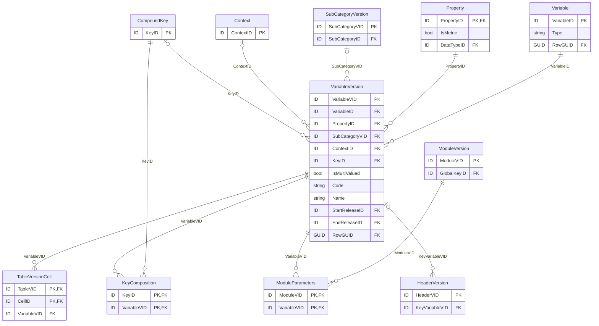
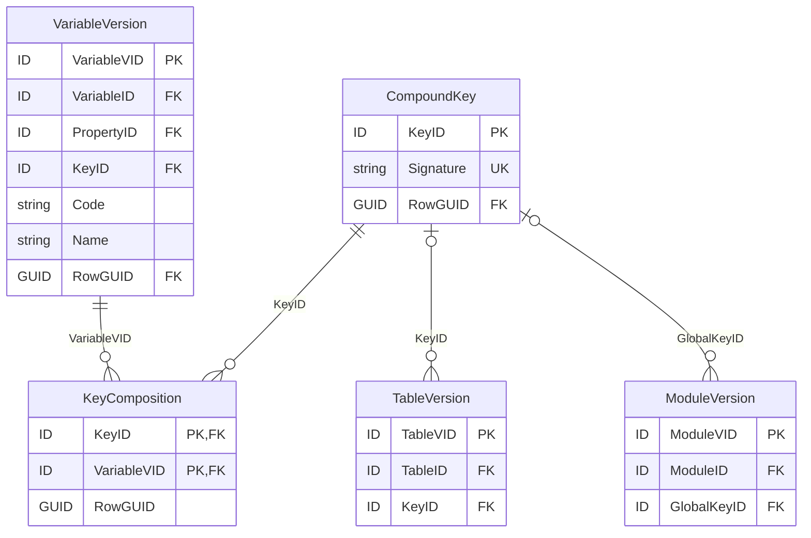

# 5.3 Identification and description of each reported value

Unique identification and description of each reportable value is required to explicitly explain what is
expected to be exchanged and enable tracking changes in modelling of each submitted value.

## 5.3.1 Variable

Each distinct quantitative or qualitative reportable value (regardless of its occurrence in rendering) is
represented in the DPM as Variable. Next sections of this chapter discuss types and versioning of
Variables. Entities and relations of this component of metamodel and their relations to other
components are presented on Figure 33.

<figure markdown="span">

<figcaption>Figure 33. Variables component entities and relations.</figcaption>
</figure>

!!! note

    Only primary and foreign keys are listed in this overview; the full attribute set of the
    related entities is given in their dedicated figures. Relationships **between** Variables (Fact
    ↔ Key via "factVariable_keyVariable", Variable ↔ Attribute via "variable_attribute", and
    "equivalent_concept" / "version_fix" / "version_new") are modelled through `ConceptRelation` /
    `RelatedConcept` — see [Figure 11](../ownership-documentation.md#414-concept-relation).

## 5.3.2 Variable Types

There are four Types of Variables:

- **Fact Variable**, which represents reported observation, typically a monetary amount, other
  numeric data, a text, a date or an enumeration. Fact Variable may refer to one or more Key
  Variables and/or Attribute Variables that are needed to complement understanding of the piece of
  data carried by Fact Variable;
- **Key Variable** may be needed by some Fact Variables in order to explicitly and uniquely identify
  exchanged observation; this identification can be Module wide (e.g., reporting entity and period)
  or apply to individual Fact Variables (e.g. appearing in an Open Table -
  [5.2.1.1](rendering-packaging.md#5211-table-and-tableversion) - where key column(s) identify
  non-key columns in each row or key sheet(s) identify all cells in that sheet of a Table);
- **Attribute Variable** provides information about some properties of exchanged observation such
  as its unit of measure, accuracy or a comment expected to be associated to it by a reporting entity
  in their report; Attribute Variable typically applies to Fact Variables but if needed can be applied
  also to Key Variables;
- **Filing Indicator Variable** which corresponds to each reporting unit (e.g. TableGroup or Table)
  that is used by Operations to determine if Operations shall be executed provided that a reporting
  unit is declared as present or not in a submitted report. In case of the EBA and EIOPA models,
  Filing Indicator Variables result from dedicated Content Tables, that list all reportable units for
  each Module. For modelling purposes, Headers and Variables of this Table apply a dedicated
  Property and Items of FilingIndicators Category (Table 8).

Variables can be related to one another by means of Concept Relation
([4.1.4](../ownership-documentation.md#414-concept-relation)). The following ConceptRelation Types are
dedicated to connecting Variables:

- "factVariable_keyVariable" – links Fact Variable (at the source of Relation) to Key Variable (at
  the target of Relation) that is needed to identify this Fact Variable,
- "variable_attribute" links Fact Variable or Key Variable (at the source of Relation) to its
  Attribute Variable (at the target of Relation).

Other Relation Types that can be used on Variables are "equivalent_concept" that connects two or
more Variables (Fact, Key, Attribute or mix of any of these) whose meaning is the same but
representation in modelling is different and "version_fix"/"version_new" to support historization by
means of Releases.

## 5.3.3 VariableVersions

Modelling of Variable may change in time. For this reason, VariableVersion represents Variable for a
given Release ([4.2.1](../ownership-documentation.md#421-releases)).

Each VariableVersion must indicate Property ([5.1.4](glossary.md#514-property)).

Additionally as explained in
[5.1.8](glossary.md#518-application-of-glossary-terms-to-other-components-of-the-metamodel),
enumerated Variable indicates SubCategory ([5.1.3](glossary.md#513-subcategory)) listing and
constraining Items ([5.1.2](glossary.md#512-item)) that are selectable options for this VariableVersion.
VariableVersion.IsMultiValued set to TRUE indicates that observation corresponding to such
enumerated Variable can be reported with two or more Items from the indicated SubCategory. When
VariableVersion.IsMultiValued is set to FALSE entities can report only one Item per observation (from
the indicated SubCategory).

Fact Variable may refer to Context ([5.1.5](glossary.md#515-context-and-contextcomposition)) if Property
assigned to it is insufficient to fully describe the meaning of that Fact Variable.

Fact Variable that requires Key Variables to be identified, links to CompoundKey
([5.3.4](#534-compoundkey-and-its-keycomposition)) gathering (via KeyComposition) all Key Variables
applicable to this Fact Variable.

VariableVersion can be identified by its Code and its description can be included in Name attribute
(which is translatable, [4.1.3.1](../ownership-documentation.md#4131-translations)).

Variable and VariableVersions are Concepts and therefore have Owner (which VariableVersion inherits
from Variable) and can have references
([4.1.3.2](../ownership-documentation.md#4132-references-to-documentation)).

## 5.3.4 CompoundKey and its KeyComposition

Open Tables ([5.2.1.1](rendering-packaging.md#5211-table-and-tableversion)) contain one or more Key
Headers ([5.2.1.2](rendering-packaging.md#5212-header-tableversionheader-and-headerversion)). Each
Key Header results in Key Variable ([5.3.2](#532-variable-types)). As presented on Figure 34, all Key
Variables of any TableVersion are gathered through KeyCompositon to one CompoundKey. This
CompoundKey is referred:

- from TableVersion and all Fact Variables of this TableVersion and/or
- by ModuleVersion ([5.2.2.2](rendering-packaging.md#5222-module)) in which case it implicitly
  applies to all Fact Variables of all Tables in this ModuleVersion (unless overridden).

<figure markdown="span">

<figcaption>Figure 34. CompoundKey and KeyComposition application to TableVersion and ModuleVersion.</figcaption>
</figure>

!!! note

    `KeyComposition` gathers the Key `VariableVersion`s of a `CompoundKey`. The same `CompoundKey`
    is referred from `TableVersion` (`KeyID`) — applying to all Fact Variables of that
    TableVersion — and/or from `ModuleVersion` (`GlobalKeyID`) — applying to all Fact Variables of
    all Tables in that ModuleVersion (unless overridden).

## 5.3.5 Variables' definition process

Although Variables ([5.3.1](#531-variable)) can be defined irrespective of the rendering, in the typicall
modelling process they result from Tables ([5.2.1.1](rendering-packaging.md#5211-table-and-tableversion)).

Fact Variables ([5.3.2](#532-variable-types)) are derived from Cells
([5.2.1.3](rendering-packaging.md#5213-cell-and-tableversioncell)), where Table level Glossary terms
contribute to definition of Headers (in which case Glossary terms are inherited, unless overridden,
from upper-level Headers - [5.2.1.2](rendering-packaging.md#5212-header-tableversionheader-and-headerversion))
and is propagated to Cells on intersection of these Headers.

Key Variables are linked from Key Headers which have no Cells attached. This is to ensure that open
(or semi-open, i.e. enumerated and constrained by means of SubCategory -
[5.1.3](glossary.md#513-subcategory)) Sheets, Columns or Rows are modelled in the same way
regardless of their graphical orientation (as ultimately it is a matter of subjective decision of a
Modeller to display these in certain direction).

Global Attribute and Key Variables are identified during definition of Modules
([5.2.2.2](rendering-packaging.md#5222-module)) they refer to.
