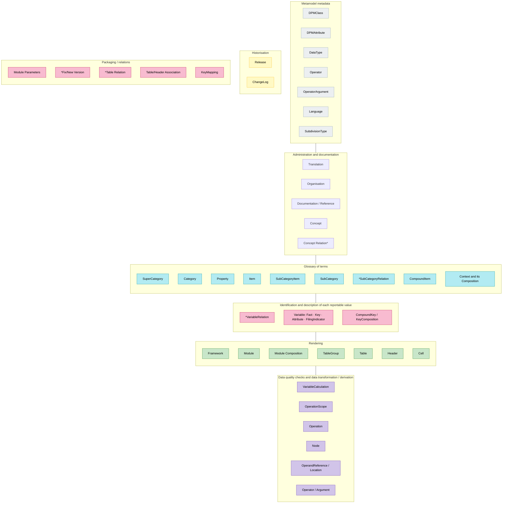

# 3 Metamodel overview

The DPM metamodel after refit consists of four main components, each serving a dedicated
purpose:

1. A **glossary of terms** ([5.1](components/glossary.md)) which are classified in Categories
   ([5.1.1](components/glossary.md#511-category)) of Properties
   ([5.1.4](components/glossary.md#514-property)) and Items
   ([5.1.2](components/glossary.md#512-item)) used in the description of information requirements.
2. **Rendering** ([5.2.1](components/rendering-packaging.md#521-grouping-and-rendering)) of
   information requirements in Tables
   ([5.2.1.1](components/rendering-packaging.md#5211-table-and-tableversion)) that can be Grouped
   ([5.2.1.4](components/rendering-packaging.md#5214-table-group)) and Related
   ([5.2.1.5](components/rendering-packaging.md#5215-table-relation) and
   [5.2.1.6](components/rendering-packaging.md#5216-tableassociation-and-keymapping)). These are
   packaged ([5.2.2](components/rendering-packaging.md#522-packaging)) in Frameworks
   ([5.2.2.1](components/rendering-packaging.md#5221-framework)) and Modules
   ([5.2.2.2](components/rendering-packaging.md#5222-module)) which represent data sets (subsets of
   information requirements) broken down by subject, scope, etc. This component supports the process
   of definition of information requirements and discovery of what is expected to be reported. It may
   serve data entry/presentation purposes.
3. The **identification and description** (using glossary terms) of each individual piece of
   information requirements ([5.3](components/variables.md)) that is to be provided with value in a
   report. These are referred to as Variables ([5.3.1](components/variables.md#531-variable)) and
   help in data exchange by providing single unique reference for each reported value as well as
   enable tracking changes in definitions resulting from fixes or other modifications in modelling to
   support data lineage. Variables typically result from Table Headers
   ([5.2.1.2](components/rendering-packaging.md#5212-header-tableversionheader-and-headerversion))
   or Table Cells ([5.2.1.3](components/rendering-packaging.md#5213-cell-and-tableversioncell)).
4. The definition of **operations on data** ([5.4](components/operations.md)) i.e., data quality
   checks (validations) and data transformation/derivations rules. Operations comprise of Operators
   (e.g. =, +, -) and Operands that may refer to glossary terms, rendering structures or Variables.

Metamodel entities identified as Concepts
([4.1.2](ownership-documentation.md#412-concept-and-ownership)) can be associated with Owner (i.e.
maintaining organization) and be provided with supportive documentation such as references to legal
acts, regulations, standards, etc.
([4.1.3.2](ownership-documentation.md#4132-references-to-documentation)). Concepts are identified
by their Code ([4.4](ownership-documentation.md#44-naming-convention)). Characteristics that explain
Concepts (e.g., Name, Description, etc) can be translatable
([4.1.3.1](ownership-documentation.md#4131-translations)).

Certain metamodel entities can be (re)used across components, e.g. Context and its Composition
([5.1.5](components/glossary.md#515-context-and-contextcomposition)) can apply to glossary,
rendering and Variables entities.

Metamodel entities or relationships between entities (e.g., associations between various types of
Concepts) can be modified in time and are therefore subject to historization by means of having
Versions relating to Releases ([4.2.1](ownership-documentation.md#421-releases)).

Figure 1 below presents an overview of the DPM metamodel described in detail in the next section
of this document.

<figure markdown="span">

<figcaption>Figure 1. DPM metamodel overview.</figcaption>
</figure>

!!! note "About the recreated diagram"

    Figure 1 in the source document is a high-level *map* that groups the metamodel entities by
    component (colour-coded) rather than a detailed entity-relationship diagram. The Mermaid
    recreation above preserves that grouping and the entity labels. The detailed relationships
    between these entities are presented in the per-component diagrams of
    [Chapter 4](ownership-documentation.md) and [Chapter 5](components/index.md).
