# 4 Metamodel, ownership and supportive documentation

!!! note "Reading the entity-relationship diagrams"

    The diagrams in this documentation are recreated from the source metamodel diagrams as
    Mermaid **entity-relationship diagrams** using crow's-foot notation:

    - `||` = exactly one (mandatory), `o|` = zero or one, `}o` / `o{` = zero or many,
      `}|` / `|{` = one or many.
    - `PK` marks a primary key, `FK` marks a foreign key, `UK` marks a unique key.
    - Entities highlighted as **Concepts** (see [4.1.2](#412-concept-and-ownership)) are noted in
      the surrounding text.

    The source diagrams list attribute *names* and their key markers; the attribute *type* tokens
    shown in the recreated diagrams (e.g. `ID`, `string`, `bool`, `date`) are indicative and added
    only to satisfy the Mermaid syntax — they are not part of the original diagrams.

## 4.1 Metamodel metadata, ownership, and supportive documentation

### 4.1.1 Metamodel metadata entities

As presented on the left-hand side of Figure 1, DPM defines a few entities that provide information
about the metamodel itself. These entities comprise of:

- DPMClass,
- DPMAttribute,
- DataType,
- SubdivisionType,
- Language,
- Operator,
- OperatorArgument

and are presented on Figure 2.

<figure markdown="span">
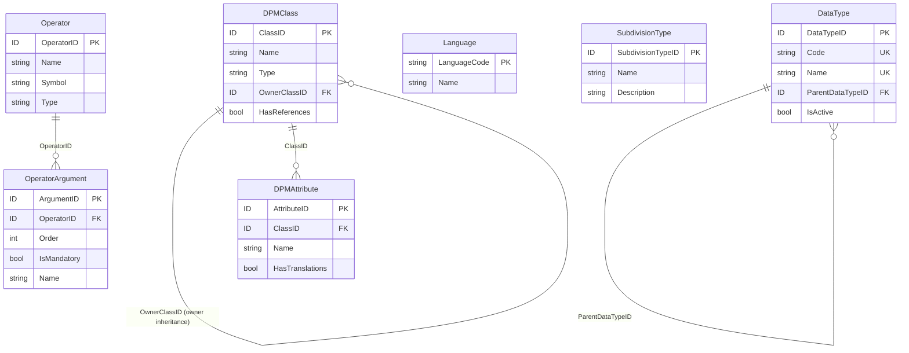
<figcaption>Figure 2. Metamodel metadata entities.</figcaption>
</figure>

Content of the metamodel metadata entities is predefined as described in the next sections of this
document, hence any changes can be introduced only by the DPM metamodel authors.

From the Modellers' perspective these entities are fixed and must not be edited.

#### 4.1.1.1 DPM Class and Attribute

DPMClass metamodel metadata entity lists of all entities of the DPM metamodel.

DPMClass.Name corresponds to the name of each entity in the metamodel.

Some entities listed in DPMClass are Concepts ([4.1.2](#412-concept-and-ownership)), i.e. these model
entities that:

- can be identified with and Owner or inherit Owner from other Concepts,
- may have references ([4.1.3.2](#4132-references-to-documentation)),
- contain attributes that are translatable ([4.1.3.1](#4131-translations)).

Concepts are those DPM metamodel entities that have a single Primary Key. The only exception is
SubCategoryItem which has two keys, however it contains attributes that are translatable
([4.1.3.1](#4131-translations)) and therefore can be considered as a Concept.

DPMClasses whose DPMClass.HasReferences equals TRUE can be provided with references (as
described in [4.1.3.2](#4132-references-to-documentation)).

DPMClasses which are Concepts may include DPMClass.OwnerClassID identifying another Concept
class from which their Owner is inherited (as described in [4.1.2](#412-concept-and-ownership)).

Table 1 lists DPMClasses which are Concepts.

| Name | Type | OwnerClass (inherited from) | HasReferences |
|---|---|---|---|
| Organisation | Independent | | Yes |
| Category | Independent | | Yes |
| Subcategory | Attributive | | Yes |
| Property | SubType | Item | Yes |
| Item | Independent | | Yes |
| Framework | Independent | | Yes |
| Module | Attributive | Framework | Yes |
| ModuleVersion | Attributive | Module | Yes |
| TableGroup | Independent | | Yes |
| Table | Independent | | Yes |
| TableVersion | Attributive | Table | Yes |
| TableAssociation | Associative | | Yes |
| Header | Attributive | Table | Yes |
| HeaderVersion | Attributive | Header | Yes |
| Cell | Associative | Table | Yes |
| Variable | Independent | | Yes |
| VariableVersion | Attributive | Variable | Yes |
| CompoundKey | Independent | | Yes |
| Context | Independent | | Yes |
| Operation | Independent | | Yes |
| OperationVersion | Attributive | Operation | Yes |
| OperationScope | Associative | Operation | Yes |
| Document | Independent | | No |
| DocumentVersion | Attributive | Document | No. |
| Subdivision | Attributive | DocumentVersion | No |
| Release | Independent | | Yes |
| SubCategoryItem | Associative | SubCategory | Yes |

<figcaption>Table 1. List of DPMClasses that are Concepts, along with their attributes.</figcaption>

DPMAttribute metamodel metadata entity lists attributes of each metamodel entity from DPMClass.
DPMAttribute.Name corresponds to the name of attribute of entity in the metamodel.

The national language of the DPM models, at least for the EBA and EIOPA, applied on all entity
attributes such as Name, Description, Label, etc. is English. Attributes whose
DPMAttribute.HasTranslation equal TRUE (e.g. Name, Description, Label, etc.) can be provided with
translations to other national languages ([4.1.3.1](#4131-translations)).

For representation of the OperationVersion.Expression the EBA and EIOPA use the DPM XL syntax.
However, using the same mechanism as for national languages translations, operations can be
represented in other syntaxes or formats (e.g. XBRL, SQL, Python).

The list of translatable attributes for each DPMClass is presented in Table 2.

| Name | DPMClass | HasTranslations |
|---|---|---|
| Name | Category | Yes |
| Description | Category | Yes |
| Name | SubCategory | Yes |
| Description | SubCategory | Yes |
| Name | Item | Yes |
| Description | Item | Yes |
| Label | SubCategoryItem | Yes |
| Name | Framework | Yes |
| Description | Framework | Yes |
| Name | ModuleVersion | Yes |
| Description | ModuleVersion | Yes |
| Name | TableGroup | Yes |
| Description | TableGroup | Yes |
| Name | TableVersion | Yes |
| Description | TableVersion | Yes |
| Label | HeaderVersion | Yes |
| Name | TableAssociation | Yes |
| Description | TableAssociation | Yes |
| Name | VariableVersion | Yes |
| Description | OperationVersion | Yes |
| Expression | OperationVersion | Yes |
| Name | Document | Yes |
| TextExcerpt | Subdivision | Yes |
| Name | Organisation | Yes |
| Acronym | Organisation | Yes |
| Description | Release | Yes |

<figcaption>Table 2. List of translatable DPMAttributes.</figcaption>

Relationship between DPMClass, DPMAttribute and Concept is presented on Figure 3.

<figure markdown="span">
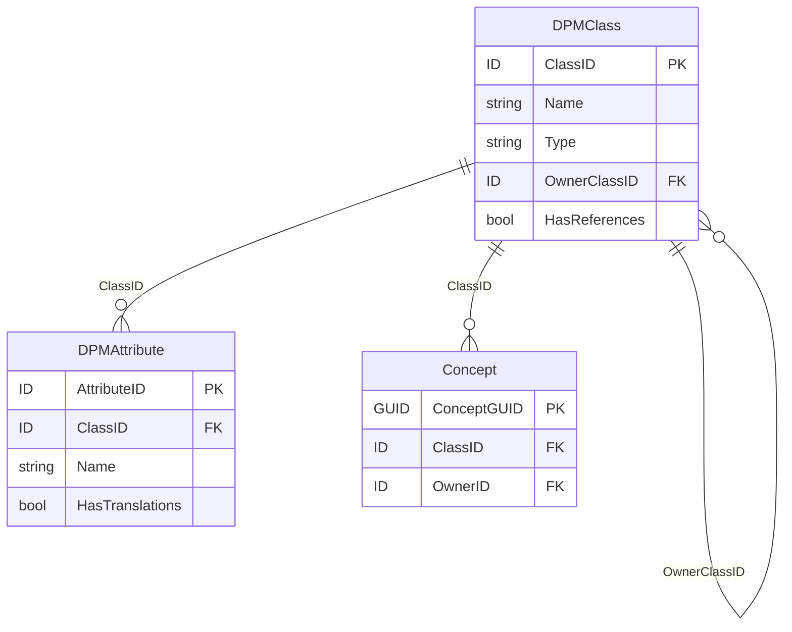
<figcaption>Figure 3. Concept, DPMClass and DPMAttribute entities.</figcaption>
</figure>

#### 4.1.1.2 Data Type

DataType entity provides the list of data types that can be used on the following metamodel entities:

- Property ([5.1.4](components/glossary.md#514-property)),
- OperationAttribute (Error! Reference source not found.).

As presented on Figure 2, each DataType is identified by Code and explained by Name.

The list of available data types is presented in see Table 3.

| Code | Name | Parent Data Type |
|---|---|---|
| i | integer | |
| r | decimal | |
| s | string (non empty) | |
| b | boolean | |
| t | true | boolean |
| dt | date time | |
| d | date | date time |
| e | enumeration | string |
| m | monetary | |
| p | percentage | |
| u | URI | |
| o | ordinals | |
| es | string (including empty string) | |

<figcaption>Table 3. List of data types.</figcaption>

Data types can be derived (by restriction) from one another. For example, True data type is a
restriction of a Boolean data type to only one value (i.e. Boolean TRUE).

DataType can be deactivated ([4.2.3](#423-deactivations)) by setting IsActive to FALSE which indicates
that such deactivated data type can no longer in use in modelling of metadata. Data types listed in
Table 3 are all active at the moment of release of this documentation.

#### 4.1.1.3 Subdivision Type

SubdivisionType is used for structuring of references to documentation
([4.1.3.2](#4132-references-to-documentation)) and as presented on Figure 4, is referred from
Subdivision.

<figure markdown="span">
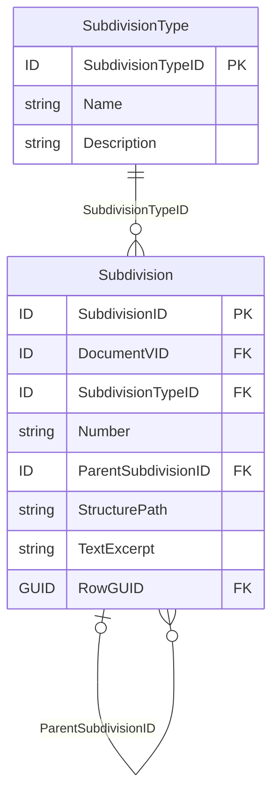
<figcaption>Figure 4. SubdivisionType entity.</figcaption>
</figure>

SubdivisionType is identified by its Name and further explained by Description. The list of
SubdivisionTypes is presented in Table 4.

| Name | Description |
|---|---|
| Chapter | For a publication that uses chapters, this part should be used to capture this information. Because chapters are not necessarily numbers, this is a string. |
| Article | Article refers to a statutory article in legal material. |
| Section | Section is used to capture information typically captured in sections of legislation or reference documents. |
| Subsection | Subsection is a subsection of the section part. |
| Paragraph | Paragraph is used to refer to specific paragraphs in a document. |
| Subparagraph | Subparagraph of a paragraph. |
| Clause | Subcomponent of a sub paragraph. |
| Subclause | Subcomponent of a clause in a paragraph. |
| Appendix | Refers to the name of an Appendix, which could be a number or text. |
| Example | Example captures examples used in reference documentation; there is a separate element for Exhibits. |
| Page | Page number of the reference material. |
| Exhibit | Exhibit refers to exhibits in reference documentation; examples have a separate element. |
| Footnote | Footnote is used to reference footnotes that appear in reference information. |
| Sentence | In some reference material individual sentences can be referred to, and this allows them to be referenced. |
| URI | Full URI of the reference such as "http://www.fasb.org/fas133". |
| Requirement | A suggestion of a new model entry for consideration / to be addressed in the next releases. |

<figcaption>Table 4. List of subdivision types.</figcaption>

#### 4.1.1.4 Language

Language entity enables translation to different national languages
([4.1.3](#413-supportive-documentation)) and therefore its content is populated based on the ISO
639-1 alpha-2 language codes and names.

Additionally, it enables representation of Expressions of Operations
([5.4.1](components/operations.md#541-operations)) in various technical implementations, e.g. SQL,
XBRL, VTL, etc or other than DPM XL formal languages (syntaxes based on specified grammar).

Language is identified by LanguageCode and its Name as presented on Figure 5.

<figure markdown="span">
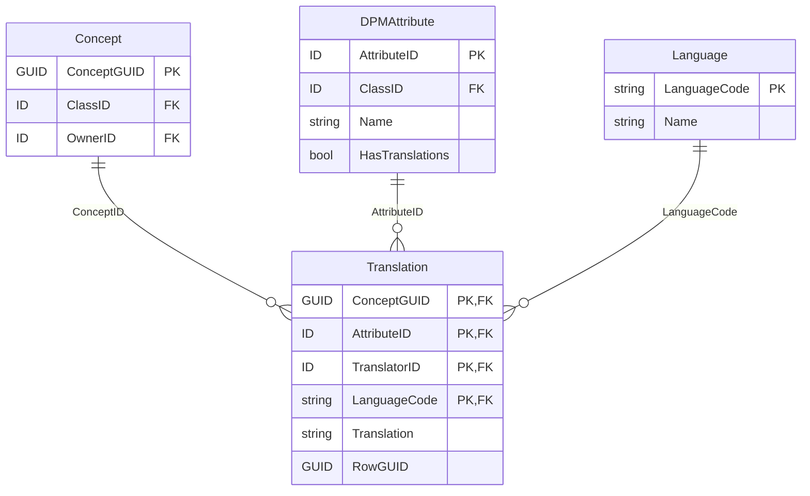
<figcaption>Figure 5. Language entity.</figcaption>
</figure>

!!! note

    The same diagram (Concept · DPMAttribute · Language · Translation) is used to present the
    Language entity here and the translation mechanism in
    [Figure 9](#4131-translations). In the `Translation` associative entity the four `PF`
    attributes form a composite primary key that is also foreign-key; `TranslatorID` references the
    `Organisation` (a Concept) that provided the translation.

#### 4.1.1.5 Operator and Operator Argument

Operators (as presented on Figure 6) can applied by:

- SubCategoryItem (to indicate arithmetic operations between Items in a SubCategory, see
  [5.1.3](components/glossary.md#513-subcategory)),
- OperationNode (in which case Operators may be more complex and include multiple
  OperatorArguments, see [5.4.1](components/operations.md#541-operations)).

<figure markdown="span">
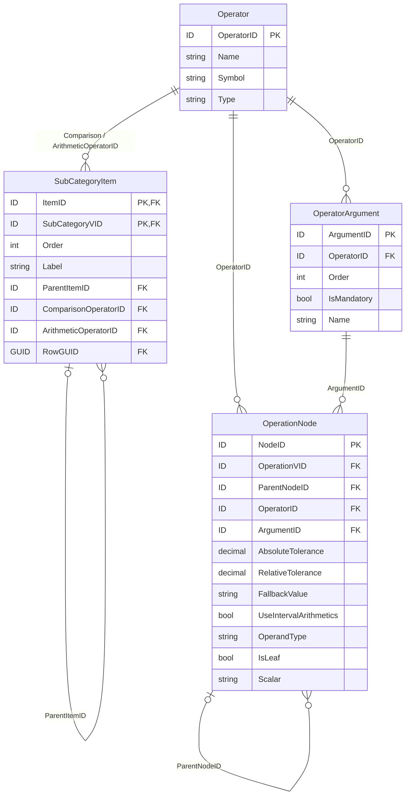
<figcaption>Figure 6. Operator and OperatorArgument entities.</figcaption>
</figure>

The list of Operators is presented in Table 5.

| Name | Symbol | Type |
|---|---|---|
| Unary plus | + | Numeric |
| Addition | + | Numeric |
| Division | / | Numeric |
| Unary minus | - | Numeric |
| Subtraction | - | Numeric |
| Absolute value | abs | Numeric |
| Numeric minimum | min | Numeric |
| Multiplication | * | Numeric |
| Numeric maximum | max | Numeric |
| Square root | sqrt | Numeric |
| Aggregate maximum | max_aggr | Aggregate |
| Aggregate minimum | min_aggr | Aggregate |
| Equal to | = | Comparison |
| Less than equal to | <= | Comparison |
| Greater than equal to | >= | Comparison |
| Element of | in | Comparison |
| Is null | isnull | Comparison |
| Greater than | > | Comparison |
| Less than | < | Comparison |
| Not equal to | != | Comparison |
| Match characters | match | Comparison |
| And | and | Logical |
| Or | or | Logical |
| Not | not | Logical |
| Exclusive or | xor | Logical |
| Sum | sum | Aggregate |
| Count | count | Aggregate |
| Where | where | Clause |
| Get | get | Clause |
| If then else | if-then-else | Conditional |
| Filter | filter | Conditional |
| Time shift | time_shift | Time |
| Rename | rename | Clause |
| RenameNode | node | Clause |
| Grouping clause | group by | Clause |
| Persistent assignment | <- | Assignment |

<figcaption>Table 5. List of Operators.</figcaption>

As presented on Figure 6, more complex Operators are composed of multiple arguments. The list of
OperatorArguments is provided in Table 6.

| Operator (FK) | Order | IsMandatory | Name |
|---|---|---|---|
| Unary plus | 1 | 1 | operand |
| Addition | 1 | 1 | left |
| Addition | 2 | 1 | right |
| Division | 1 | 1 | left |
| Division | 2 | 1 | right |
| Unary minus | 1 | 1 | operand |
| Subtraction | 1 | 1 | left |
| Subtraction | 2 | 1 | right |
| Absolute value | 1 | 1 | operand |
| Numeric minimum | 1 | 1 | operand |
| Multiplication | 1 | 1 | left |
| Multiplication | 2 | 1 | right |
| Numeric maximum | 1 | 1 | operand |
| Square root | 1 | 1 | operand |
| Aggregate maximum | 1 | 1 | operand |
| Aggregate maximum | 2 | 1 | grouping_clause |
| Aggregate maximum | 3 | 1 | component |
| Aggregate minimum | 1 | 1 | operand |
| Aggregate minimum | 2 | 1 | grouping_clause |
| Aggregate minimum | 3 | 1 | component |
| Equal to | 1 | 1 | left |
| Equal to | 2 | 1 | right |
| Less than equal to | 1 | 1 | left |
| Less than equal to | 2 | 1 | right |
| Greater than equal to | 1 | 1 | left |
| Greater than equal to | 2 | 1 | right |
| Element of | 1 | 1 | operand |
| Element of | 2 | 1 | set |
| Is null | 1 | 1 | operand |
| Greater than | 1 | 1 | left |
| Greater than | 2 | 1 | right |
| Less than | 1 | 1 | left |
| Less than | 2 | 1 | right |
| Not equal to | 1 | 1 | left |
| Not equal to | 2 | 1 | right |
| Match characters | 1 | 1 | operand |
| Match characters | 2 | 1 | pattern |
| And | 1 | 1 | left |
| And | 2 | 1 | right |
| Or | 1 | 1 | left |
| Or | 2 | 1 | right |
| Not | 1 | 1 | operand |
| Exclusive or | 1 | 1 | left |
| Exclusive or | 2 | 1 | right |
| Sum | 1 | 1 | operand |
| Sum | 2 | 1 | grouping_clause |
| Sum | 3 | 1 | component |
| Count | 1 | 1 | operand |
| Count | 2 | 1 | grouping_clause |
| Count | 3 | 1 | component |
| Where | 1 | 1 | operand |
| Where | 2 | 1 | condition |
| Get | 1 | 1 | operand |
| Get | 2 | 1 | component |
| If then else | 1 | 1 | condition |
| If then else | 2 | 1 | then |
| If then else | 3 | 1 | else |
| Filter | 1 | 1 | selection |
| Filter | 2 | 1 | condition |
| Time shift | 1 | 1 | operand |
| Time shift | 2 | 1 | period_indicator |
| Time shift | 3 | 1 | shift_number |
| Time shift | 4 | 1 | dimension |
| Rename | 1 | 1 | operand |
| Rename | 2 | 1 | node |
| RenameNode | 1 | 1 | old_name |
| RenameNode | 2 | 1 | new_name |

<figcaption>Table 6. List of OperatorArguments.</figcaption>

### 4.1.2 Concept and Ownership

As explained in the previous section, information requirements and hence data models are
developed by various authorities. It is therefore necessary to identify Organisation that defined a
given classification, business term, data set, table, etc, and is responsible for its maintenance.

For this purpose, among others, DPM defines Concept entity that represents any identifiable object
in a model (i.e. receiving Code/Name assigned by a modeller). In technical terms – all metamodel
entities that have a single primary key are Concepts (it is important to note though, that some of
such entities are merely versions of another object in time - [4.2.1](#421-releases)). As Concepts are
also prescribed by the metamodel for managing references
([4.1.3.2](#4132-references-to-documentation)) and translations ([4.1.3.1](#4131-translations)), all
DPMClasses ([4.1.1.1](#4111-dpm-class-and-attribute)) who have HasReferences set to TRUE or of
which at least one attribute has HasTranslations set to TRUE, are also represented in the model as
Concepts.

All metamodel entities have RowGUID attribute[^16] which is globally unique. This identifier is referred
from Concept.GUID.

[^16]: It is also used for the log of changes (non-normative part of the model, see
    [4.2.5](#425-log-of-changes-non-normative)).

<figure markdown="span">
```mermaid
flowchart TB
  Concept(["Concept"])

  Framework & Module & ModuleVersion --- Concept
  TableGroup & TableAssociation & Table & TableVersion & Header & HeaderVersion & Cell --- Concept
  Variable & VariableVersion & CompoundKey & Context --- Concept
  Operation & OperationVersion --- Concept
  Document & DocumentVersion & Subdivision & Organisation --- Concept
  SubCategoryVersion & SubCategory & Property & Item & Category --- Concept
  Release --- Concept
  SubCategoryItem -. "translatable only" .- Concept

  classDef pack fill:#ffe0b2,stroke:#e65100,color:#000;
  classDef rend fill:#c8e6c9,stroke:#2e7d32,color:#000;
  classDef doc  fill:#b2dfdb,stroke:#00695c,color:#000;
  classDef ops  fill:#d1c4e9,stroke:#4527a0,color:#000;
  classDef gloss fill:#bbdefb,stroke:#1565c0,color:#000;
  classDef concept fill:#f8bbd0,stroke:#ad1457,color:#000;
  classDef other fill:#eceff1,stroke:#607d8b,color:#000;

  class Framework,Module,ModuleVersion pack;
  class TableGroup,TableAssociation,Table,TableVersion,Header,HeaderVersion,Cell,Variable,VariableVersion,CompoundKey,Context rend;
  class Document,DocumentVersion,Subdivision,Organisation doc;
  class Operation,OperationVersion ops;
  class SubCategoryVersion,SubCategory,Property,Item,Category gloss;
  class Release,Concept concept;
  class SubCategoryItem other;
```
<figcaption>Figure 7. Concepts.</figcaption>
</figure>

!!! note

    Figure 7 shows the central `Concept` entity related to every DPMClass that is a Concept (the
    classes listed in Table 1). `SubCategoryItem` is linked because — although it has a
    two-field key rather than a single primary key — it carries translatable attributes and is
    therefore treated as a Concept.

As presented on Figure 8, Concept can be assigned with an Owner indicating Organisation that has
defined and manages it. DPM metamodel restricts each Concept to have one and only one Owner.

<figure markdown="span">
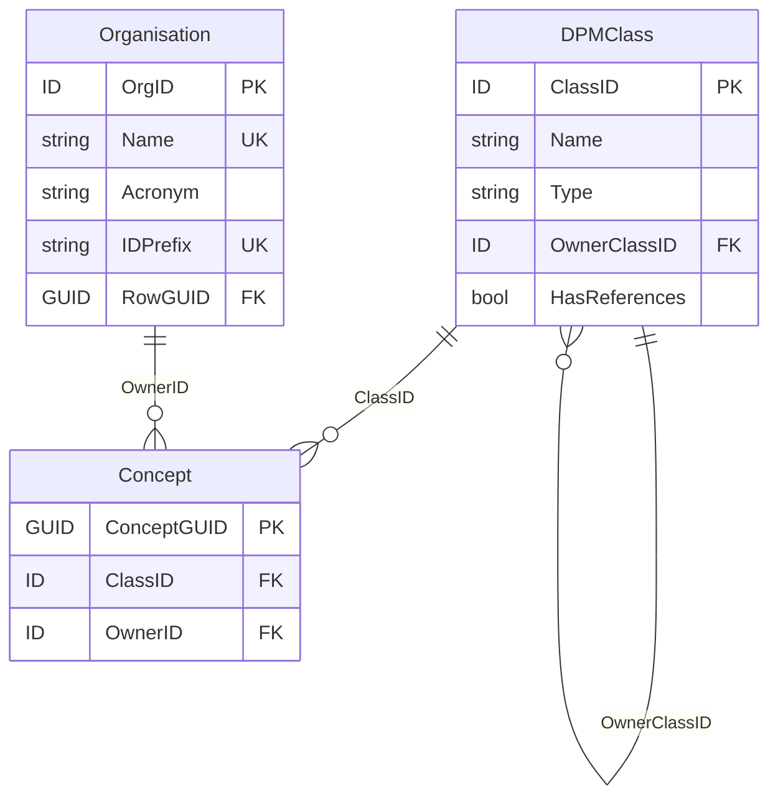
<figcaption>Figure 8. Concept as DPMClass and its Owner Organisation.</figcaption>
</figure>

For some Concepts information about Owner is inherited from other Concepts. This is identified by
DPMClass.OwnerClassID and documented in Table 1. Modellers are therefore enabled to assign
Owner only for Concepts not having parent class while any children of an upper-level class inherit
this information from their parent (i.e. their Owner is the same as the Owner of their parent
DPMClass).

Owner Organisations are described by their Name and Acronym (e.g. "European Banking Authority"
and "EBA" respectively). Organisation is a Concept itself and therefore these attributes are
translatable ([4.1.3.1](#4131-translations)).

It is possible that one Organisation may indicate itself as Owner of Concepts that are not yet defined
in DPM model by their legitimate Owners (for example standardisation organizations such as ISO,
LEI, IFRS, etc). Should such Concepts be subsequently added by their rightful Owners, DPM
metamodel enables linking such definitions to existing duplicates using ConceptRelation entity
([4.1.4](#414-concept-relation)).

For technical reason it is considered that all identifiers (primary key IDs of all metamodel entities) in
the physical database implementation are unique for each Concept. This shall simplify the process of
merging models from various databases maintained individually by different Organisations. To
achieve this, the first three digits of any ID indicate the Owner (as prescribed by
Organisation.IDPrefix) while the other digits ensure uniqueness for each DPMClass for that Owner
(e.g. sequential numbers).

DPM Metamodel contains predefined Organisations as illustrated in Table 7.

| Name | Acronym | IDPrefix |
|---|---|---|
| DPM Metamodel | DPMM | 100 |
| European Banking Authority | EBA | 101 |
| European Insurance and Occupational Pensions Authority | EIOPA | 102 |

<figcaption>Table 7. DPM Metamodel predefined Organisations.</figcaption>

DPM Metamodel Organisation host definitions of "Properties", "Not applicable" and "Templates"
Categories ([5.1.1](components/glossary.md#511-category)).

### 4.1.3 Supportive documentation

#### 4.1.3.1 Translations

The primary language of modelling, at least for the EBA and EIOPA DPM models, is English.
Therefore, all attributes like Name, Label, Description, Value, etc across all DPM metamodel entities
are provided in English.

Attributes that are expected or enabled to be translatable are marked as
DPMAttribute.HasTranslation equal TRUE ([4.1.1.1](#4111-dpm-class-and-attribute)).

As presented on Figure 9, Translation identifies Concept (Translation.ConceptID,
[4.1.2](#412-concept-and-ownership)) along with translated attribute of this Concept
(Translation.AttributeID, [4.1.1.1](#4111-dpm-class-and-attribute)), the national language of
translation (Translation.LanguageCode, [4.1.1.4](#4114-language)) and the Organisation that provided
and manages this translation (Translation.TranslatorID, [4.1.2](#412-concept-and-ownership)). It is
therefore possible that an attribute of a Concept has more than one translation defined by different
Organizations in one language.

<figure markdown="span">
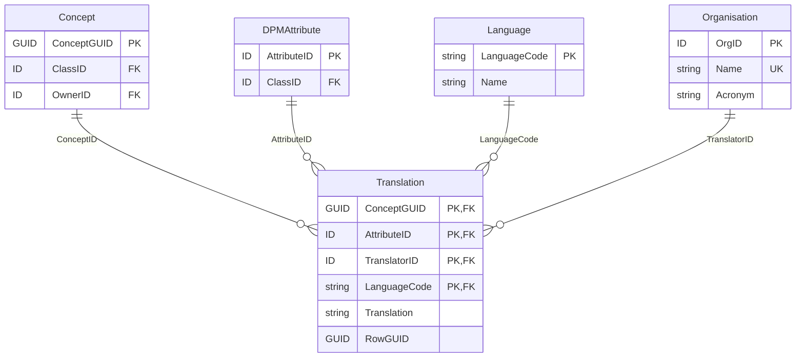
<figcaption>Figure 9. Concepts' attributes translations.</figcaption>
</figure>

#### 4.1.3.2 References to documentation

Information requirements result from various documents: legal acts, regulations, standards, change
requests, requirements, etc. Concepts ([4.1.2](#412-concept-and-ownership)) belonging to DPMClasses
whose HasReferences equals TRUE ([4.1.1.1](#4111-dpm-class-and-attribute)) can be associated with
references containing their definitions, guidelines, or other explanation.

<figure markdown="span">
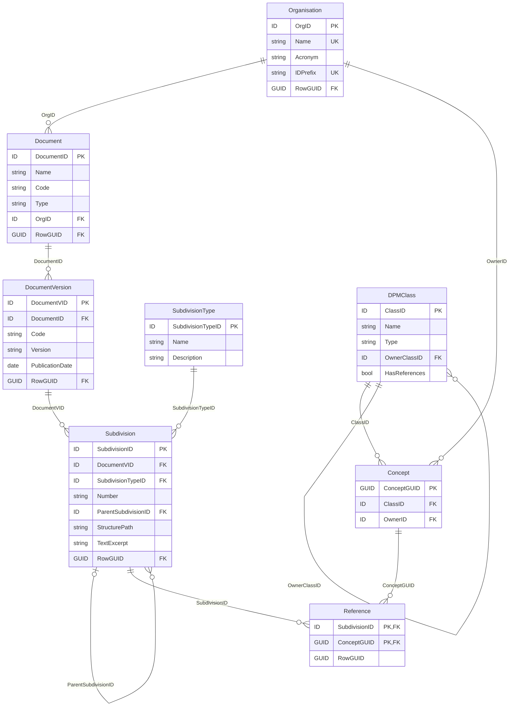
<figcaption>Figure 10. References.</figcaption>
</figure>

As presented on Figure 10, Document identifies a piece of legislation (e.g. EU Directive, ITS, etc) or
other report by its Name and (optionally) Code. Type informs on the kind of the Document (e.g.
"legal_document", "change_request"). DocumentVersion serves historization purposes and indicates
PublicationDate and Version information of Document along with its Code which may also vary in
time.

As explained in section 4.1.1, SubdivisionType provides a list of typical parts that structure a piece of
a legislation or other report. They are used in Subdivision to resemble arrangement and structure of
Document by providing ability to refer to any individual Subdivision by its Number and providing
means of nesting them in higher-level Subdivisions (hence hierarchical structure of
Subdivision.ParentSubdivisonID). Complete address of Subdivision position in the document is also
provided by Subdivision.StructurePath.

Subdivision (typically leaf-level) may contain the actual wording of the document fragment it
represents (Subdivision.TextExcerpt).

Subdivisions are linked to Concepts via Reference (one Concept can have many References and one
Reference can be reused across many Concepts).

Document, DocumentVersion and Subdivision are Concepts and therefore can have Owner
(DocumentVersion and Subdivision inherits Owner from Document as per Table 1) and some of their
attributes (e.g. TextExcerpt) can have translations (see Table 2 and section
[4.1.3.1](#4131-translations)).

### 4.1.4 Concept relation

DPM metamodel provides means for Concepts to be related to one another by means of
ConceptRelation that can be referred from all RelatedConcepts as presented on Figure 11.

This generic approach enables linking Concepts within and across Owners and/or representing
various DPMClasses ([4.1.1.1](#4111-dpm-class-and-attribute)). For example, it can be used to connect
identical Concepts defined by different Owners, or to identify the same Concept but modelled
differently or even at different modelling levels (e.g. in logical and physical implementation).

<figure markdown="span">
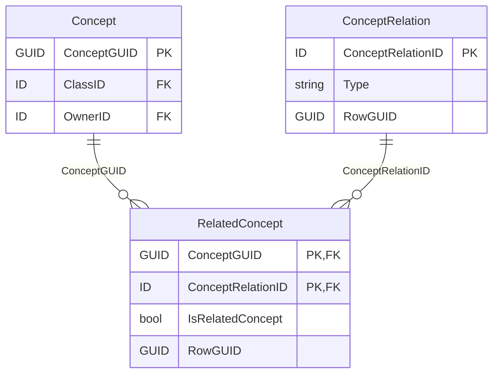
<figcaption>Figure 11. Concept and ConceptRelation.</figcaption>
</figure>

!!! note

    `RelatedConcept` is the associative entity that links each `ConceptRelation` to the
    participating `Concept`s. In the source figure, example Concept classes (e.g. `Table`,
    `TableVersion`, `Variable`, `VariableVersion`, `Module`, `Property`) are shown connected to
    `Concept` to illustrate that relations can be established between any kinds of Concepts.

If a relation has a direction, RelatesConcept.IsRelatedConcept equal TRUE identifies a Concept at the
target of this relation, otherwise it is FALSE (default value) for relation's source Concept or in case
relation has no direction/is bidirectional.

ConceptRelaton.Type identifies the type of relation. There are three generic relation types (i.e. that
can be applied to various classes of Concepts - [4.1.1.1](#4111-dpm-class-and-attribute)):

- "equivalent_concept" indicate that Concepts linked through such relation type (whatever
  DPMClass they represent) are semantically the same. This relation is bidirectional hence
  IsRelatedConcept is FALSE for all RelatedConcepts,
- "version_fix" and "version_new" applies typically to Versions of various Concepts (e.g.
  ModuleVersions, TableVersions or HeaderVersions) and informs that the target of the
  relation is created:
    - to correct a modelling problem ("version_fix") of the source Concept or
    - as an evolution of the source Concept ("version_new") due to e.g. revision of
      information requirements;

  This information along with Releases ([4.2.1](#421-releases)) is essential in determining
  applicability of glossary ([5.1](components/glossary.md)) Concepts in modelling of rendering
  ([5.2.1](components/rendering-packaging.md#521-grouping-and-rendering)) and Variables
  ([5.3.1](components/variables.md#531-variable)) in time.

In addition to the above three generic relation types, DPM metamodel predefines also relation types
that can be used to relate specific Concepts, i.e.:

- SubCategories – "subCategoryMaster_version" and "subCategoryRendering_version"
  ([5.1.3](components/glossary.md#513-subcategory)),
- Variables – "factVariable_keyVariable" and "variable_attributeVariable"
  ([5.3.1](components/variables.md#531-variable)),
- Tables – "table_variant" ([5.2.1.1](components/rendering-packaging.md#5211-table-and-tableversion)).

Detailed semantics of these relation types are explained in the referred sections.

Modellers can extend ConceptRelation.Type with other options that they need or find useful.

## 4.2 Historisation

Information requirements may change in time. Updates to the DPM models can be published by
their authors in scheduled or ad hoc manner.

Moreover, Modellers may decide to modify the way they represent glossary terms or information
requirements e.g. due to bug fixes or to improve the model during periodic revisions. Some Concepts
([4.1.2](#412-concept-and-ownership)) can therefore become obsolete in time. However, to enable
resubmissions of data for past periods or to support time series analysis, Concepts of published
models are never deleted as it shall always be possible by reading the model to learn the modelling
and information requirements applicable at any moment of time.

### 4.2.1 Releases

Release represents each publication of a model[^17]. Each Release is identified by Code and Date.

[^17]: This is typically an external publication i.e. in a public repository or on the website of the
    model author organisation, however it may be also used to support internal workflows and
    processes withing these organisations.

As presented on Figure 12, Release is applied to metamodel entities which can be:

- versions of certain classes of Concepts, i.e:
    - SubCategoryVersion,
    - TableVersion,
    - HeaderVersion,
    - VariableVersion,
    - ModuleVersion,
    - OperationVersion,
- connections between Concepts:
    - ItemCategory,
    - PropertyCategory,
    - SuperCategoryComposition,
    - TableGroupCompositon,
    - CompountItemContext,
- individual Concepts life cycle: TableGroup.

The purpose of Release is to support documenting evolution of Concepts or their composition and to
help identifying how a glossary term, a table content or a variable was represented at a point in
time.

<figure markdown="span">
```mermaid
erDiagram
  Release {
    ID ReleaseID PK
    string Code
    date Date
    string Description
    string Status
    bool IsCurrent
    GUID RowGUID FK
  }
  ItemCategory {
    ID ItemID PK,FK
    ID StartReleaseID PK,FK
    ID CategoryID FK
    string Code
    bool IsDefaultItem
    string Signature
    ID EndReleaseID FK
  }
  PropertyCategory {
    ID PropertyID PK,FK
    ID StartReleaseID PK,FK
    ID CategoryID FK
    ID EndReleaseID FK
  }
  SuperCategoryComposition {
    ID SuperCategoryID PK,FK
    ID CategoryID PK,FK
    ID StartReleaseID FK
    ID EndReleaseID FK
  }
  CompoundItemContext {
    ID ItemID PK,FK
    ID StartReleaseID PK,FK
    ID ContextID FK
    ID EndReleaseID FK
  }
  TableGroupComposition {
    ID TableGroupID PK,FK
    ID TableID PK,FK
    int Order
    ID StartReleaseID FK
    ID EndReleaseID FK
  }
  TableGroup {
    ID TableGroupID PK
    ID StartReleaseID FK
    ID EndReleaseID FK
  }
  SubCategoryVersion {
    ID SubCategoryVID PK
    ID StartReleaseID FK
    ID EndReleaseID FK
  }
  TableVersion {
    ID TableVID PK
    ID StartReleaseID FK
    ID EndReleaseID FK
  }
  HeaderVersion {
    ID HeaderVID PK
    ID StartReleaseID FK
    ID EndReleaseID FK
  }
  VariableVersion {
    ID VariableVID PK
    ID StartReleaseID FK
    ID EndReleaseID FK
  }
  ModuleVersion {
    ID ModuleVID PK
    ID StartReleaseID FK
    ID EndReleaseID FK
  }
  OperationVersion {
    ID OperationVID PK
    ID StartReleaseID FK
    ID EndReleaseID FK
  }
  Release ||--o{ ItemCategory : "Start / EndReleaseID"
  Release ||--o{ PropertyCategory : "Start / EndReleaseID"
  Release ||--o{ SuperCategoryComposition : "Start / EndReleaseID"
  Release ||--o{ CompoundItemContext : "Start / EndReleaseID"
  Release ||--o{ TableGroupComposition : "Start / EndReleaseID"
  Release ||--o{ TableGroup : "Start / EndReleaseID"
  Release ||--o{ SubCategoryVersion : "Start / EndReleaseID"
  Release ||--o{ TableVersion : "Start / EndReleaseID"
  Release ||--o{ HeaderVersion : "Start / EndReleaseID"
  Release ||--o{ VariableVersion : "Start / EndReleaseID"
  Release ||--o{ ModuleVersion : "Start / EndReleaseID"
  Release ||--o{ OperationVersion : "Start / EndReleaseID"
```
<figcaption>Figure 12. Metamodel entities whose historization is supported by reference to Release.</figcaption>
</figure>

!!! note

    Each entity above references `Release` twice — mandatorily as `StartReleaseID` and optionally
    as `EndReleaseID`. In `ItemCategory` and `PropertyCategory` (and the other composition
    entities) `StartReleaseID` is part of the primary key. Only the keys relevant to historisation
    are shown here; the full attribute set of each versioned entity is given in its dedicated figure
    (e.g. [Figure 25](components/rendering-packaging.md#5211-table-and-tableversion) for
    `TableVersion`, [Figure 32](components/rendering-packaging.md#5222-module) for
    `ModuleVersion`, [Figure 33](components/variables.md#533-variableversions) for
    `VariableVersion`, [Figure 35](components/operations.md#541-operations) for
    `OperationVersion`).

On all entities where it applies, Release is referenced twice, mandatorily as StartRelease and
optionally as EndRelease. Additionally, in ItemCategory and PropertyCategory, StartRelease is part of
their primary key. In cases where StartRelease is not part of the primary key, the metamodel
employs as Primary Key one-field ID for this specific concept version. Alternatively, this Primary Key
could be the combination (Version_Invariant_ID, StartRelease). For example, in TableVersion the
Primary Key is TableVID but it could also be TableID and StartReleaseID instead. To make it explicit
on DPM Refit implementation level, one can define a Unique Index containing the alternate Primary
Keys whenever required (note that an exception to this is StartRelease in TableGroup in which case
StartRelease has an informational role only).

As a Concept ([4.1.2](#412-concept-and-ownership)), Release can be assigned with an Owner, and can
be linked to Reference ([4.1.3.2](#4132-references-to-documentation)) while its Name and Description
attributes are translatable ([4.1.3.1](#4131-translations)).

IsCurrent flag indicates a Release that in a given publication of the model is the most recent one.

DPM does not impose any specific semantic versioning approach. Instead, it shall be driven by
individual requirements of modellers, their organisations and the life cycle of information
requirements represented in the model. In case when subsequent Releases may introduce changes
to past (not only the direct preceding) Releases and modellers decide to track this information
(instead of correcting/updating these past Release), it may be necessary to employ in addition the
"version_fix" and "version_new" Concept relationship types ([4.1.4](#414-concept-relation)). Reference
and submission dates ([4.2.2](#422-application-dates)) also play an important role in determining
Concepts' applicability.

Releases, by design, do not address model administration purposes i.e. storing of creation or
modification timestamps, reflecting a workflow or stages of the development process (internal and
public working drafts). Neither are the Releases aimed at supporting handling of temporary
metadata (e.g. work-in-progress modelling along with internal comments). The latter however can
be reflected in the log of changes ([4.2.5](#425-log-of-changes-non-normative)).

### 4.2.2 Application dates

Life cycle of certain model Concepts does not necessarily follow publication timelines or dates
indicated by Release ([4.2.1](#421-releases)). This applies in particular to Modules
([5.2.2.2](components/rendering-packaging.md#5222-module)) that may be indicated as applicable for
reporting from a point of time in the future or until a specified date, independent from the model
publication. For this reason, ModuleVersion definition contains FromReferenceDate attribute and
may include ToReferenceDate attribute as presented on Figure 13.

<figure markdown="span">
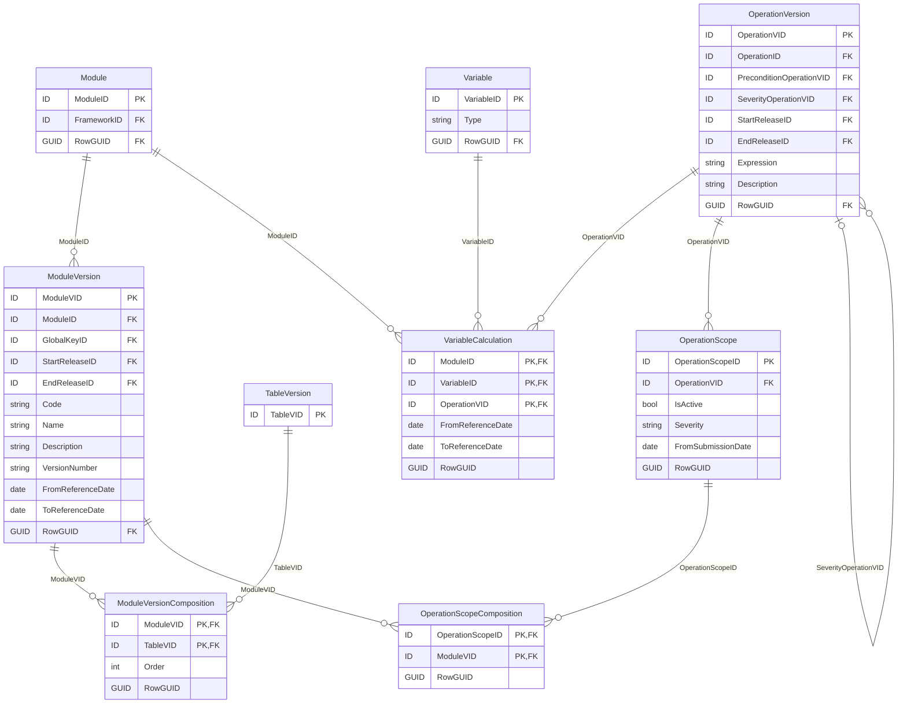
<figcaption>Figure 13. Metamodel entities with "from" and "to" application dates.</figcaption>
</figure>

!!! note

    The application-date attributes are `ModuleVersion.FromReferenceDate` /
    `ModuleVersion.ToReferenceDate`, `VariableCalculation.FromReferenceDate` /
    `VariableCalculation.ToReferenceDate`, and `OperationScope.FromSubmissionDate`. `TableVersion`
    is shown reduced to its key here; its full definition is in
    [Figure 25](components/rendering-packaging.md#5211-table-and-tableversion).

Similar independence from the model publication date applies to Operations
([5.4.1](components/operations.md#541-operations)). A version of a data quality check can be
indicated as applicable for reports submitted after a certain date
(OperationScope.FromSubmissionDate) while transformation rules execution can be constrained by
reference dates (VariableCalculation.FromReferenceDate and VariableCalculation.ToReferenceDate).

These dates support model users in understanding the scope of reportable information at any
moment of time: any date falls in some reference period of a ModuleVersion and hence the
applicable TableVersions and OperationVerisons are those attached to it via
ModuleVersionComposition and OperationScopeComposition respectively. In case of the latter, users
shall also consider the status (as the OperationVersion as it can be deactivated, see
[4.2.3](#423-deactivations)) and if a report is to be sent after the
OperationScope.FromSubmissionDate.

### 4.2.3 Deactivations

As presented Figure 14, the following metamodel entities: DataType, Category and Item (hence
indirectly also Property) can be marked as deactivated by setting IsActive attribute to FALSE. This
deactivation implies that they must not be used in modelling of any future information
requirements.

<figure markdown="span">
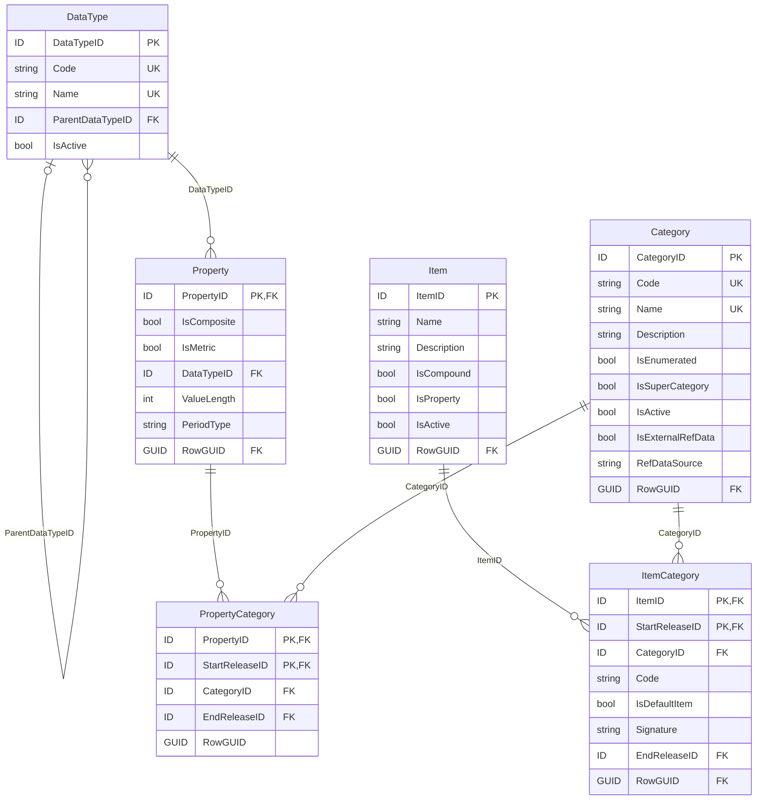
<figcaption>Figure 14. Metamodel metadata and glossary entities containing IsActive attribute enabling their deactivation.</figcaption>
</figure>

!!! note

    The `IsActive` attribute (the deactivation flag) is present on `DataType`, `Category` and
    `Item` — and therefore indirectly on `Property`, which in the physical implementation has a
    counterpart `Item`.

IsActive attribute is also present on OperationScope (see Figure 13) where it determines if
OperationVersion (referred from the OperationScope) shall apply to a ModuleVersion (linked to
OperationScope via OperationScopeComposition) for any reports sent after the
OperationScope.FromSubmissionDate.

In contrast to DataType and glossary Concepts where deactivation is final, OperationScope enables
re-activation of OperationVersion for ModuleVersion.

### 4.2.4 Dependencies

Historisation dependencies follow the dependencies between entities in the metamodel (identified
for example by Ownership inheritance, see [4.1.1.1](#4111-dpm-class-and-attribute),
[4.1.2](#412-concept-and-ownership)). For example, deactivating of Category results in deactivation of
all Items, SubCategories and Properties associated with it (unless they are reassigned to another
Category). It is also expected that assigning Concept with EndRelease shall impact EndRelease of all
dependent Concepts. For example, Property (represented as Item) with EndRelease for a given
Category must not be used with Items of that Category on any TableVersion or HeaderVersion in any
subsequent release. Same applies for StartRelease which indicates a first published version starting
from which a glossary Concept can be used in description of Tables or Variables. The rule does not
have to be obeyed for bug fixing of past versions or non-glossary Concepts. For example,
ModuleVersion may refer to TableVersions that don't exist for a Release for which a ModuleVersion is
defined (for example to reintroduce a Table that was replaced in some previous Release by another
version).

### 4.2.5 Log of changes (non-normative)

EBA and EIOPA introduced in the DPM Refit metamodel a non-normative (i.e., not aimed to become
part of the DPM standard) component to store information about changes made in models.

ChangeLog entity contains information about modifications made to the content of model entities or
their attributes. In case it is published with a model, it may contain all alterations (including
temporary modelling) or be limited only to final changes (e.g., difference between the published
Releases).

As presented on Figure 15, ChangeLog indicates a Timestamp for each modification made and an
individual User who introduce this modification. This latter information is aimed at internal use only,
not to be shared in the public releases.

<figure markdown="span">
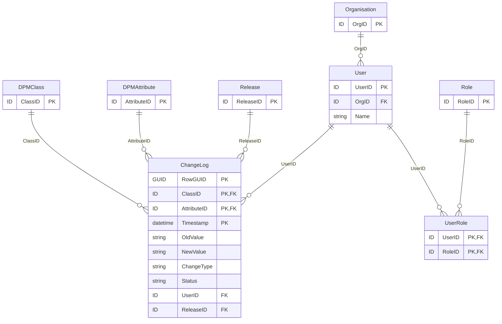
<figcaption>Figure 15. Change log component (non-normative).</figcaption>
</figure>

!!! note

    `ChangeLog` has a composite key `(RowGUID, ClassID, AttributeID, Timestamp)`. Its `RowGUID`
    references the globally-unique `RowGUID` of whichever metamodel entity row was modified, so the
    change log can record modifications to **all** DPM metamodel entities (not only those
    representing Concepts) using a single identifier. `UserID` and the `User`/`UserRole`/`Role`
    entities are aimed at internal use only and are not shared in public releases.

In order for the ChangeLog to contain modifications to all DPM metamodel entities (i.e., not only to
those representing Concepts but also those containing associations of Concepts and many-to-many
relationships) and refer to them using a single identifier, each entity in the physical implementation
of the metamodel contains RowGUID attribute which is a unique identifier referenced by
ChangeLog.RowGUID.

## 4.3 Derivation

In is assumed that majority of the metamodel entities is populated by Modellers, most likely with
support of dedicated tooling (e.g., DPM Studio). Several entities however, depending on the
modelling process applied, can be computed based on entries from other entities. This concerns for
example generation (and suggestion for reuse) of Variables
([5.3.5](components/variables.md#535-variables-definition-process)) for Table Headers or Cells, or
assembling Property-Item pairs in Contexts when defining Table Headers as well as automated reuse
of existing ContextCompositons ([5.1.5](components/glossary.md#515-context-and-contextcomposition))

## 4.4 Naming convention

Majority of metamodel entities that are Concepts are identified by Modellers by their Code and
Name.

Name is a short, but at the same time meaningful and distinguishable human readable description of
a given Concept. Name shall be unique in the context of a given DPMClass. For example, Item.Name
shall be unique within a Category it belongs but not necessarily across all Categories to allow for
homonyms.

Codes can be meaningless and take alphanumeric sequence unless they are clearly defined in
underlying information requirements (e.g. Table and their row/column codes) or in cases, when
according to some convention, they can be abbreviations of Name (e.g., capitalised starting letters of
each word of Name) or follow commonly applied codes (e.g. ISO codes for countries, currencies,
NACE codes, etc). Codes for each DPMClass must be unique for an Owner. For example, one
Category must not have two or more Items with the same Code, unless these Items are defined by
different Owners.

Many Concepts can be also assigned with Description which is a more verbose explanation of the
meaning of this Concept.

Specific implementations may restrict the length and format of Codes, Names and Descriptions to
follow database type constraints or replace disallowed characters unsupported by a given
technology (e.g., XML).
