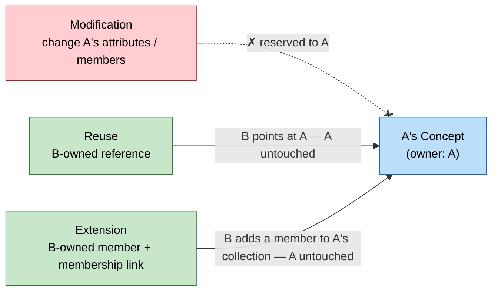
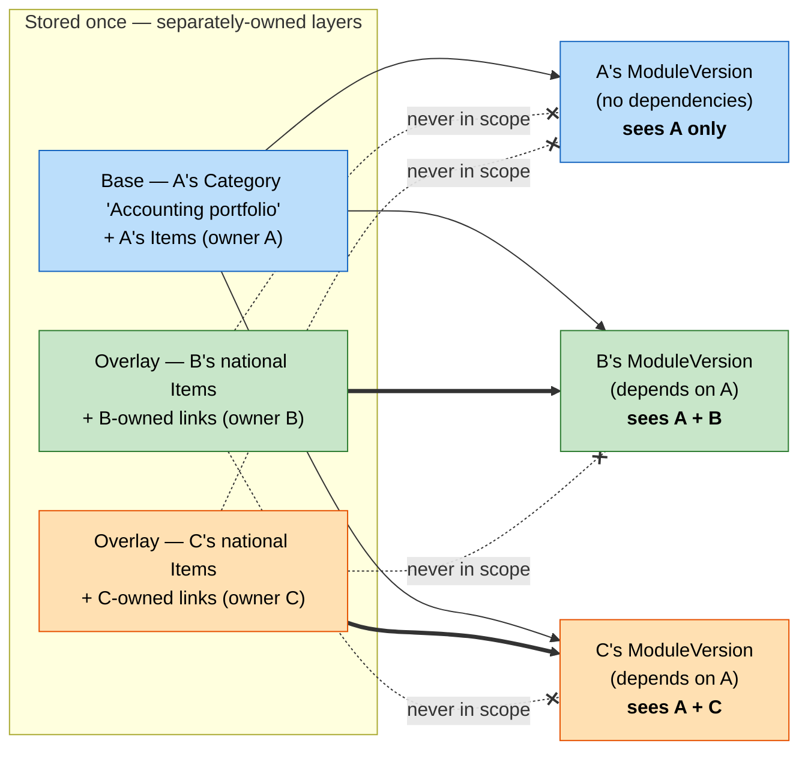
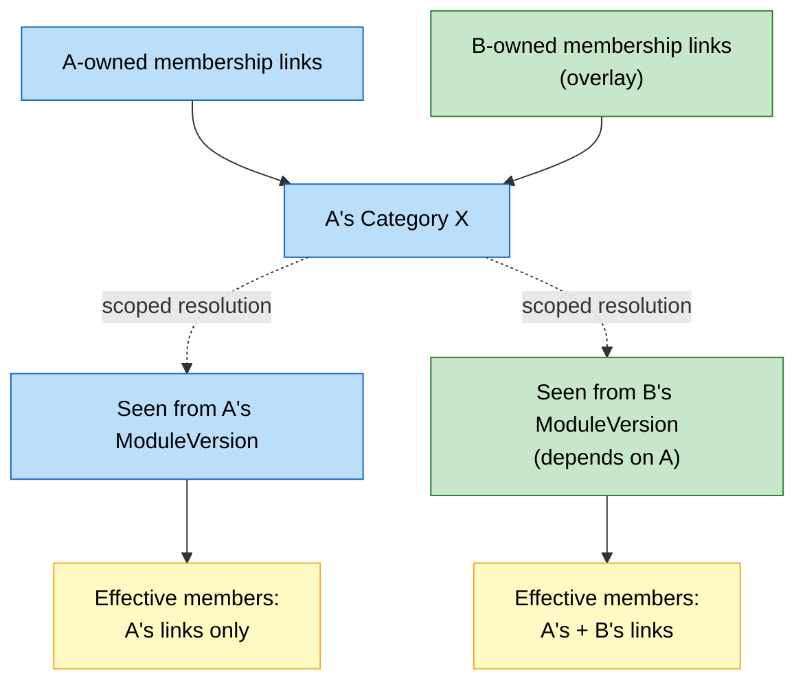
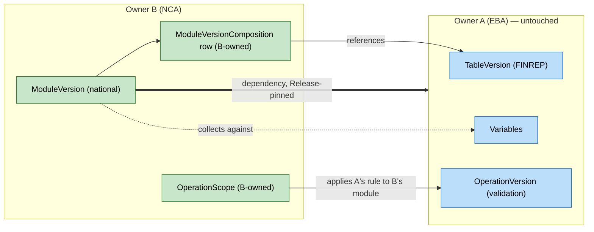
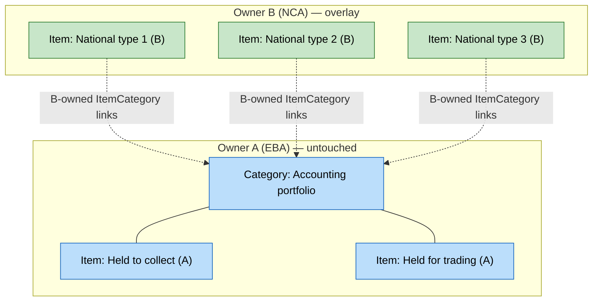

# Proposal — Extensibility and cross-owner reuse in DPM

!!! warning "Status: draft proposal for discussion"

    This document is a working proposal, not part of the published DPM 2.0 metamodel
    documentation. It builds on the ownership model described in
    [Chapter 4](https://meaningful-data.github.io/dpm-docs/latest/ownership-documentation/), in particular
    [Concept and Ownership (4.1.2)](https://meaningful-data.github.io/dpm-docs/latest/ownership-documentation/#412-concept-and-ownership).

## 1 Purpose and scope

DPM models are developed and maintained by multiple Organisations (EBA, EIOPA, ECB, NCAs,
standardisation bodies, …). Each identifiable object in a model — each **Concept** — has exactly
one **Owner**. In practice, however, authorities build on each other's work: an NCA collects an
EBA template plus national breakdowns; several authorities share the same code lists; a
resolution authority applies an EBA validation rule to its own data collection.

This proposal defines, exhaustively, which DPM objects can be:

- **Reused** — referenced from artefacts of another Owner without any change to the object, and
- **Extended** — enriched with new elements contributed by another Owner,

and which can be neither, with a justification for each decision. It also identifies the minimal
metamodel adjustments needed to support the recommended approach.

## 2 Definitions

The three modes of cross-owner interaction must be kept strictly apart, because they carry very
different risks:

**Modification**
:   Changing attributes or existing relationships of a Concept (renaming an Item, re-ordering a
    SubCategory, editing an Operation expression). *Modification is reserved to the Owner,
    always.* Nothing in this proposal grants any form of cross-owner modification.

**Reuse (reference)**
:   Owner B points to a Concept owned by A from B's own artefacts: B's ModuleVersion includes
    A's TableVersion; B's Cell references A's Item; B's Operation reads A's Variable. A's
    Concept is untouched; the *reference* belongs to B.

**Extension (contribution)**
:   Owner B adds a new, separately identifiable element to a collection anchored on A's Concept:
    B adds an Item to A's Category, a CompoundItem to A's Context, a Translation to A's Concept.
    A's Concept and its existing members are untouched; the *added member and the membership
    link* belong to B.

The three modes differ only in *what B is allowed to own*: nothing of A's (modification,
forbidden), a reference to A's Concept (reuse), or a new member plus its membership link
(extension). In every permitted mode A's Concept is physically untouched.

## 3 What the metamodel already provides

The recommended approach is deliberately conservative: it generalises mechanisms that the
metamodel already contains, rather than inventing new ones.

1. **Single ownership with inheritance**
   ([4.1.2](https://meaningful-data.github.io/dpm-docs/latest/ownership-documentation/#412-concept-and-ownership)). Every Concept has exactly
   one Owner. Table 1 of Chapter 4 specifies which classes *inherit* their Owner from a parent
   class (e.g. TableVersion from Table, Module from Framework, Cell from Table). This inheritance
   immediately rules out certain extensions: an object whose Owner is inherited from a parent
   **cannot** be contributed by a different Owner into that parent without breaking the ownership
   model (B cannot add a Cell to A's Table, because that Cell would be owned by A).

2. **Owner-prefixed identifiers**
   ([4.1.2](https://meaningful-data.github.io/dpm-docs/latest/ownership-documentation/#412-concept-and-ownership)). The first digits of every
   ID identify the Owner (`Organisation.IDPrefix`), explicitly to "simplify the process of merging
   models from various databases maintained individually by different Organisations". Cross-owner
   referencing is therefore a design goal of the identification scheme itself.

3. **Code uniqueness is per Owner, not global**
   ([4.4](https://meaningful-data.github.io/dpm-docs/latest/ownership-documentation/#44-naming-convention)): "one Category must not have two or
   more Items with the same Code, *unless these Items are defined by different Owners*". The
   naming convention already anticipates Items from several Owners coexisting **inside one
   Category** — i.e. Category extension.

4. **Translations are already a cross-owner extension**
   ([4.1.3.1](https://meaningful-data.github.io/dpm-docs/latest/ownership-documentation/#4131-translations)). Any Organisation can attach a
   Translation to any Concept's translatable attributes; `Translation.TranslatorID` records who
   asserted it, and one attribute may carry competing translations from different Organisations.
   This is exactly the pattern proposed here: *additive, separately-attributed assertions that
   never alter the host Concept*.

5. **ConceptRelation works across Owners by design**
   ([4.1.4](https://meaningful-data.github.io/dpm-docs/latest/ownership-documentation/#414-concept-relation)): it "enables linking Concepts
   within and across Owners", supports `equivalent_concept` for duplicates defined by different
   Owners, and `table_variant` for tables derived from other tables. Its `Type` list is explicitly
   extensible by Modellers.

6. **Releases and application dates** ([4.2](https://meaningful-data.github.io/dpm-docs/latest/ownership-documentation/#42-historisation))
   provide the time dimension: every reuse or extension link carries StartRelease/EndRelease, so
   cross-owner composition is always resolvable *as of* a point in time.

## 4 Candidate approaches for extensions

Three architectures were considered for extension semantics:

| | Approach | Description | Assessment |
|---|---|---|---|
| A | **Global in-place extension** | B's contributions become part of A's object for *all* users of the model. | Rejected. It silently changes the semantics of A's published artefacts (e.g. an open Cell over A's Property would suddenly admit B's Items in A's own reports; aggregation rules over a domain would change results). It would require A to approve every contribution, creating a governance bottleneck, and would make A's model non-reproducible from A's own database. |
| B | **Copy and relate** | No extension at all: B copies A's object, adds elements, links the copy to the original via ConceptRelation (`equivalent_concept` / `table_variant`). | Always available as a fallback, and the right tool for *closed* objects (see §5, P4). But as the only mechanism it duplicates content massively, breaks single-sourcing (B's copy does not follow A's corrections), and destroys comparability (the "same" Item exists twice with two identities). |
| C | **Owned, scoped overlay** *(recommended)* | B's contribution is a separately-owned assertion (the added Concept **and** the membership link both belong to B). The host object is physically untouched. Resolution is *dependency-scoped*: B's contributions are visible only where B's model is in scope, never in A's own artefacts. | Monotonic and non-invasive: A's published semantics are bit-for-bit unchanged; no approval workflow is needed; per-owner databases remain self-contained and mergeable (the overlay travels with B's model). Matches the existing Translation pattern. |

**Recommendation: approach C for open collections, approach B for closed ones.** The rest of
this document spells out which collections are open and which are closed.

The "overlay" metaphor makes approach C concrete. Picture A's model as a base sheet, and each
extending Owner's contribution as a *transparent sheet* laid over it. The sheets are stored
separately and never flattened into the base — A's sheet is exactly what A wrote. What anyone
actually sees is the base plus only the overlay sheets that are *in scope*, i.e. owned by an
Owner the consuming ModuleVersion depends on. So A (who depends on no one) sees the base alone;
B (who depends on A) sees base + B's own sheet; and an unrelated Owner C's sheet stays invisible
to both A and B. The diagram below stacks three owned layers (left) and shows what three
different consuming modules resolve to (right).

### 4.1 The scoped-resolution rule

Under approach C, the effective content of an extensible collection is computed per consuming
context, not stored globally:

!!! abstract "Resolution rule"

    The **effective members** of an extensible Concept *X* (owned by A), as seen from a
    ModuleVersion *M* (owned by B), are the membership links whose Owner is in the **dependency
    closure of M** (B itself, plus the Owners of all ModuleVersions M depends on, which always
    includes A as the provider of X), restricted to the Release window applicable to M.

Consequences:

- A's own modules see only A's links: **A's semantics never change** because someone extended
  A's vocabulary.
- B sees A's links plus B's own (plus those of any third Owner B explicitly depends on).
- Two extensions by unrelated Owners never interfere with each other.
- The rule is deterministic and computable from data already in the model (ownership of links +
  ModuleVersion dependencies + Releases); it needs no run-time negotiation between Owners.

The same host Concept therefore resolves to different effective contents depending on who is
looking: A's modules never see B's overlay, while B's modules (which depend on A) see both.

## 5 General principles

The classification in §6 is generated by seven principles. When a new entity is added to the
metamodel, applying these principles should classify it without reopening the discussion.

**P1 — Modification is reserved to the Owner.**
No cross-owner mechanism alters attributes or existing relationships of a foreign Concept.
Extensibility is exclusively the *addition* of new, separately-owned assertions.

**P2 — Reuse by reference is universally permitted.**
Any Concept may be referenced from another Owner's artefacts, provided that (a) the referencing
ModuleVersion declares a dependency on the providing Owner's model (with Release pinning), and
(b) the referenced Concept is usable at that Release (not deactivated, within its
StartRelease/EndRelease window — see
[4.2.3](https://meaningful-data.github.io/dpm-docs/latest/ownership-documentation/#423-deactivations) and
[4.2.4](https://meaningful-data.github.io/dpm-docs/latest/ownership-documentation/#424-dependencies)).

**P3 — Versions are immutable; versioning is reserved to the Owner.**
No `*Version` class is ever extensible, and no Owner may add a Version to another Owner's
Concept. A Version is a Release-bound snapshot whose value lies precisely in being frozen;
the version lineage (including `version_fix` / `version_new` relations) is part of the Owner's
maintenance responsibility. Versions are, at the same time, the natural **unit of reuse** — but
at the granularity of a complete **publication unit** (TableVersion, ModuleVersion,
OperationVersion, VariableVersion), not of its internal structure. Sub-table components
(HeaderVersion, Cell) are reused only *as part of* the TableVersion that contains them; they are
never referenced individually across Owners. Stitching foreign HeaderVersions or Cells into one's
own table would build a fine-grained, hard-to-pin web of cross-owner dependencies (each borrowed
fragment carrying its own Release pinning) **without delivering the comparability that motivates
reuse** — comparability rests on shared Variables (§6.5), not on shared header arrangements.
Structural consistency on a shared axis is instead obtained by reusing the underlying glossary
domain (Property, Items, Context, SubCategory) and rendering it in B-owned Headers.

**P4 — Extension applies only to open collections.**
A collection is **open** when it is a vocabulary or domain: its meaning is "the set of defined
terms", each member is meaningful on its own, and adding a member does not change the meaning of
any existing member (Category, Context membership, SuperCategory). A collection is **closed**
when the member list *is* the definition: removing or adding one element changes the semantics of
the whole (SubCategory, CompoundItem values, CompoundKey, Operation expression, the cell set of a
TableVersion, the composition of a ModuleVersion). Closed collections are never extended in
place; the alternative is always a new, separately-owned object related to the original via
ConceptRelation (approach B).

**P5 — Extensions are owned and scoped.**
Both the contributed Concept and the membership link carry the extender's ownership, and
visibility follows the scoped-resolution rule of §4.1. An extension is an overlay on the host
model, never a change to it.

**P6 — Publication containers are not extensible.**
Framework, Module/ModuleVersion, TableGroup, Table/TableVersion and Release represent an
authority's official publication structure and reporting obligations. Cross-owner composition is
achieved by *B referencing A's content from B's own container* (B's ModuleVersion includes A's
TableVersion), never by inserting content into A's container (B cannot add a Table to A's
TableGroup or a Module to A's Framework).

**P7 — Ownership inheritance delimits the extension surface.**
Classes that inherit their Owner from a parent class (Table 1 of Chapter 4) cannot host foreign
contributions *through that parent*: a contributed element would be forced to take the host's
Owner, violating P5. Extension is therefore only possible across **association entities joining
independently-owned Concepts** (ItemCategory, PropertyCategory, SuperCategoryComposition,
CompoundItemContext, Translation, Reference, …). This gives a mechanical test: *if the candidate
extension point is an owner-inheriting child relationship, the answer is no; if it is an
association between Concepts, evaluate P4.*

## 6 Exhaustive classification

Legend — **Reuse**: may another Owner reference this object from their artefacts?
**Extend**: may another Owner contribute elements to it? "Owner-only" means the operation
exists but is reserved to the owning Organisation.

### 6.1 Metamodel metadata

| Entity | Reuse | Extend | Justification |
|---|---|---|---|
| DPMClass, DPMAttribute | Yes (implicit) | No | Fixed by the DPM metamodel authors (Owner: DPMM); Modellers must not edit ([4.1.1](https://meaningful-data.github.io/dpm-docs/latest/ownership-documentation/#411-metamodel-metadata-entities)). Changes go through metamodel governance, not through model-level extension. |
| DataType | Yes | No | Shared type system; uncontrolled additions would fragment interoperability of Property/Operation typing. Derivation-by-restriction exists but is metamodel-governed. |
| Operator, OperatorArgument | Yes | No | The operator inventory defines the executable semantics of Operations across all implementations. An Owner-specific operator would make foreign Operations non-evaluatable by other consumers. New operators require metamodel governance. |
| Language | Yes | No (governed) | Populated from ISO 639-1 plus registered expression syntaxes. Additions (e.g. a new Operation syntax) are administrative registrations, not model extensions. |
| SubdivisionType | Yes | No | Closed typology for structuring document references; stability is what makes references comparable across Owners. |
| ConceptRelation.Type | Yes | **Yes** | Explicitly extensible per [4.1.4](https://meaningful-data.github.io/dpm-docs/latest/ownership-documentation/#414-concept-relation): "Modellers can extend ConceptRelation.Type with other options". Free-text typed; collisions are tolerable because relations are annotations, not executable semantics. |

### 6.2 Administration and documentation

| Entity | Reuse | Extend | Justification |
|---|---|---|---|
| Organisation | Yes (as Owner, Translator, …) | No | Self-describing registry entries; each Organisation maintains its own record. Nothing to extend. |
| Translation | n/a | **Yes — existing precedent** | Any Organisation may attach Translations to any Concept's translatable attributes; `TranslatorID` attributes the assertion ([4.1.3.1](https://meaningful-data.github.io/dpm-docs/latest/ownership-documentation/#4131-translations)). The model even allows competing translations of one attribute in one language. This is the template for all extension in this proposal. |
| Document / DocumentVersion / Subdivision | Yes | No | Subdivision and DocumentVersion inherit Owner from Document (P7). Another Owner needing a different subdivision structure of the same legal act registers its own Document and links the two via `equivalent_concept`. Legal texts are external objects; duplication of the *registration* is cheap and conflict-free. |
| Reference (Concept ↔ Subdivision) | n/a | **Yes** | Any Owner may attach references to any Concept whose class has `HasReferences = TRUE` — annotating a foreign Concept with the legal basis *as B reads it* alters nothing for A. Requires the asserting Owner to be recorded on the Reference link (see §8). |
| ConceptRelation | n/a | **Yes — cross-owner by design** | Stated purpose includes "linking Concepts … across Owners" ([4.1.4](https://meaningful-data.github.io/dpm-docs/latest/ownership-documentation/#414-concept-relation)). The relation itself is owned by whoever asserts it. |
| Release | Yes (pinning) | No | A Release is one Owner's act of publication; its content list is closed by definition (P4, P6). Other Owners reference foreign Releases when pinning dependencies, never contribute to them. |

### 6.3 Glossary

| Entity | Reuse | Extend | Justification |
|---|---|---|---|
| **Category** | Yes (as glossary root, SubCategory parent, …) | **Yes — items, properties and hierarchy links** | The flagship extension case. A Category is an open vocabulary (P4): B adding national Items to A's "Instrument type" Category adds terms without changing any existing term. The naming convention already legislates for it (per-Owner code uniqueness *within* a Category, [4.4](https://meaningful-data.github.io/dpm-docs/latest/ownership-documentation/#44-naming-convention)) — so the code signature is `(Category, Owner, Code)`, see §8.1. Mechanism: B-owned Items + B-owned ItemCategory links; B may also place its Items under A's Items in the hierarchy (the ParentItem link lives in B's ItemCategory row). Scoped resolution (§4.1) guarantees A's open Cells, domains and aggregations are unaffected in A's own modules. |
| **Item** | Yes — the most reused object in DPM (Cells, SubCategories, CompoundItems, Operation scopes, multiple Categories) | Hierarchy children only, via Category extension | An Item itself has no owned member collection; "extending an Item" reduces to attaching child Items beneath it inside some Category, which is governed by the Category rule above. Item attributes (Name, Code, …) follow P1: owner-only. |
| **Property** | **Yes — primary semantic reuse** (shared dimensions: Currency, Country, Sector used by all Owners) | Domain only (= Category extension); definition no | Reusing A's Property in B's dimensions/headers is what makes data comparable across frameworks — it should be the *preferred* practice over redefining. The Property's enumerated domain extends via the Category mechanism. Its `DataType` and meaning are its identity: owner-only (P1). |
| PropertyCategory (link) | n/a | **Yes (scoped)** | B asserting that A's Category uses B's Property (e.g. attaching a national classification aspect to a shared Category) is an overlay assertion: visible only in B's scope, harmless to A. Requires Owner on the link (§8). |
| **SubCategory** | Yes (in Cells, hierarchy validations, renderings) | **No** | The motivating counter-example. A SubCategory is a *closed, ordered selection* with arithmetic/comparison semantics on its members (SubCategoryItem operators): its member list **is** its definition (P4). If B could add members, every hierarchy validation ("total = sum of members") and every rendering referencing it would silently change meaning. B instead defines its own SubCategory (freely reusing A's Items, including alongside B's Items) and may relate it to A's via ConceptRelation. |
| SubCategoryItem | n/a | No | Part of the SubCategory definition; inherits its Owner (P7). |
| **Context** | **Yes — designed for reuse** across glossary, rendering and Variables | **Signature: no. Membership: yes** | The signature (the ordered set of Properties) is the Context's identity and the contract every member and every consumer relies on — changing it is a breaking change, owner-only via a new Context. Membership is open: B may define B-owned CompoundItems against A's Context (B's combinations for B's tables). A new member is meaningful on its own and changes nothing for existing members or for A (P4 + scoped resolution). Members must conform to the signature and draw values from the signature Properties' domains *as visible to B*. |
| **CompoundItem** | Yes | No | Its ordered value list (one Item per signature Property) is its definition — a closed tuple (P4). A different combination is simply a new CompoundItem. |
| **SuperCategory** | Yes | **Yes (composition)** | SuperCategories aggregate categories for navigation and filtering *without* hierarchy or arithmetic semantics. Additions are the lowest-risk extension in the model; scoped resolution still applies so any Operation filtering through a SuperCategory is unaffected outside the extender's scope. |

### 6.4 Rendering and packaging

| Entity | Reuse | Extend | Justification |
|---|---|---|---|
| **Framework** | Visibility only | **No** | Modules inherit Owner from Framework (Table 1) — P7 makes foreign Modules in A's Framework impossible without breaking ownership. Substantively, a Framework is the institutional expression of one authority's mandate (P6). Cross-authority packaging happens at Module level. |
| **Module / ModuleVersion** | **Yes — as dependency and import target** | No | A ModuleVersion defines a reporting obligation: its composition (TableVersions, Variables, Operations, reference-period window) is a closed, Release-bound snapshot (P3, P4, P6). B builds its own ModuleVersion that *imports*: it declares a dependency on A's ModuleVersion (pinned to A's Release) and references A's content in its own composition. |
| ModuleVersionComposition (link) | — | Cross-owner **references** allowed | The composition rows belong to the ModuleVersion's Owner (B), and may point at foreign TableVersions: this *is* the user-facing requirement "an Owner can add to a module a TableVersion defined by another Owner". It is reuse (B's row in B's container), not extension of anything of A's. |
| **TableGroup** | Yes (B may include A's Tables in **B's own** groups) | No | A TableGroup mirrors the Owner's official publication structure (e.g. the annexes of an ITS) — P6. B organises any tables, including A's, in B's own TableGroups; inserting into A's groups would let B alter how A's publication presents itself. |
| **Table** | Yes (in B's groups, associations, relations, variants) | No — extend via the **table-variant pattern** | Cells and Headers inherit the Table's Owner (P7): B physically cannot own a row added to A's Table. The metamodel's intended pattern for "A's template plus B's breakdowns" is a **variant**: B creates its own Table/TableVersion, rebuilds the shared axes in B-owned HeaderVersions populated from A's reused glossary domain (Properties, Items, Contexts), adds B-owned Headers for the extra axis/breakdowns, and links it to A's Table via ConceptRelation `table_variant`. A's template stays intact; B's additions are cleanly attributable; mapping the shared cells to A's Variables preserves comparability cell-by-cell. |
| **TableVersion** | **Yes — the headline reuse case** | No | Reusable in foreign ModuleVersionCompositions so that one template is collected identically by many authorities, with a single set of cell definitions and Variables (comparability + single sourcing). Not extensible: it is an immutable snapshot (P3) and its cell set defines the reportable scope and the Variables' identity — a closed collection (P4). |
| Header / HeaderVersion | Within its TableVersion only — **not referenced individually across Owners** | No | A HeaderVersion is internal table structure, not a stand-alone unit of reuse (P3). Reusing it travels with the whole TableVersion; referencing an individual foreign HeaderVersion into B's own table is *not* permitted, because it couples B's table to a fragment of A's at sub-table granularity (its own Release pinning, its own deactivation lifecycle) while delivering no comparability — comparability comes from shared Variables (§6.5), not from a shared header arrangement. For a consistent shared axis (e.g. standard maturity bands), B reuses the underlying glossary domain (the SubCategory/Context/Items) and renders it in a B-owned HeaderVersion. Not extensible: a HeaderVersion's cell tree is its definition (P3, P4); Header inherits Owner from Table (P7). |
| Cell | Within its TableVersion only (and referenceable from in-scope Operations) | No — except through **owner-defined open points** | A Cell is a coordinate in one specific table's grid and inherits that Table's Owner (P7); it is never an independent unit of reuse. It is reused only when B reuses the whole TableVersion that contains it, and may be referenced by Operations resolvable in B's scope. The metamodel already gives the *Owner* controlled extension points — open cells over a Property and open tables/axes — and those resolve against Property domains, where Category extension (6.3) re-enters with proper scoping. Third parties never add cells; they use variants. |
| TableAssociation / TableRelation / KeyMapping | **Yes** | n/a (B creates its own) | These are themselves Concepts owned by whoever asserts them. B may freely create associations, relations and key mappings that link A's tables (to each other or to B's): pure annotation/wiring, nothing of A's changes. |

### 6.5 Variables

| Entity | Reuse | Extend | Justification |
|---|---|---|---|
| **Variable / VariableVersion** | **Yes — and mandatory when reusing rendering** | No | When B's ModuleVersion includes A's TableVersion, B must collect against **A's Variables**, not re-derive its own: one data point = one identity, otherwise cross-framework comparability and lineage break and validations stop being shareable. B's Operations may freely reference A's Variables. Not extensible: a Variable's dimensional composition *is* its identity — a closed tuple (P4). A different breakdown is a new Variable (typically arising from B's variant tables, owned by B). |
| CompoundKey / KeyComposition | Yes | No | Key structure defines record identity for open tables; closed by nature (P4). Reuse of A's CompoundKey in B's variants keeps record matching possible across owners (supported by KeyMapping). |

### 6.6 Operations

| Entity | Reuse | Extend | Justification |
|---|---|---|---|
| **Operation / OperationVersion** | **Yes — reference and re-scope** | No | The expression tree (OperationNodes) is the rule: a closed definition (P4); versions are owner-only (P3). But *application* of a rule is separable from its definition: B should be able to apply A's OperationVersion to B's own modules (see OperationScope below) and to reference A's OperationVersions as preconditions. This realises "common EBA validation applied to a national collection" without copying rules. |
| **OperationScope** | — | **Yes, with a metamodel change** | The scope says *where* a rule applies — asserting "A's rule applies to B's module" modifies nothing of A's. Today OperationScope inherits Owner from Operation (Table 1), which blocks this. Recommendation: make OperationScope independently ownable (Owner = the Organisation asserting applicability), keeping A's own scopes untouched. The existing re-activation semantics of OperationScope (`IsActive`, [4.2.3](https://meaningful-data.github.io/dpm-docs/latest/ownership-documentation/#423-deactivations)) then work per-asserting-owner. Fallback without the change: B wraps A's rule in a B-owned Operation — works, but pollutes the rule inventory and obscures provenance. |
| OperationScopeComposition | — | Follows its OperationScope | Owned with the scope row; B's compositions target B's ModuleVersions and may filter on any Items visible in B's scope. |
| VariableCalculation | Yes | No | A calculation binding is part of the defining Owner's derivation semantics for its Variables; B derives its own Variables with its own calculations, which may *read* A's Variables (P2). |
| OperationNode | — | No | Internal structure of an OperationVersion (P7; part of a closed definition). |

### 6.7 Summary matrix

| | Reusable by reference | Extensible (scoped overlay) | Closed — copy & relate instead |
|---|---|---|---|
| **Glossary** | Category, Item, Property, SubCategory, Context, CompoundItem, SuperCategory | Category (items/properties/hierarchy), Context (membership), SuperCategory (composition) | SubCategory, CompoundItem (values), Context (signature) |
| **Rendering / packaging** | TableVersion (whole grid — its Headers & Cells travel with it), Table (in B's groups / variants), TableGroup (content into B's groups), Module (as dependency) | — *(use the table-variant pattern)* | TableVersion, HeaderVersion & Cells (reused only within their TableVersion, never individually across Owners), TableGroup, Module composition, Framework, Release |
| **Variables** | Variable (mandatory with rendering reuse), CompoundKey | — | Variable signature, CompoundKey |
| **Operations** | OperationVersion (reference, precondition, re-scoping) | OperationScope (apply foreign rules to own modules) | Expression / OperationNodes |
| **Documentation** | Document, Subdivision | Translation, Reference, ConceptRelation (incl. Type) | Document structure |
| **Metamodel metadata** | all | ConceptRelation.Type only | DataType, Operator, Language, SubdivisionType (governance-reserved) |

## 7 Recommended patterns (worked examples)

**Reusing a template (the ModuleVersion ← TableVersion case).**
An NCA collects EBA's FINREP table plus national tables in one national module:
the NCA's ModuleVersion declares a dependency on the EBA ModuleVersion at a pinned EBA Release,
its ModuleVersionComposition references the EBA TableVersion directly, data is collected against
EBA's Variables, and EBA's validations are attached via NCA-owned OperationScopes. No EBA object
is touched; the NCA module remains reproducible from the two databases.

**Extending a vocabulary (the Category case).**
The NCA needs three national portfolio types in addition to EBA's "Accounting portfolio" Items:
it defines three NCA-owned Items and three NCA-owned ItemCategory links into EBA's Category
(optionally parented under an EBA Item). In EBA modules nothing changes; in NCA modules the
domain resolves to EBA's Items plus the NCA's three.

**"Extending" a closed selection (the SubCategory case).**
The NCA wants EBA's "Total assets breakdown" SubCategory plus one national member. Extension is
refused (the member list is the definition); instead the NCA creates its own SubCategory listing
EBA's Items plus the national Item — Items are reused, only the selection is duplicated — and
links it to EBA's SubCategory via ConceptRelation for traceability.

**Extending a template (the table-variant case).**
The NCA wants EBA's template with an extra national column: it creates an NCA-owned Table and
TableVersion, rebuilds the unchanged axis in an NCA-owned HeaderVersion populated from EBA's
reused glossary domain (the same Properties/Items/Context, not a reference to EBA's HeaderVersion),
defines a further NCA HeaderVersion for the extended axis (reusing EBA's Items plus the national
column), relates the Tables via `table_variant`, and maps the shared cells to EBA's Variables so
that the common content stays comparable. Comparability is carried by the shared Variables, not by
sharing EBA's table structure — which keeps the NCA table dependent on EBA only at the
glossary/Variable level, not on EBA's internal header objects.

## 8 Required metamodel adjustments

The recommended approach needs four targeted changes, all additive:

1. **Owner on extensible association entities.** ItemCategory, PropertyCategory,
   SuperCategoryComposition, CompoundItemContext and Reference need an explicit `OwnerID`
   (today only Concepts — single-PK entities — carry an Owner; Translation already has its
   `TranslatorID`). Without it, B's contributions into A's collections cannot be attributed,
   scoped, or carved out when merging/distributing per-owner databases. Default value: the Owner
   of the surrounding Concept, so existing content is unaffected.

   This same `OwnerID` must also enter the **code signature** of an Item within a Category. The
   naming convention permits two Items with the same `Code` in one Category *provided they have
   different Owners* (§3 item 3, [4.4](https://meaningful-data.github.io/dpm-docs/latest/ownership-documentation/#44-naming-convention));
   the uniqueness constraint that enforces this — and the key by which an Item is addressed by
   code inside a Category — must therefore be `(CategoryID, OwnerID, Code)`, not `(CategoryID,
   Code)`. (The `ItemCategory` primary key is already owner-safe because it joins on the
   owner-prefixed `ItemID`; the change here is to the *code* uniqueness rule and to any code-based
   lookup, which must qualify the code by the contributing Owner.) Under scoped resolution this
   guarantees B's national code can never collide with A's within the shared Category, and an Item
   is unambiguously resolvable as `(Category, Owner, Code)`.

2. **Independently ownable OperationScope** (drop the Owner inheritance from Operation in
   Table 1 for this class), enabling cross-owner application of validation rules (§6.6).

3. **Normative scoped-resolution rule** (§4.1) added to the Historisation/Dependencies text of
   Chapter 4, defining "effective members as seen from a ModuleVersion" in terms of the
   dependency closure and Release windows.

4. **Dependency pinning made explicit.** Cross-owner references and extensions are only valid if
   the consuming ModuleVersion declares a dependency on the providing Owner's ModuleVersion or
   Release; the lifecycle rules of
   [4.2.4](https://meaningful-data.github.io/dpm-docs/latest/ownership-documentation/#424-dependencies) (no new use of ended/deactivated
   Concepts) apply across Owners exactly as within one Owner.

## 9 Open questions

1. **Adoption/promotion.** Should a host Owner be able to "adopt" a foreign extension (e.g. EBA
   takes over an NCA Item for general use)? Proposed answer: the host defines its own Item and
   links the two via `equivalent_concept` — no transfer-of-ownership mechanism needed — but a
   lighter convention may be worth discussing.
2. **Constraint validation across Owners.** Who validates that B's CompoundItems conform to A's
   Context signature, or that B's Items respect constraints A attached to a Category? Proposal:
   tooling-level validation at import time (when B pins A's Release), since A cannot be expected
   to validate content it never sees.
3. **Discovery.** Scoped overlays mean "what is in Category X?" has no global answer. Tooling
   (e.g. DPM Studio) should display extensions per scope, and the exchange format should carry
   overlays as clearly separated per-owner layers.
4. **Translations/References governance.** These are deliberately unrestricted today; whether
   publication channels should filter third-party annotations (e.g. show only translations from
   "trusted" Organisations) is a portal/tooling concern, not a metamodel one.
