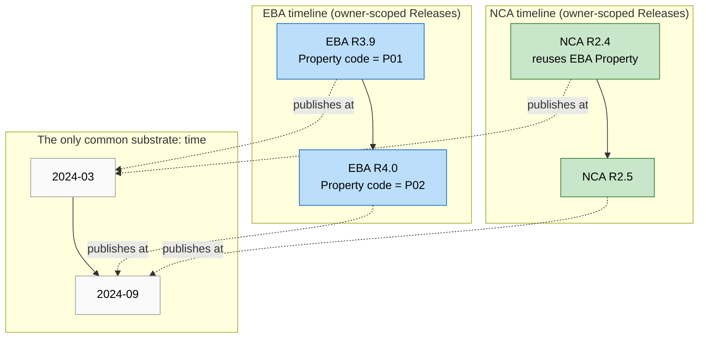
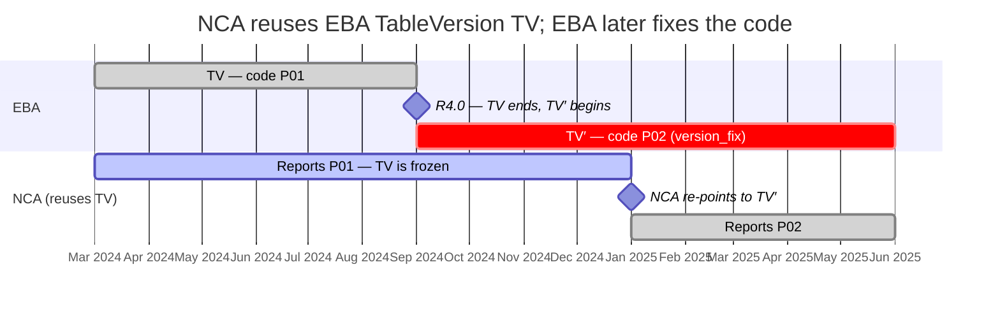
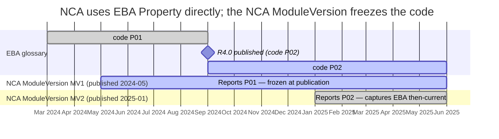
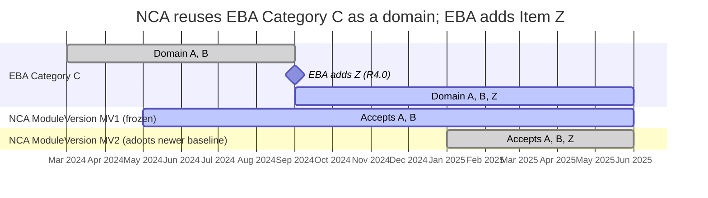
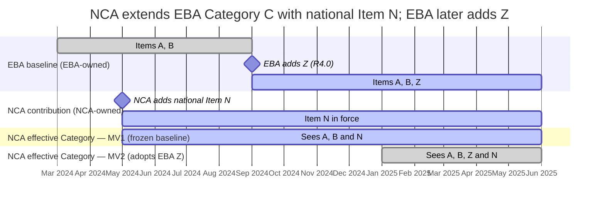
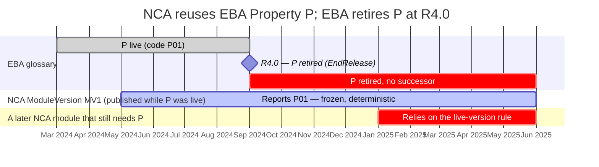

# Proposal — Versioning under cross-owner reuse

!!! warning "Status: draft proposal for discussion"

    This document is a working proposal, not part of the published DPM 2.0 metamodel documentation. It sits at the intersection of the two companion proposals — [Extensibility and cross-owner reuse](extensibility.md) and [Versioning in DPM](versioning.md) — and assumes their vocabulary. It builds in particular on extensibility principle **P2** (reuse by reference) and **§8** (required metamodel adjustments), and on versioning **§3** (Release as coordinated state) and **§5** (a glossary change forces a new ModuleVersion).

## 1 Purpose and scope

The versioning proposal shows that, *within a single owner*, the model guarantees a deterministic reporting signature: a glossary change on an Item that a Module consumes forces a new `ModuleVersion` ([versioning §5](versioning.md#5-evolution-of-glossary-items)), so every Release answers "what code do I use for Item X?" unambiguously. The extensibility proposal shows that owners build on each other's work by **reuse by reference**: an NCA points its own artefacts at an EBA Concept without copying or changing it.

This document asks what happens when those two facts collide:

> An NCA reuses an EBA artefact. EBA later publishes a Release in which that artefact changes — for instance, a Property's code is revised. **How is the reused artefact's version resolved for the NCA's reporters, and who is responsible for keeping the NCA's signature deterministic?**

The problem is **general** — it arises for any foreign artefact whose owner re-versions it after others have come to depend on it — but it is sharpest, and is led here, by the **glossary code-change** case the question describes.

The conclusion in brief: **determinism is never lost.** A consuming `ModuleVersion` freezes the foreign codes it reuses — resolved to the owner's state as of the consuming version's publication date — so every report is unambiguous even when the owner's codes later change ([Option A, §5](#5-option-a-resolution-under-the-current-model)), and this needs **no schema change**. What is lost across owners is only the *automatic* propagation of upstream change. An optional **additive** model change then makes the cross-owner dependency explicit and finer-grained ([Option B, §6](#6-option-b-explicit-pinning-a-methodology-improvement)). The recommendation ([§9](#9-recommendation)) is to adopt the publication-date freezing rule now and pursue explicit pinning as an enhancement.

## 2 The setup

Take the canonical case throughout:

- EBA owns a **Property** — represented as an Item, whose operative `Code` for a period lives on its `ItemCategory` row, not on the Item itself ([versioning §2](versioning.md#2-what-is-versioned)).
- An NCA **reuses** that Property by reference ([extensibility P2](extensibility.md#5-general-principles)): the NCA's own Headers/Cells use it as a dimension. The reference belongs to the NCA; the Property is untouched and remains EBA-owned.
- In a later **EBA Release**, the Property's `Code` is revised (a glossary-level change — a closed `ItemCategory` row and a new one, per [versioning §5](versioning.md#5-evolution-of-glossary-items)).

The requirement that must survive this change is the one from [versioning §3](versioning.md#3-release-as-the-unit-of-coordinated-state): the NCA's reporters still need a **deterministic signature** — exactly one code for the reused Property in any given reporting context. The question is how that determinism is maintained when the artefact and the reporter belong to different owners.

## 3 Why the single-owner guarantee breaks across owners

Within one owner, [versioning §5](versioning.md#5-evolution-of-glossary-items) keeps the signature deterministic by *forcing a new ModuleVersion* whenever a consumed glossary Item changes. That mechanism rests on three things that all fail at the ownership boundary:

1. **Authority.** By [extensibility P1 and P3](extensibility.md#5-general-principles), the NCA may neither modify nor version EBA's Property, and EBA may not touch the NCA's Module. Neither party can act inside the other's model.
2. **A shared Release axis.** Within one owner a Release is a *coordinated snapshot of the whole model at once*. Across owners there is **no such common axis**: a [Release is itself a Concept](https://meaningful-data.github.io/dpm-docs/latest/ownership-documentation/#421-releases) with its own Owner, and **the metamodel contains no foreign key linking an EBA Release to any NCA Release**. EBA's Release 4.0 and the NCA's Release 2.5 are simply unrelated rows.
3. **The forcing rule.** Because of (1) and (2), EBA publishing a code change **cannot mint a new NCA `ModuleVersion`**. The §5 rule has no cross-owner counterpart, and **the NCA cannot be compelled to cut a new version — by definition**, since EBA has no authority over, and no link into, the NCA's release process.

What, then, *is* shared across owners? Only **time**. Every Release carries a publication `Date`; every `ModuleVersion` carries `FromReferenceDate` / `ToReferenceDate`; `OperationScope` carries `FromSubmissionDate` ([§4.2.1](https://meaningful-data.github.io/dpm-docs/latest/ownership-documentation/#421-releases), [§4.2.2](https://meaningful-data.github.io/dpm-docs/latest/ownership-documentation/#422-application-dates)). These calendar attributes are the *only* substrate common to two owners who share nothing else — and of them, only the publication `Date` has a meaning that is owner-independent (the reference and submission dates encode each owner's internal application periods). That is the attribute [§5](#5-option-a-resolution-under-the-current-model) builds on. This does **not** cost determinism: as [§5](#5-option-a-resolution-under-the-current-model) shows, the consuming `ModuleVersion` freezes the foreign codes it reuses, so every report stays unambiguous. What the boundary removes is only the *automatic* propagation the single-owner rule provides — the NCA adopts an upstream change by publishing a new version, not by being compelled into one.

*Figure 1. EBA and NCA Releases are unrelated rows — no foreign key joins them. The only thing that lets one be placed relative to the other is the publication date.*

## 4 Where the problem actually bites: the glossary tier

The difficulty is **not** uniform across everything an NCA might reuse. It depends on which versioning tier the reused artefact belongs to ([versioning §2](versioning.md#2-what-is-versioned)).

**Reused truly-versioned artefacts are fully pinned today — structure *and* glossary.**
:   When the NCA reuses an EBA `TableVersion`, `OperationVersion` or `HeaderVersion`, its reference targets a specific frozen `…VID`. EBA minting a *new* version (a new `TableVID`) does not disturb the NCA's existing reference — the old version row is immutable and is never deleted. Crucially, freezing the version also freezes the **glossary codes** it resolves to. A `TableVersion`'s cells reference glossary Concepts by identity, and their codes resolve through the EBA `ModuleVersion` that anchors the table ([versioning §4](versioning.md#4-moduleversion-as-the-applicability-anchor)); and by [§4.2.4 Dependencies](https://meaningful-data.github.io/dpm-docs/latest/ownership-documentation/#424-dependencies), when a used Item's code is ended the dependent `TableVersion` is ended too, so a code change *forces a new `TableVersion`*. A given `TableVID` therefore corresponds to exactly one glossary signature. The NCA adopts any EBA change — structural or glossary — only by deliberately re-referencing the new version, which produces a new NCA `ModuleVersion` on its own schedule. **Determinism holds across the boundary, with no model change**; the only wrinkle is that the pinned `…VID` may be one EBA's *current* Release no longer carries (the live-version exception, [§5](#5-option-a-resolution-under-the-current-model)). This case is worked through in [§8.1](#81-reusing-a-whole-table-an-upstream-code-fix).

**Reused glossary Concepts used in your *own* structures have no *explicit* version handle.**
:   The interesting case is when the NCA places an EBA glossary Concept — a Property, Item or Category — **directly into its own Header, Cell or Table**, rather than reusing a whole EBA `TableVersion`. Here the reference targets the Concept's **identity** (the owner-prefixed ID), not a version; there is no stored field saying *which* EBA release's codes apply, and the §4.2.4 cascade that ends a *whole* `TableVersion` on an upstream code change cannot reach across the ownership boundary. But determinism is **not** lost: the NCA's own `ModuleVersion` still freezes the codes, by resolving them against EBA's state as of its **publication date** ([§5](#5-option-a-resolution-under-the-current-model)). The anchor here is *implicit* (computed from dates) rather than *stored* — which is exactly what an explicit pin ([§6](#6-option-b-explicit-pinning-a-methodology-improvement)) would make robust and queryable.

So the two cases differ only in *how* the freeze is carried: a reused `TableVersion` carries it explicitly (its `TableVID` fixes the codes), while a bare glossary Concept relies on the consuming `ModuleVersion`'s publication date to fix them. **Both are deterministic.** The rest of this document states the resolution rule that guarantees that, and the optional handle that makes the dependency explicit.

!!! note "This is a known, open gap"

    The same situation is recorded as an unresolved issue in the SDMX↔DPM mapping work — *"how do Releases interact when contributing organisations have different release calendars? … Multi-owner Items in different release calendars need clear rules for which release applies"* — where it is explicitly marked **Open**. This proposal is an attempt to close it.

## 5 Option A — resolution under the current model

Determinism is preserved across owners by the same device that provides it within one owner: **the consuming `ModuleVersion` freezes what it reuses.** Nothing here requires a metamodel change — only a normative resolution rule, built on the one attribute owners share, the publication `Date` ([§3](#3-why-the-single-owner-guarantee-breaks-across-owners)).

**The freezing rule.**
:   A reused foreign Concept resolves to the owner's state **as of the consuming `ModuleVersion`'s publication date**, and is frozen there for that ModuleVersion's whole life. An NCA `ModuleVersion` published while EBA's current Release is R3.9 reuses the EBA Property at its R3.9 code (`P01`) — and keeps resolving `P01` no matter what EBA publishes afterwards. The NCA moves to a later EBA code only by **publishing a new `ModuleVersion`**, which captures EBA's then-current state. This is exactly single-owner DPM behaviour ([versioning §4](versioning.md#4-moduleversion-as-the-applicability-anchor)): a `ModuleVersion` is a snapshot, and the reused foreign content is part of that snapshot.

**Why this is deterministic.**
:   Each NCA `ModuleVersion` yields exactly one code for the reused Property, fixed for its life. EBA and the NCA may then carry **different codes for the same reporting period** — EBA on its latest, the NCA on the code frozen in its module — yet nothing is ambiguous: *which code goes to whom* is decided by *which `ModuleVersion` governs the submission*. The determinism of [versioning §3](versioning.md#3-release-as-the-unit-of-coordinated-state) is upheld across the boundary, not surrendered.

**Why not reference or submission dates.**
:   This rule deliberately ignores `ModuleVersion.FromReferenceDate` / `ToReferenceDate` and `OperationScope.FromSubmissionDate`. Those encode each owner's *intended application period* — semantics that are internal to that owner's timeline and do not translate cleanly across owners (two authorities phase reporting periods differently). Publication date is the one attribute with an unambiguous, owner-independent meaning: *available to the public, therefore in force.* An **alternative** could align reuse on the owner's `FromReferenceDate` instead — resolving by the reporting period a version applies to rather than by when it became public — which is closer to the owner's own semantics, but it forces differing reference-period conventions onto a shared axis and complicates everything for little gain. It is recorded here only as a possibility; **publication-date resolution is preferred.**

**The live-version note.**
:   A frozen NCA `ModuleVersion` may go on resolving an EBA version that EBA has since superseded or ended. That is sound, because DPM versions are immutable and published Concepts are never deleted ([§4.2 Historisation](https://meaningful-data.github.io/dpm-docs/latest/ownership-documentation/#42-historisation)): the foreign state captured at the consuming module's publication date stays readable for that module's life, even after the owner moves on. So [extensibility P2](extensibility.md#5-general-principles)'s "use only live versions" rule is refined for reuse — *you depend on the foreign state as captured, not on the owner's current state.*

What the rule does **not** do:

- **It does not propagate upstream change automatically.** A correction or evolution EBA publishes after the NCA's module reaches the NCA only when the NCA publishes a new module ([§7](#7-corrections-versus-evolution)). For determinism this is the point; the trade-off is that adopting even a correction takes a deliberate republish.
- **It keeps the dependency implicit.** The binding is *computed* from publication dates rather than *stored*, so it relies on owners' Releases being well-ordered in time and cannot be queried directly. Making it explicit is the subject of [§6](#6-option-b-explicit-pinning-a-methodology-improvement).

An owner that positively *wants* to ride an upstream owner's corrections automatically can instead mark a reference **floating** — always resolving to the owner's latest published code. That deliberately re-introduces mid-life change, so it is an explicit opt-in, never the default ([§6](#6-option-b-explicit-pinning-a-methodology-improvement), [§8.3](#83-reusing-a-category-as-a-domain-the-owner-adds-an-item)).

*Option A is deterministic and usable today: the consuming `ModuleVersion` freezes the reused codes, exactly as it freezes everything else.*

## 6 Option B — explicit pinning (a methodology improvement)

Option A's freeze is *implicit* — reconstructed from publication dates. Option B makes the cross-owner dependency **explicit and first-class**, turning the dependency pinning foreshadowed in [extensibility §8.4](extensibility.md#8-required-metamodel-adjustments) into stored metadata. It does **not** rescue determinism — [§5](#5-option-a-resolution-under-the-current-model) already provides that — it adds control and auditability with a **small, additive** change.

**Record the dependency explicitly.**
:   A consuming `ModuleVersion` *stores* a dependency that **pins** to a specific upstream `Release` (or `ModuleVersion`); a single reuse reference may pin to a specific reused-Concept version key (`ItemID`, EBA `StartReleaseID`) that fixes the `ItemCategory` row in force. The binding becomes queryable instead of inferred from date arithmetic — the missing *explicit* handle from [§4](#4-where-the-problem-actually-bites-the-glossary-tier).

**What an explicit pin adds over Option A.**
:   In the common case — pin to the release current at the consuming module's publication — it resolves to exactly what [§5](#5-option-a-resolution-under-the-current-model) would. Beyond that it buys: **auditability** (you can ask "what does this module depend on?" and read the answer rather than recompute it); the ability to **pin to a deliberately chosen release** — an older or specific one, not only the owner's state at your publication date; **robustness** against imprecisely-ordered publication dates; and a place to record **policy** (adopt `version_fix` corrections, defer `version_new` evolutions — [§7](#7-corrections-versus-evolution)).

**Floating: an explicit opt-in.**
:   A reference may instead be declared **floating** — always the owner's latest published version. This deliberately re-introduces mid-life change, so it is the right choice only where a reuser *wants* to ride additive upstream growth automatically ([§8.3](#83-reusing-a-category-as-a-domain-the-owner-adds-an-item)); it is a declared, owned choice on a specific reference, never the default.

!!! note "Reframing the 'only-use-live-versions' rule"

    Pinning legitimises depending on a version that is *historical* on the owner's axis. This is sound precisely because, in DPM, **versions are immutable and published Concepts are never deleted** ([§4.2 Historisation](https://meaningful-data.github.io/dpm-docs/latest/ownership-documentation/#42-historisation)). So the rule restates cleanly: *within your own timeline you still only mint and use live versions; a **dependency** may pin a frozen, historical version of a foreign artefact.* The exception Option A had to bolt on becomes a principled, explicit relationship.

**Minimal metamodel additions** (all additive, defaults preserve current behaviour):

| Change | Purpose |
|---|---|
| A cross-owner **Dependency** entity: consuming `ModuleVersion` → pinned upstream `Release` / `ModuleVersion` | Records the binding the model lacks today; generalises [extensibility §8.4](extensibility.md#8-required-metamodel-adjustments) |
| Optional **per-reference pin** to a reused glossary version key (e.g. `ItemID` + owner `StartReleaseID`) | Anchors a single reused Property/Item/Category at glossary granularity |
| A **`pinned` / `floating` mode** flag on the reference (default `pinned`) | Lets a reuser opt into floating where it wants to ride additive growth; the default preserves the §5 freeze |
| **Relaxation** of the "must be live" rule for *pinned historical* dependencies | Permits depending on an immutable past version while still forbidding new use of something deactivated as erroneous |

*Option B does not rescue determinism — Option A already provides it — but it makes the dependency explicit, queryable and finely controllable, at the cost of the additive change above.*

## 7 Corrections versus evolution

DPM already distinguishes two reasons an upstream version supersedes another, via the [`version_fix` and `version_new` ConceptRelation types](https://meaningful-data.github.io/dpm-docs/latest/ownership-documentation/#414-concept-relation): a `version_fix` corrects a modelling problem (the old code was *wrong*), a `version_new` is a deliberate evolution. Because both options **freeze** what a reuser has captured ([§5](#5-option-a-resolution-under-the-current-model)/[§6](#6-option-b-explicit-pinning-a-methodology-improvement)), neither adopts an upstream change automatically — so the distinction does not affect *determinism*; it guides **when the reuser should republish**:

- A `version_fix` means the captured code is *erroneous*. The reuser should republish promptly to stop emitting it. The freezing rule does not force this, so it is an operational obligation — ideally prompted by the owner.
- A `version_new` is a legitimate evolution the reuser may schedule at will; deferring it is normal, not a defect.

Only an explicit pin (Option B) can **encode** this as policy — auto-adopt fixes, defer evolutions — and let an owner signal `version_fix` events to known dependents ([§10](#10-open-questions)). Under Option A the distinction is advisory: it tells the NCA *when* to act, but the act is always a deliberate republish. This is one of the clearest arguments for pursuing Option B.

## 8 Worked examples

These cases span the kinds of cross-owner interaction, from the deterministic baseline to the genuinely hard ones. Throughout, **EBA** is the owning authority and the **NCA** the reuser; `P01`/`P02` are a reused Property's successive codes, `A`/`B`/`Z` are Items of a Category, and `Rx.y` are EBA Releases.

Each example carries a **Gantt timeline** on a shared calendar. Read it as: lanes are grouped by owner and by NCA `ModuleVersion`; a **bar** shows which code/version that module reports over its life, and a **♦ milestone** marks a publication. The thing to watch is that each NCA `ModuleVersion`'s bar **stays flat** even when EBA's bar changes — that flatness is the determinism the freezing rule guarantees; the NCA moves only by publishing a new module.

| # | Interaction | Scenario | Deterministic today? |
|---|---|---|---|
| [8.1](#81-reusing-a-whole-table-an-upstream-code-fix) | Reuse a whole `TableVersion` | upstream code fix | **Yes** — pinned through the reused table |
| [8.2](#82-direct-reuse-of-a-bare-property-the-code-changes) | Direct reuse of a bare Property | code fix or evolution | **Yes** — frozen at the module's publication date |
| [8.3](#83-reusing-a-category-as-a-domain-the-owner-adds-an-item) | Reuse a Category as a domain | owner adds an Item | **Yes** when frozen; floating is an opt-in to ride additive growth |
| [8.4](#84-extension-contributing-a-national-item-to-a-foreign-category) | **Extend** a foreign Category | reuser adds an Item; baseline evolves | **Yes** — own member on NCA axis; baseline frozen as 8.2 |
| [8.5](#85-the-owner-retires-a-concept-you-depend-on) | Reuse a Concept the owner **retires** | owner ends the Concept | **Yes** — frozen historical state; floating would break |

### 8.1 Reusing a whole table: an upstream code fix

Suppose:

- EBA publishes Release **R3.9** containing a `TableVersion` **TV** (a specific `TableVID`). One of TV's cells uses an EBA **Property** whose code, on its `ItemCategory` row in R3.9, is **`P01`**.
- The NCA **reuses TV** in its own `ModuleVersion` — it includes EBA's `TableVID` directly ([extensibility P6](extensibility.md#5-general-principles): the NCA references EBA's content from its own container, never the other way round) — and keeps reporting against this table across several of its own Releases.
- EBA then publishes Release **R4.0** in which the Property's code is **corrected** from `P01` to `P02` — a [`version_fix`](https://meaningful-data.github.io/dpm-docs/latest/ownership-documentation/#414-concept-relation), because `P01` was a mistake.

The NCA keeps reporting **`P01`**, deterministically. Reusing TV pins not only the table's structure but its **glossary codes**, for the reason given in [§4](#4-where-the-problem-actually-bites-the-glossary-tier): a `TableVersion`'s codes resolve through the EBA `ModuleVersion` that anchors it, and by [§4.2.4](https://meaningful-data.github.io/dpm-docs/latest/ownership-documentation/#424-dependencies) ending the old `P01` membership *ends TV itself* and spawns a new `TableVersion` **TV′** carrying `P02`. There is no "old table with the new code": TV means `P01`, full stop, and TV′ means `P02`. By reusing TV the NCA has — through the table — already fixed the glossary version it depends on.

*Figure 2. Reusing TV pins the glossary to `P01`; EBA's fix lives in a new version TV′, which the NCA reaches only by deliberately re-pointing. Both options behave identically here, because reusing a versioned artefact is already a pin.*

**How the reporter knows which code to use:**

- The NCA reuses **TV**, so its reporters write **`P01`** — under both Option A and Option B, which agree here because *reusing a versioned artefact is already a pin*. EBA publishing R4.0 does not change TV's meaning; TV is immutable.
- To adopt the correction, the NCA **re-points** its `ModuleVersionComposition` from TV to **TV′**. That is a deliberate edit producing a new NCA `ModuleVersion`, on the NCA's own schedule — the determinism of [§3](#3-why-the-single-owner-guarantee-breaks-across-owners) is preserved throughout.
- The `version_fix` relation says `P01` was erroneous, which is a strong reason to re-point promptly ([§7](#7-corrections-versus-evolution)); but the methodology cannot silently switch TV to `P02`, because that would change the meaning of a frozen version. Had the change been a `version_new` instead, the same mechanics would hold — the NCA stays on TV until it chooses TV′.

**Takeaway:** reusing a truly-versioned artefact pins its glossary codes as well as its structure — so the NCA reports `P01` deterministically and reaches the corrected `P02` only by deliberately re-pointing to the new version. The bare-glossary case ([§8.2](#82-direct-reuse-of-a-bare-property-the-code-changes)) reaches the *same* determinism by a different route — the consuming `ModuleVersion`'s publication date — rather than the reused `TableVID`.

### 8.2 Direct reuse of a bare property: the code changes

*Setup.* The NCA places EBA's Property **directly in its own Header** — not through an EBA table. At **R4.0** EBA changes the code from `P01` to `P02`; the change is either a `version_fix` (`P01` was wrong) or a `version_new` (a deliberate evolution).

*Figure 3. MV1 freezes `P01` at its publication date and keeps it even after EBA publishes `P02`; the NCA moves to `P02` only by publishing MV2. Deterministic under both options.*

*Resolution.* There is no EBA `TableVersion` to carry the pin, and the NCA's reference names only the Property's identity ([§4](#4-where-the-problem-actually-bites-the-glossary-tier)) — so the freeze is carried by the NCA's own `ModuleVersion` instead.

- **Both options are deterministic.** Under Option A the code is resolved to EBA's state as of MV1's publication date (`P01`) and frozen; under Option B, MV1 stores an explicit pin to that EBA release. Either way MV1 reports `P01` for its whole life, regardless of EBA's later `P02`; the NCA adopts `P02` only by publishing MV2.
- **The difference is explicitness, not the outcome.** Option A *infers* the pin from MV1's publication date; Option B *records* it, so it is queryable and can deliberately target a different release.
- **`version_fix` vs `version_new` decides *when to publish MV2*** ([§7](#7-corrections-versus-evolution)), not what MV1 reports: for a fix the NCA should publish MV2 promptly to stop emitting the erroneous `P01`; for an evolution it may wait.

### 8.3 Reusing a category as a domain: the owner adds an item

*Setup.* The NCA reuses an EBA Category **C** as the enumerated domain of one of its dimensions. C contains Items `A, B`. At **R4.0** EBA **adds** Item `Z` — an additive, backward-compatible change (data already reported stays valid).

*Figure 4. By default the domain is frozen per ModuleVersion: MV1 keeps `A, B` even after EBA adds `Z`; MV2 adopts `A, B, Z`. A reuser that wants `Z` automatically can mark the reference floating.*

*Resolution.*

- **Default (frozen).** Like every reuse, the domain is frozen in the NCA `ModuleVersion`: MV1 keeps `A, B`; the NCA accepts `Z` by publishing MV2. Deterministic.
- **Floating opt-in.** Because the change is purely *additive* (data already reported stays valid), this is the one family where a reuser may reasonably mark the reference **floating** and accept `Z` automatically — mirroring how a single owner absorbs codelist growth. The cost is the usual one: the accepted domain then changes mid-life of MV1.
- **Lesson.** Additive growth is the benign end of the spectrum and the only case where floating is a sensible opt-in; wherever the NCA's own validation treats the domain as *closed*, freezing is safer, because even an added value can change a rule's outcome.

### 8.4 Extension: contributing a national item to a foreign category

*Setup.* Beyond reusing C, the NCA **extends** it ([extensibility](extensibility.md), Extension mode, P4): it adds a national Item **N**, which is NCA-owned. Later, at **R4.0**, EBA adds its own Item `Z` to C.

*Figure 5. The NCA's effective Category is EBA's (frozen) baseline plus its own member N; adopting EBA's `Z` means publishing MV2.*

*Resolution.* The NCA's effective view of C is **EBA's baseline ∪ the NCA's own members**, versioned on *different axes*:

- **N (NCA-owned)** versions on the NCA's own timeline — fully deterministic, exactly like any single-owner glossary member ([versioning §5](versioning.md#5-evolution-of-glossary-items)).
- **EBA's baseline (`A, B, …`)** is *reused*, so it is frozen per the NCA `ModuleVersion` exactly as in [§8.2](#82-direct-reuse-of-a-bare-property-the-code-changes)/[§8.3](#83-reusing-a-category-as-a-domain-the-owner-adds-an-item): MV1 keeps `A, B`, MV2 adopts `Z` (or a floating reference rides the addition automatically).
- So extension introduces **no new versioning rule** — it is *reuse of the baseline plus ownership of the contributed member*. The one requirement is that the contributed membership link be NCA-owned (the `OwnerID` addition of [extensibility §8](extensibility.md#8-required-metamodel-adjustments)), so `N` cannot collide with EBA's Items and is resolved as `(Category, Owner, Code)`.

### 8.5 The owner retires a concept you depend on

*Setup.* The NCA reuses EBA Property **P** (code `P01`). At **R4.0** EBA **retires** P — gives it an `EndRelease`, with no successor — because the concept is no longer collected.

*Figure 6. MV1, published while P was live, keeps reporting `P01` deterministically. Only a *new* module that still wants the retired P leans on the live-version rule; a floating reference would lose P entirely.*

*Resolution.*

- **Default (frozen).** MV1 was published while P was live, so it captured `P01` and keeps resolving it — deterministic, and not even an exception: it reads P *as of MV1's publication*, when P was current.
- **A later module that still needs P** leans on the live-version rule ([§5](#5-option-a-resolution-under-the-current-model)): depending on a now-retired-but-frozen version is sound, because DPM versions are **immutable and never deleted** ([§4.2](https://meaningful-data.github.io/dpm-docs/latest/ownership-documentation/#42-historisation)). You may *keep* such a dependency; you may not start a *new* one on something the owner deactivated as erroneous.
- **Floating (the opt-in).** A floating reference would lose P at R4.0 — EBA's latest no longer contains it and there is no successor — forcing the NCA to act. That is exactly why floating is never the default, and why the freezing rule is the safe baseline.

## 9 Recommendation

1. **Adopt the publication-date freezing rule now (Option A).** It is deterministic and needs no schema change: a consuming `ModuleVersion` resolves each reused foreign Concept against the owner's state *as of the consuming module's publication date* and freezes it for that module's life ([§5](#5-option-a-resolution-under-the-current-model)). Make it normative, together with the live-version refinement (you depend on the foreign state *as captured*) and the rule that resolution uses publication date, **not** reference or submission dates. Floating remains an explicit, per-reference opt-in for additive growth.
2. **Pursue Option B (explicit pinning) as a DPM methodology enhancement.** It does not rescue determinism — Option A already provides it — but the additive changes in [§6](#6-option-b-explicit-pinning-a-methodology-improvement) make the cross-owner dependency **explicit, queryable and finely controllable** (pin to a chosen release; remove reliance on date arithmetic; encode the `version_fix`-vs-`version_new` policy of [§7](#7-corrections-versus-evolution)). They dovetail with the `OwnerID` and dependency-pinning adjustments already proposed in [extensibility §8](extensibility.md#8-required-metamodel-adjustments), so the two proposals should advance together.

## 10 Open questions

- **Tie-breaking.** Can an owner publish two Releases bearing the same `Date`, and if so what orders them? (Publication-date resolution largely sidesteps *cross-owner* ties, since each foreign Concept resolves against its own owner's timeline; the question is whether a single owner's same-day publications need a finer ordering.)
- **Granularity of the pin.** Is pinning best expressed once per consuming `ModuleVersion` (one dependency on an upstream Release) or per individual reuse reference (finer, but heavier)? A ModuleVersion-level pin is simpler; a per-reference pin is needed only when one Module reuses artefacts from several upstream Releases of the same owner.
- **Extension, not just reuse.** When the NCA has *extended* a foreign Category ([extensibility](extensibility.md) Extension mode) rather than only reused it, how do the NCA's own contributed members version relative to the pinned EBA baseline?
- **Reused validation rules.** How should a reused `OperationScope` / `OperationVersion` behave under each option, given that operations carry their own `FromSubmissionDate` independent of the glossary?
- **Notification.** Pinning insulates a reuser but can leave it unaware that EBA has issued a correction. Does the methodology need a mechanism for owners to signal `version_fix` events to known dependents?
