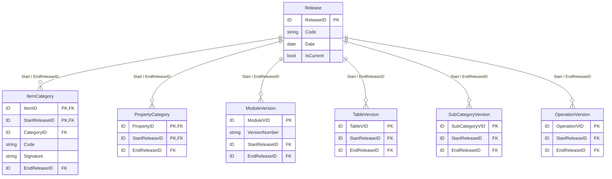
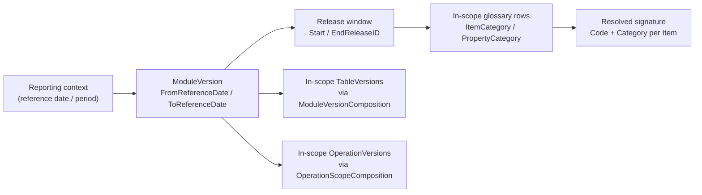
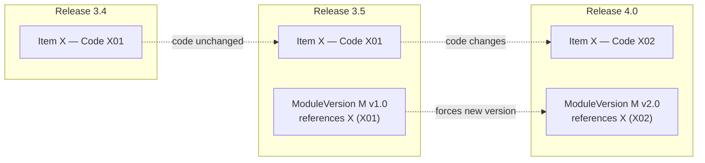
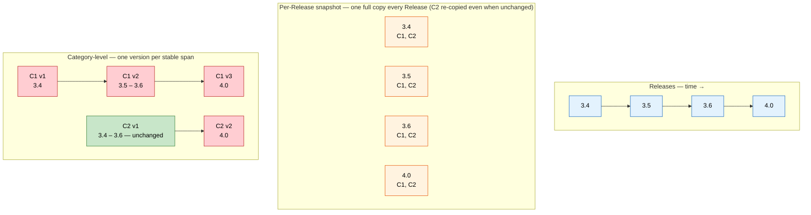

# Proposal — Versioning in DPM

!!! warning "Status: draft proposal for discussion"

    This document is a working proposal, not part of the published DPM 2.0 metamodel documentation. It consolidates and makes explicit the versioning model that [§4.2 Historisation](https://meaningful-data.github.io/dpm-docs/latest/ownership-documentation/#42-historisation) currently describes only in part. The intent is that, once agreed, sections [2](#2-what-is-versioned)–[6](#6-two-views-of-glossary-versions) are folded into §4.2 as the official description of versioning (see [§8 Recommendation](#8-recommendation)).

## 1 Purpose and scope

DPM models evolve: codes are corrected, items move between categories, table structures change, validation rules are revised. The metamodel already records this evolution — through Releases, version entities, release-tagged composition rows, application dates and deactivations — but the documentation describes those mechanisms **piecemeal**, spread across the subsections of [§4.2 Historisation](https://meaningful-data.github.io/dpm-docs/latest/ownership-documentation/#42-historisation). What is missing is a single, coherent answer to three questions:

- **What is versioned**, and what is not?
- **How is a version identified**, and where does its validity come from?
- **How does a consumer resolve** the applicable version of any artefact for a given reporting context?

!!! note "Relationship to §4.2.1"

    [§4.2.1 Releases](https://meaningful-data.github.io/dpm-docs/latest/ownership-documentation/#421-releases) states that *"DPM does not impose any specific semantic versioning approach."* That statement is about **version numbering** — DPM does not mandate a `major.minor.patch` scheme or prescribe when each part increments. It does **not** mean DPM lacks a versioning model. This proposal describes the *structural* versioning model (what carries a version, how validity windows work, how applicability resolves); the freedom over numbering conventions described in §4.2.1 is preserved and unaffected.

## 2 What is versioned

DPM versioning operates on **two tiers**.

**Tier 1 — Explicitly versioned entities.**
:   A distinct `…Version` row exists for each version of the Concept, carrying its own surrogate key (`…VID`), an optional `VersionNumber`, and a validity window expressed as `StartReleaseID` (mandatory) and `EndReleaseID` (optional). These are `ModuleVersion`, `TableVersion`, `HeaderVersion`, `VariableVersion`, `OperationVersion`, and `SubCategoryVersion`. `TableGroup` is historised the same way at the level of its own life cycle.

**Tier 2 — Release-tagged relationships (the glossary).**
:   Glossary Concepts — Items, Categories, Properties, Contexts — do **not** carry their own version rows. Their evolution is recorded on the **composition rows that connect them**: `ItemCategory`, `PropertyCategory`, `SuperCategoryComposition`, `CompoundItemContext`, and `TableGroupComposition`. Each such row carries `StartReleaseID` / `EndReleaseID`, and in `ItemCategory` and `PropertyCategory` `StartReleaseID` is part of the primary key. The Item's operative attributes for a period — its `Code`, its `IsDefaultItem` flag, its `Signature` — live on the `ItemCategory` row, not on the Item.

The single hinge for both tiers is `Release`: every version row and every release-tagged relationship points at the Release(s) that bound its validity.

*Figure A. The two tiers of versioning, both anchored on Release. Representative entities only; the full set is in [Figure 12 of §4.2.1](https://meaningful-data.github.io/dpm-docs/latest/ownership-documentation/#421-releases).*

| Concept | Versioning mechanism | Version identity |
|---|---|---|
| Module | `ModuleVersion` row | `ModuleVID` (+ optional `VersionNumber`) |
| Table | `TableVersion` row | `TableVID` (+ optional `VersionNumber`) |
| Header | `HeaderVersion` row | `HeaderVID` |
| Variable | `VariableVersion` row | `VariableVID` |
| Operation | `OperationVersion` row | `OperationVID` |
| SubCategory | `SubCategoryVersion` row | `SubCategoryVID` |
| TableGroup | historised `TableGroup` row | `TableGroupID` + `StartReleaseID` |
| Item | `ItemCategory` row (release-tagged) | (`ItemID`, `StartReleaseID`) |
| Property | `PropertyCategory` row (release-tagged) | (`PropertyID`, `StartReleaseID`) |
| Category / Context | membership rows of contained Concepts | resolved per Release |

## 3 Release as the unit of coordinated state

A [Release](https://meaningful-data.github.io/dpm-docs/latest/ownership-documentation/#421-releases) represents one publication of the model, identified by `Code` and `Date`, with a `Status` and an `IsCurrent` flag marking the most recent publication. A version is not published in isolation: a Release captures the **coordinated state of the whole model at once**. The repository is published as a coherent snapshot, and the Release is the unit everyone pins against.

`StartReleaseID` and `EndReleaseID` turn that snapshot model into per-row validity windows. A version row or relationship row is *in scope* at Release `R` when `StartReleaseID ≤ R` and (`EndReleaseID` is null **or** `EndReleaseID > R`). Resolving the model "as of `R`" means applying that predicate uniformly across all versioned entities and release-tagged relationships.

!!! note "Per-Release uniqueness of a glossary signature"

    A business rule sits on top of the change log and is **required for the model to be usable for data exchange**, even though the metamodel cardinalities do not enforce it:

    > Within any given Release, an Item has exactly one active `ItemCategory` — therefore exactly one `Code` and exactly one `Category`.

    Curation must guarantee this: the model itself permits overlapping log entries (two active `StartReleaseID` rows for the same Item), but if that occurred the same logical Item would resolve to two codes or two categories at once, breaking deterministic exchange. This is why a **Release** — not a Module or a Category in isolation — is the smallest unit at which *"what code do I use for Item X?"* has a well-defined answer.

## 4 ModuleVersion as the applicability anchor

Release windows say *when* something is in scope, but not *which calendar period a reporting bundle applies to*. That second dimension lives on one entity only.

[`ModuleVersion`](https://meaningful-data.github.io/dpm-docs/latest/ownership-documentation/#422-application-dates) is the only versioned entity that carries **reference-date validity**: `FromReferenceDate` and (optionally) `ToReferenceDate`. All other versioned entities locate themselves only by `StartReleaseID` / `EndReleaseID`. The practical consequence is a single, mandatory resolution path:

> To resolve the applicable version of a Table, SubCategory, Item or Property for a reporting context, a consumer **must start from a ModuleVersion**. The ModuleVersion fixes the reference period and the Release window; the Release window fixes the in-scope release-tagged glossary rows; those rows determine the codes and category membership the reporter must use. There is no shorter path — querying the glossary directly, without a ModuleVersion, yields ambiguous answers.

*Figure B. Resolution always begins at a ModuleVersion.*

The same anchor governs the time-dependent parts of operations: `OperationScope.FromSubmissionDate` and `VariableCalculation.FromReferenceDate` / `ToReferenceDate` are interpreted within the ModuleVersion that brings them into scope (see [§4.2.2](https://meaningful-data.github.io/dpm-docs/latest/ownership-documentation/#422-application-dates)).

## 5 Evolution of glossary items

Because glossary Concepts are not version rows, an Item evolves along **two independent dimensions**, both recorded on `ItemCategory` rows and bounded by Releases:

1. **Code change** — the Item's `Code` is revised. The previous `ItemCategory` row is closed with an `EndReleaseID` and a new row opens with the new `Code` from a later `StartReleaseID`.
2. **Category reassignment** — the Item moves to a different `Category`, recorded as an `EndReleaseID` on the old `ItemCategory` and a new row referencing the new `CategoryID`.

In both cases the Item's logical identity (`ItemID`) persists — neither produces a "new" Item. Where a correction or a deliberate new version must be distinguished across **non-adjacent** Releases (rather than simply closing and reopening a row), the [`version_fix` and `version_new` ConceptRelation types (§4.1.4)](https://meaningful-data.github.io/dpm-docs/latest/ownership-documentation/#414-concept-relation) record the relationship between the old and new state.

A glossary change does not stay private. Because of the per-Release uniqueness rule (§3), a code revision or reassignment on an Item that a Module references — directly or transitively — **forces a new `ModuleVersion`**, so that the signature a reporter must produce stays deterministic for the Release:

*Figure C. A glossary-level code change propagates to a new ModuleVersion to preserve a deterministic per-Release signature.*

## 6 Two views of glossary versions

The change log does not, by itself, declare "glossary versions" — but two complementary projections of it can stand in as version concepts. They are not alternatives so much as different views: the first is the archival ground truth, the second reveals where the glossary actually changed.

**Per-Release snapshot.**
:   For each Release `R`, materialise the full glossary state at `R` by keeping every `ItemCategory` / `PropertyCategory` row that is *in scope* at `R` — that is, `StartReleaseID ≤ R` and (`EndReleaseID` is null or `EndReleaseID > R`), the rule introduced in [§3](#3-release-as-the-unit-of-coordinated-state). The surviving rows give each Item its code and Category as they stood at `R`. The result is one self-contained, flat snapshot per Release: easy to compute, easy to pin against by Release number, but it produces a fresh snapshot every Release even when nothing changed, so it cannot, on its own, tell you whether a Category is identical from one Release to the next.

**Category-level (change-tracked) versions.**
:   Do not snapshot per Release; track each Category's own history of change. The `ItemCategory` / `PropertyCategory` rows already encode *when* a Category's content changes, through their `StartReleaseID` / `EndReleaseID`. Group the rows by Category and a new Category version begins only at a Release where an Item is added or removed, a `Code` is revised, or membership otherwise changes; between such events the same Category version persists unchanged across however many Releases intervene. No Module graph walk is needed — a Module *consumes* glossary content but does not *define* its versions, and because any reporting-relevant glossary change already forces a new `ModuleVersion` ([§5](#5-evolution-of-glossary-items)), a Category-level view can never disagree with what a Module sees. Identifying which Categories a given reporter needs is then a separate, orthogonal *scoping* question (resolved through the ModuleVersion, per [§4](#4-moduleversion-as-the-applicability-anchor)), not a versioning one.

| Dimension | Per-Release snapshot | Category-level (change-tracked) |
|---|---|---|
| Granularity | Whole glossary, one version per Release | One version per Category |
| New version minted when | Every Release | Only when the Category's items or their codes change |
| Identifier | Release `Code` | Category + the Release at which its current state began |
| Survives unchanged across Releases | No (new snapshot each Release) | Yes (one version spans the stable Releases) |
| Reveals that a Category was stable across Releases | No | Yes — its defining purpose |
| Cheap to materialise | Yes | Yes — a single pass over the relationship rows |
| Answers "the glossary at Release R" | Directly | Indirectly — collect each Category's version current at `R` |

The contrast is easiest to see on a worked timeline. Suppose Category `C1` changes at Releases 3.5 and 4.0, while Category `C2` stays untouched from 3.4 through 3.6 and only changes at 4.0:

*Figure D. The same four Releases under both views. The snapshot view stores `C2` four times though it never changes until 4.0; the Category-level view records `C2` as a single version spanning 3.4–3.6, making its stability visible at a glance.*

Both views are computable from the same release-tagged rows, with no Module graph required for either. Choosing one, the other, or maintaining both side by side is a **publication-strategy decision, not a modelling constraint**. The per-Release snapshot suits archival publication and regulator-side reference ("what did the glossary look like at Release 3.7?"); the Category-level view suits change analysis — seeing at a glance which Categories were touched between two Releases and which carried over untouched.

## 7 Deactivations and dependencies

Two further §4.2 mechanisms complete the picture and should be read together with the above:

- **Deactivations** ([§4.2.3](https://meaningful-data.github.io/dpm-docs/latest/ownership-documentation/#423-deactivations)). A version can be resolved as in-scope yet **inactive** — most notably an `OperationVersion` whose `OperationScope.IsActive` is false. Version resolution and activation status are separate questions: a consumer must check both.
- **Dependencies** ([§4.2.4](https://meaningful-data.github.io/dpm-docs/latest/ownership-documentation/#424-dependencies)). Dependencies constrain which versions can legitimately co-occur, so that a resolved set of ModuleVersions and the glossary slice they reference remain mutually consistent.

The non-normative [log of changes (§4.2.5)](https://meaningful-data.github.io/dpm-docs/latest/ownership-documentation/#425-log-of-changes-non-normative) remains the place for development-workflow and administrative history that the Release mechanism deliberately does not carry.

## 8 Recommendation

Fold sections [2](#2-what-is-versioned)–[6](#6-two-views-of-glossary-versions) into the official documentation as a new **introductory subsection of §4.2** — for example **4.2.0 "Versioning model"**, placed immediately before [§4.2.1 Releases](https://meaningful-data.github.io/dpm-docs/latest/ownership-documentation/#421-releases) so that the reader meets the overall model before its constituent mechanisms.

The editorial change is minimal:

- **One new subsection** in [`docs/ownership-documentation.md`](https://meaningful-data.github.io/dpm-docs/latest/ownership-documentation/), reusing the existing Figure 12 and Figure 13 rather than introducing new diagrams where possible.
- **No navigation change** — §4.2 lives inside the `ownership-documentation.md` page already listed in `mkdocs.yml`.
- **§4.2.1's "no mandated scheme" paragraph is retained verbatim**, with a single sentence reconciling it to the new subsection (numbering freedom vs. structural model), as set out in the note in [§1](#1-purpose-and-scope).

Sections [7](#7-deactivations-and-dependencies) and this Recommendation are not themselves folded in: §4.2.3–§4.2.5 already cover that material, and §7 only cross-references them here for completeness.
